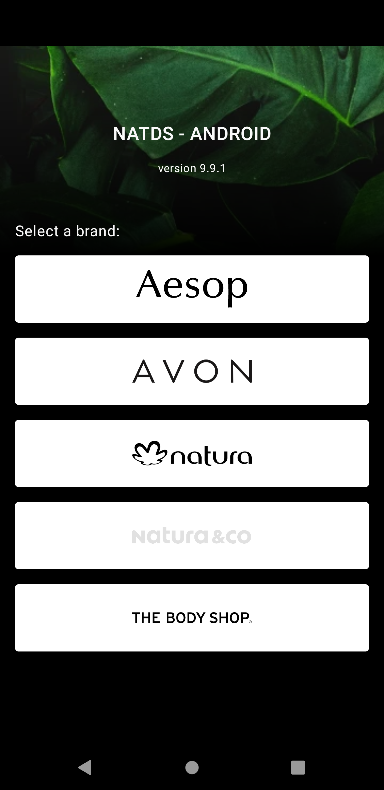

# Design System Natura for Android

## What for
Library with Android components defined by [Natura Group Design System Team](https://zeroheight.com/28db352be/p/35bf2e-natds--natura-design-system).

## How to use

### How to add dependency
Copy and paste the file **github_credentials.properties.sample** and rename it to **github_credentials.properties**. Updating the fields **github.username** and **github.password**. For getting your GitHub password see the [Tutorial](https://help.github.com/en/github/authenticating-to-github/creating-a-personal-access-token-for-the-command-line). Its important to check **read:packages** when generating you password.
In the file build.gradle, insert the informations:

    repositories {
    
        def githubProperties = new Properties()
        def githubFile = rootProject.file("github_credentials.properties")
        if (githubFile.exists()) {
            githubProperties.load(new FileInputStream(githubFile))
        }
        
        maven {
            name = "natds-android"
            url = uri("https://maven.pkg.github.com/natura-cosmeticos/natds-android")
            credentials {
                username = githubProperties['github.username'] ?: System.getenv("GITHUB_USERNAME")
                password = githubProperties['github.password'] ?: System.getenv("GITHUB_API_KEY")
            }
        }
    }

And:

    dependencies {
        implementation "com.natura.android:designsystem:<version>"
        implementation 'com.google.android.material:material:1.1.0'
    }

#### Nat DS Icons

Since 4.0.0 Nat DS Android has no longer Nat DS Icons. In order to use Nat DS Icons, you MUST add a new dependency:

    repositories {

        def githubProperties = new Properties()
        def githubFile = rootProject.file("github_credentials.properties")
        if (githubFile.exists()) {
            githubProperties.load(new FileInputStream(githubFile))
        }

        //To Access Nat DS Icons dependency at Github Packages
        maven {
            name = "natds-commons"
            url = uri("https://maven.pkg.github.com/natura-cosmeticos/natds-commons")
            credentials {
                username = githubProperties['github.username'] ?: System.getenv("GITHUB_USERNAME")
                password = githubProperties['github.password'] ?: System.getenv("GITHUB_API_KEY")
            }
        }
        
    }

And:

    dependencies {
        implementation "com.natura:icons:$rootProject.<version>"
    }
    
You can use Nat DS Icons without using Nat DS Android 

### Getting Started
[Start using our lib](doc/getting-started.md)

<!-- ## How to contribute
[Help us to grow!](doc/how-to-contribute.md) -->
