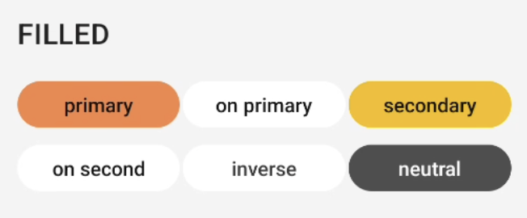
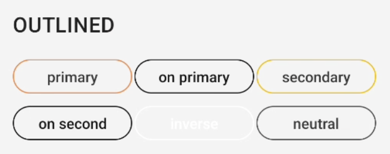
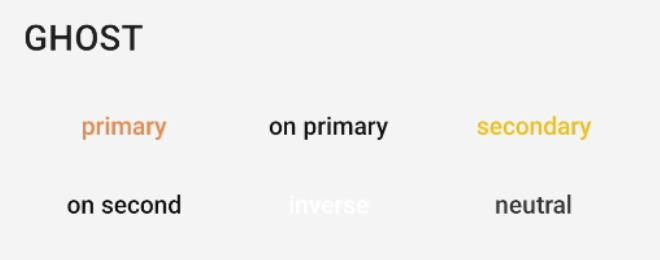
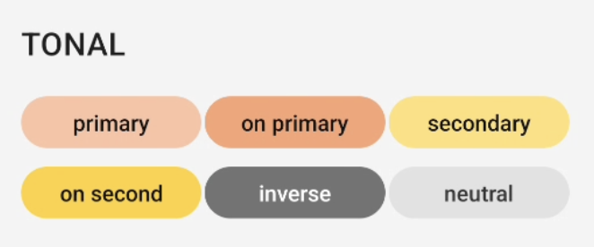
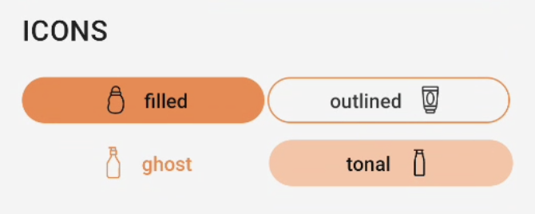
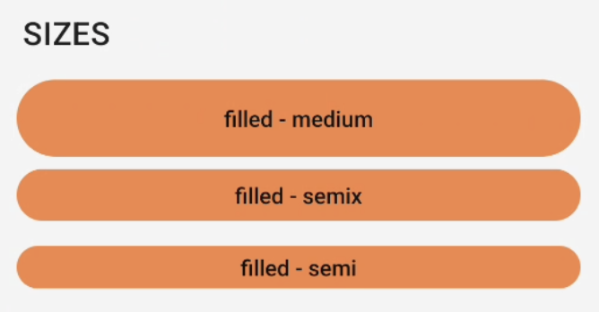
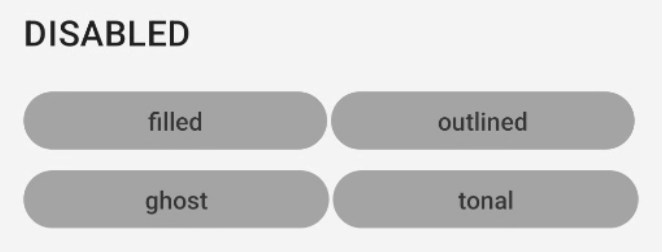

# Guia de Uso - GaYaButton

> 📢 O GaYaButton faz parte da evolução contínua de componentes do GaYa Design System. Ele foi lançado como um novo componente mas os antigos ContainedButton, OutlinedButton e TextButton permaneceram disponíveis para uso mas não receberão mais atualizações ou suporte ativo. Encorajamos a migração para o GaYaButton o quanto antes para aproveitar as melhorias e garantir compatibilidade futura.


## Visão Geral

O componente `GaYaButton` é essencial para interações no aplicativo, permitindo que os usuários façam escolhas e executem ações com um simples toque. Este guia detalha as configurações disponíveis para personalizar o botão de acordo com as necessidades do seu design de interface.

| Prop Figma       | Prop XML       | Valores                                                      | Status            |
| -------------- |  --------------    |    -------------------------                                 |  ----------------- |
| Variant        | btn_type              | filled, outlined, ghost, tonal                               | ✅  Disponível       |
| Colors         | btn_color              | primaryColor, onPrimaryColor, secondaryColor, onSecondaryColor, inverseColor, neutralColor | ✅  Disponível       |
| Icon           | btn_icon + btn_icon_position    | start, end                                                  | ✅  Disponível       |
| Sizes          | btn_size               | Small, Medium, Large                                         | ✅  Disponível       |
| Disabled       | enabled          | True, False                                                  | ✅  Disponível       |
| Display        | -                  | -                                                            | ❌  Não aplicável  |
| Text-Transform | -                  | Definido pelo tema                                           | ✅  Disponível  |


### Changelog

Para acompanhar a evolução deste e de outros componentes acesse: [https://github.com/natura-cosmeticos/natds-ios/blob/master/CHANGELOG.md](https://github.com/natura-cosmeticos/natds-android/blob/main/CHANGELOG.md)

### Como Usar

Para começar a usar o `GaYaButton`, siga as instruções abaixo para configurar os diferentes estilos e funcionalidades.

## Estilos de Botão

**1. Filled**

<p align="center">
   
</p>

   - **Descrição**: Botão com fundo colorido.
   - **Código**:
     ```xml
     <com.natura.android.button.GaYaButton
         android:layout_width="wrap_content"
         android:layout_height="wrap_content"
         android:text="filled"
         app:btn_type="filled"
         app:btn_size="semix" />
     ```

**2. Outlined**

<p align="center">
   
</p>

   - **Descrição**: Botão com borda e fundo transparente.
   - **Código**:
     ```xml
     <com.natura.android.button.GaYaButton
         android:layout_width="wrap_content"
         android:layout_height="wrap_content"
         android:text="outlined"
         app:btn_type="outlined"
         app:btn_size="semix" />
     ```

**3. Ghost**

<p align="center">
   
</p>

   - **Descrição**: Botão sem borda ou fundo, apenas texto.
   - **Código**:
     ```xml
     <com.natura.android.button.GaYaButton
         android:layout_width="wrap_content"
         android:layout_height="wrap_content"
         android:text="ghost"
         app:btn_type="ghost"
         app:btn_size="semix" />
     ```
     
**4. Tonal**

<p align="center">
   
</p>

   - **Descrição**: Botão com fundo colorido, cores mais claras.
   - **Código**:
     ```xml
     <com.natura.android.button.GaYaButton
         android:layout_width="wrap_content"
         android:layout_height="wrap_content"
         android:text="tonal"
         app:btn_type="tonal"
         app:btn_size="semix" />
     ```

## Cores

**1. Primary**
   - **Código**:
     ```xml
     app:btn_color="primaryColor"
     ```

**2. OnPrimary**
   - **Código**:
     ```xml
     app:btn_color="onPrimaryColor"
     ```

**3. Secondary**
   - **Código**:
     ```xml
     app:btn_color="secondaryColor"
     ```
     
**4. OnSecondary**
   - **Código**:
     ```xml
     app:btn_color="onSecondaryColor"
     ```

**4. Inverse**
   - **Código**:
     ```xml
     app:btn_color="inverseColor"
     ```

**4. Neutral**
   - **Código**:
     ```xml
     app:btn_color="neutralColor"
     ```

## Ícones

**Posicionamento de Ícones**

<p align="center">
   
</p>

   - **Descrição**: Adicione ícones ao botão para melhorar a identificação visual.
   - **À Direita**:
     ```xml
     <com.natura.android.button.GaYaButton
         android:layout_width="wrap_content"
         android:layout_height="wrap_content"
         android:text="FILLED"
         app:btn_size="semix"
         app:btn_type="filled"
         app:btn_color="primaryColor"
         app:btn_icon="@drawable/outlined_product_face"
         app:btn_icon_position="end" />
     ```
   - **À Esquerda**:
     ```xml
     <com.natura.android.button.GaYaButton
         android:layout_width="wrap_content"
         android:layout_height="wrap_content"
         android:text="FILLED"
         app:btn_size="semix"
         app:btn_type="filled"
         app:btn_color="primaryColor"
         app:btn_icon="@drawable/outlined_product_childish"
         app:btn_icon_position="start" />
     ```

## Tamanho, Ativação, Posicionamento e Text-transform

**Tamanhos Disponíveis**

<p align="center">
   
</p>

   - **Semi, Semix e Medium**
     - Ajuste o tamanho para adequar-se ao contexto de uso.
     
     ```xml
     <com.natura.android.button.GaYaButton
         android:layout_width="wrap_content"
         android:layout_height="wrap_content"
         android:text="filled - medium"
         app:btn_size="medium"
         app:btn_type="filled" />

     <com.natura.android.button.GaYaButton
         android:layout_width="wrap_content"
         android:layout_height="wrap_content"
         android:text="filled - semix"
         app:btn_size="semix"
         app:btn_type="filled" />

     <com.natura.android.button.GaYaButton
         android:layout_width="wrap_content"
         android:layout_height="wrap_content"
         android:text="filled - semi"
         app:btn_size="semi"
         app:btn_type="filled" />

     ```

**Ativação**

<p align="center">
   
</p>

   - **Habilitar/Desabilitar Botão**
     - Gerencie se o botão pode ser interagido pelo usuário.
     
     ```xml
     <com.natura.android.button.GaYaButton
         android:layout_width="0dp"
         android:layout_height="wrap_content"
         android:enabled="false"
         android:text="FILLED"/>
     ```

**Posicionamento (não aplicável)**
   - **Display**
     - O posicionamento obedece a arquitetura da tela utilizada e hierarquia dos componentes existentes.
    
**Text-transform (não aplicável)**
   - **Definido pelo tema**
     - Gerenciado pelo tema, podem ser Uppercase e Lowercase mas será modificada diretamente pelo tema utilizado
     
