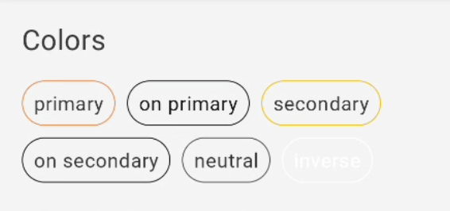
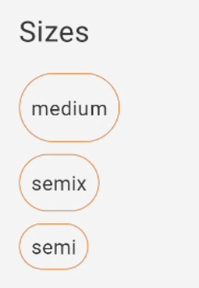
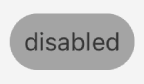
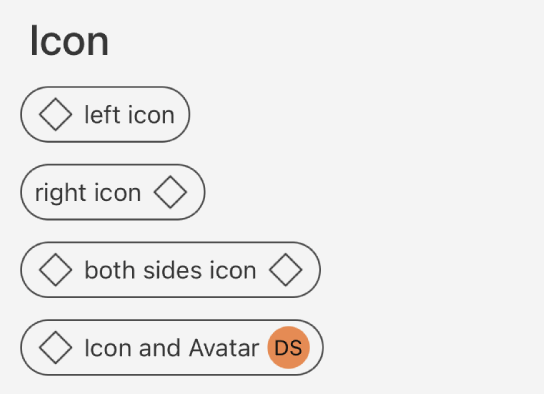
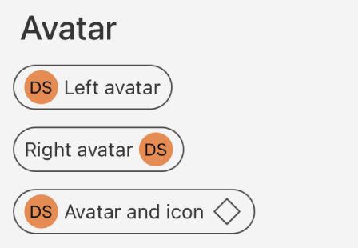

# Guia de Uso - GaYaChip

> 📢 O GaYaChip faz parte da evolução contínua de componentes do GaYa Design System. Ele foi lançado como um novo componente mas o antigo Chip permanecerá disponível para uso mas não receberá mais atualizações ou suporte ativo. Encorajamos a migração para o GaYaChip o quanto antes para aproveitar as melhorias e garantir compatibilidade futura.


## Visão Geral

O componente `GaYaChip` permite que os usuários insiram informações, façam seleções, filtrem conteúdo ou acionem ações. Enquanto botões são esperados aparecer de forma consistente e com chamadas para ação familiares, os chips devem aparecer dinamicamente como um grupo de múltiplos elementos interativos.


| Prop Figma       | Prop XML       | Prop Kotlin       |  Valores                    | Status            |
| -------------- | -------------- | ------------------------- | ------------------------- | ----------------- |
| Colors          | Color          | Color          |  Primary, OnPrimary, Secondary, OnSecondary, Inverse, Neutral | ✅  Disponível       |
| Size          | Size           | Size           | Small, Medium, Large      | ✅  Disponível       |
| Disabled          | State      | Size           | Disabled               | ✅  Disponível       |
| State          | State           | Size           | Normal, Selected         | ✅  Disponível       |
| Helper before          | Position          | Size           | Left | ✅  Disponível       |
| Helper after          | Position        | Size           | Right               | ✅  Disponível   |
| Label          | Text | Size           | -     | ✅  Disponível  |
| Helper type          | - | Size           | Icon, Avatar     | ✅  Disponível  |

### Changelog

Para acompanhar a evolução deste e de outros componentes acesse: [https://github.com/natura-cosmeticos/natds-ios/blob/master/CHANGELOG.md](https://github.com/natura-cosmeticos/natds-ios/blob/master/CHANGELOG.md)

### Como Usar

Para começar a usar o `GaYaChip`, siga as instruções abaixo para configurar os diferentes estilos e funcionalidades.


## Cores

<p align="center">
   
</p>

**Primary**

  ```xml
  <com.natura.android.chip.GaYaChip
      android:layout_width="wrap_content"
      android:layout_height="wrap_content"
      app:gchp_color="primary"
      app:gchp_label="primary"
      app:gchp_selected="false" />
  ```

**OnPrimary**

  ```xml
  <com.natura.android.chip.GaYaChip
      android:layout_width="wrap_content"
      android:layout_height="wrap_content"
      app:gchp_color="onPrimary"
      app:gchp_label="onPrimary"
      app:gchp_selected="false" />
  ```

**Secondary**
  ```xml
  <com.natura.android.chip.GaYaChip
      android:layout_width="wrap_content"
      android:layout_height="wrap_content"
      app:gchp_color="secondary"
      app:gchp_label="secondary"
      app:gchp_selected="false" />
  ```
     
**OnSecondary**
  ```xml
  <com.natura.android.chip.GaYaChip
      android:layout_width="wrap_content"
      android:layout_height="wrap_content"
      app:gchp_color="onSecondary"
      app:gchp_label="onSecondary"
      app:gchp_selected="false" />
  ```

**Inverse**
  ```xml
  <com.natura.android.chip.GaYaChip
      android:layout_width="wrap_content"
      android:layout_height="wrap_content"
      app:gchp_color="inverse"
      app:gchp_label="inverse"
      app:gchp_selected="false" />
  ```

**Neutral**
  ```xml
  <com.natura.android.chip.GaYaChip
      android:layout_width="wrap_content"
      android:layout_height="wrap_content"
      app:gchp_color="neutral"
      app:gchp_label="neutral"
      app:gchp_selected="false" />
  ```

## Tamanho, Ativação e Estado

**Tamanhos Disponíveis**

<p align="center">
   
</p>

 
 - **Semi, Semix e Medium**
     
     ```xml
     <com.natura.android.chip.GaYaChip
         android:layout_width="wrap_content"
         android:layout_height="wrap_content"
         app:gchp_color="primary"
         app:gchp_size="medium"
         app:gchp_label="medium"
         app:gchp_selected="false"/>

     <com.natura.android.chip.GaYaChip
         android:layout_width="wrap_content"
         android:layout_height="wrap_content"
         app:gchp_color="primary"
         app:gchp_size="semix"
         app:gchp_label="semix"
         app:gchp_selected="false"/>

     <com.natura.android.chip.GaYaChip
         android:layout_width="wrap_content"
         android:layout_height="wrap_content"
         app:gchp_color="primary"
         app:gchp_size="semi"
         app:gchp_label="semi"
         app:gchp_selected="false"/>
     ```

**Ativação**

<p align="left">
   
</p>

   - **Habilitar/Desabilitar Chip**
     
     ```xml
     <com.natura.android.chip.GaYaChip
         android:layout_width="wrap_content"
         android:layout_height="wrap_content"
         app:gchp_color="primary"
         app:gchp_label="disabled"
         android:enabled="false"
         app:gchp_selected="false"/>
     ```

**Estado**

- **Normal, Selected, HasAction**
     
     ```xml
     <com.natura.android.chip.GaYaChip
         android:layout_width="wrap_content"
         android:layout_height="wrap_content"
         app:gchp_color="primary"
         app:gchp_size="semix"
         app:gchp_label="normal"
         app:gchp_selected="false"/>
        
     <com.natura.android.chip.GaYaChip
         android:layout_width="wrap_content"
         android:layout_height="wrap_content"
         app:gchp_color="primary"
         app:gchp_size="semix"
         app:gchp_label="selected"
         app:gchp_selected="true"/>

     <com.natura.android.chip.GaYaChip
         android:layout_width="wrap_content"
         android:layout_height="wrap_content"
         app:gchp_color="primary"
         app:gchp_size="semix"
         app:gchp_label="chip with action"
         app:gchp_has_action="true"
         app:gchp_selected="true"/>
     ```
     
## Helpers

**Icon**

<p align="center">
   
</p>

   - **À Direita**:
     ```xml
     <com.natura.android.chip.GaYaChip
         android:layout_width="wrap_content"
         android:layout_height="wrap_content"
         app:gchp_color="primary"
         app:gchp_helper_right="@drawable/outlined_action_like"
         app:gchp_helper_right_type="icon"
         app:gchp_label="right icon"
         app:gchp_selected="false" />
     ```
   - **À Esquerda**:
     ```xml
     <com.natura.android.chip.GaYaChip
         android:layout_width="wrap_content"
         android:layout_height="wrap_content"
         app:gchp_color="primary"
         app:gchp_helper_left="@drawable/outlined_action_like"
         app:gchp_helper_left_type="icon"
         app:gchp_label="left Icon"
         app:gchp_selected="false" />
     ```

**Avatar**

<p align="center">
   
</p>

   - **À Direita**:
     ```xml
     <com.natura.android.chip.GaYaChip
         android:layout_width="wrap_content"
         android:layout_height="wrap_content"
         app:gchp_color="primary"
         app:gchp_helper_right="@mipmap/nat_avatar"
         app:gchp_helper_right_type="avatar"
         app:gchp_label="right avatar"
         app:gchp_selected="false" />
     ```
   - **À Esquerda**:
     ```xml
     <com.natura.android.chip.GaYaChip
         android:layout_width="wrap_content"
         android:layout_height="wrap_content"
         app:gchp_color="primary"
         app:gchp_helper_left="@mipmap/nat_avatar"
         app:gchp_helper_left_type="avatar"
         app:gchp_label="left avatar"
         app:gchp_selected="false" />
     ```

## Programaticamente

**Criando o GaYaChip dinamicamente**

<p align="center">
   
</p>

   - **Descrição**: Você pode criar o GaYaChip de forma programática e com todas as propriedades existentes.
     ```kotlin
     val gayaChip = GaYaChip(this)
     gayaChip.setLabel("Criado programaticamente")
     gayaChip.setColor(GaYaChip.SECONDARY)
     gayaChip.setSize(GaYaChip.MEDIUM)
     gayaChip.setHelperLeftType(GaYaChip.ICON_TYPE)
     gayaChip.setHelperLeft(R.drawable.outlined_action_like)
     gayaChip.setHelperRightType(GaYaChip.AVATAR_TYPE)
     gayaChip.setHelperRight(R.mipmap.nat_avatar)
     ```
