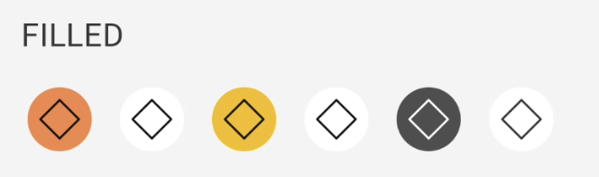
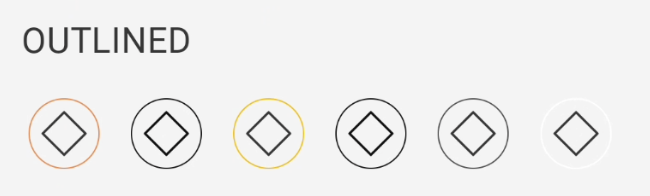
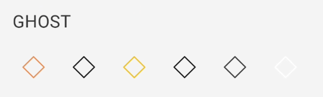
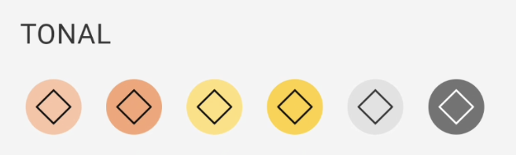
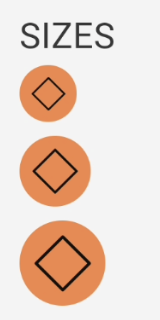
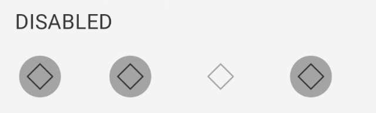
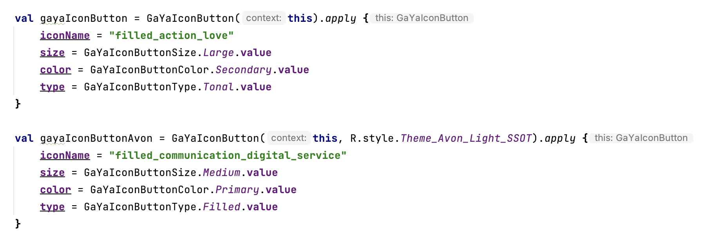

# Guia de Uso - GaYaIconButton

> 📢 O GaYaIconButton faz parte da evolução contínua de componentes do GaYa Design System. Ele foi lançado como um novo componente mas o antigo IconButton permanece disponível para uso mas não receberá mais atualizações ou suporte ativo. Encorajamos a migração para o GaYaIconButton o quanto antes para aproveitar as melhorias e garantir compatibilidade futura.


## Visão Geral

O componente `GaYaIconButton` ajuda as pessoas a realizarem pequenas ações com um único toque.

| Prop Figma       | Prop XML       | Valores                                                      | Status            |
| -------------- |  --------------    |    -------------------------                                 |  ----------------- |
| Variant        | gibt_type              | filled, outlined, ghost, tonal                               | ✅  Disponível       |
| Colors         | gibt_color              | primary, onPrimary, secondary, onSecondary, inverse, neutral | ✅  Disponível       |
| Icon           | gibt_iconName    | -                                                  | ✅  Disponível       |
| Sizes          | gibt_size               | small, medium, large                                         | ✅  Disponível       |
| Disabled       | enabled          | True, False                                                  | ✅  Disponível       |
| Switch de temas       | Switch de temas          | Todos os temas já disponibilidados                                                 | ✅  Disponível       |


### Changelog

Para acompanhar a evolução deste e de outros componentes acesse: [https://github.com/natura-cosmeticos/natds-android/blob/main/CHANGELOG.md](https://github.com/natura-cosmeticos/natds-android/blob/main/CHANGELOG.md)

### Como Usar

Para começar a usar o `GaYaIconButton`, siga as instruções abaixo para configurar os diferentes estilos e funcionalidades.

## Estilos de Botão

**1. Filled**

<p align="center">
   
</p>

   - **Código**:
     ```xml
     <com.natura.android.iconButton.GaYaIconButton
        android:layout_width="wrap_content"
        android:layout_height="wrap_content"
        app:gibt_iconName="outlined_default_mockup"
        app:gibt_type="filled"/>
     ```

**2. Outlined**

<p align="center">
   
</p>

   - **Código**:
     ```xml
      <com.natura.android.iconButton.GaYaIconButton
          android:layout_width="wrap_content"
          android:layout_height="wrap_content"
          app:gibt_iconName="outlined_default_mockup"
          app:gibt_type="outlined"/>
     ```

**3. Ghost**

<p align="center">
   
</p>

   - **Código**:
     ```xml
       <com.natura.android.iconButton.GaYaIconButton
          android:layout_width="wrap_content"
          android:layout_height="wrap_content"
          app:gibt_iconName="outlined_default_mockup"
          app:gibt_type="ghost"/>
     ```
     
**4. Tonal**

<p align="center">
   
</p>

   - **Código**:
     ```xml
       <com.natura.android.iconButton.GaYaIconButton
          android:layout_width="wrap_content"
          android:layout_height="wrap_content"
          app:gibt_iconName="outlined_default_mockup"
          app:gibt_type="tonal"/>
     ```

## Cores

**1. Primary**
   - **Código**:
     ```xml
     app:gibt_color="primary"
     ```

**2. OnPrimary**
   - **Código**:
     ```xml
     app:gibt_color="onPrimary"
     ```

**3. Secondary**
   - **Código**:
     ```xml
     app:gibt_color="secondary"
     ```
     
**4. OnSecondary**
   - **Código**:
     ```xml
     app:gibt_color="onSecondary"
     ```

**5. Inverse**
   - **Código**:
     ```xml
     app:gibt_color="inverse"
     ```

**6. Neutral**
   - **Código**:
     ```xml
     app:gibt_color="neutral"
     ```

## Tamanho e Ativação

**Tamanhos Disponíveis**

<p align="center">
   
</p>

   - **Small, Medium e Large**
     - Ajuste o tamanho para adequar-se ao contexto de uso.
     
     ```xml
      <com.natura.android.iconButton.GaYaIconButton
          android:layout_width="wrap_content"
          android:layout_height="wrap_content"
          app:gibt_color="primary"
          app:gibt_iconName="outlined_default_mockup"
          app:gibt_size="small"
          app:gibt_type="filled"/>
  
      <com.natura.android.iconButton.GaYaIconButton
          android:layout_width="wrap_content"
          android:layout_height="wrap_content"
          app:gibt_color="primary"
          app:gibt_iconName="outlined_default_mockup"
          app:gibt_size="medium"
          app:gibt_type="filled"/>
  
      <com.natura.android.iconButton.GaYaIconButton
          android:layout_width="wrap_content"
          android:layout_height="wrap_content"
          app:gibt_color="primary"
          app:gibt_iconName="outlined_default_mockup"
          app:gibt_size="large"
          app:gibt_type="filled"/>

     ```

**Ativação**

<p align="center">
   
</p>

   - **Habilitar/Desabilitar Botão**
     - Gerencie se o botão pode ser interagido pelo usuário.
     
     ```xml
      <com.natura.android.iconButton.GaYaIconButton
          android:layout_width="wrap_content"
          android:layout_height="wrap_content"
          app:gibt_iconName="outlined_default_mockup"
          android:enabled="false"
          app:gibt_type="filled"/>
     ```

## Programaticamente

**Criando o GaYaIconButton dinamicamente**

<p align="center">
   
</p>

   - **Descrição**: Você pode criar o GaYaIconButton de forma programática e com todas as propriedades existentes.
     ```kotlin
     val gayaIconButton = GaYaIconButton(this).apply {
            iconName = "filled_action_love"
            size = GaYaIconButtonSize.Large.value
            color = GaYaIconButtonColor.Secondary.value
            type = GaYaIconButtonType.Tonal.value
        }
     ```

## Mudança de temas

 - Utilize o Switch de Temas, mesmo usando um tema padrão, com outro tema no mesmo contexto

<p align="center">
   
</p>   

```kotlin
    val gayaIconButtonAvon = GaYaIconButton(this, R.style.Theme_Avon_Light_SSOT).apply {
        iconName = "filled_communication_digital_service"
        size = GaYaIconButtonSize.Medium.value
        color = GaYaIconButtonColor.Primary.value
        type = GaYaIconButtonType.Filled.value
    }
```
