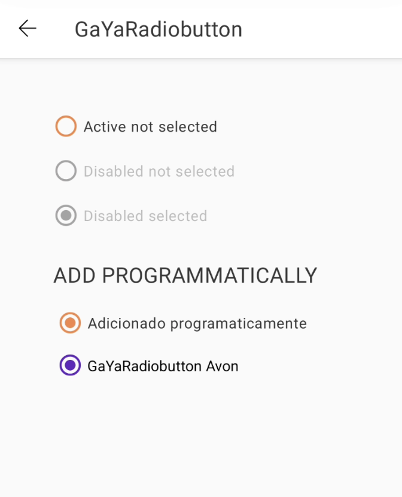

# Guia de Uso - GaYaRadiobutton

> 📢 O GaYaRadiobutton faz parte da evolução contínua de componentes do GaYa Design System. Ele foi lançado como um novo componente mas o antigo RadioButton permanecerá disponível para uso mas não receberá mais atualizações ou suporte ativo. Encorajamos a migração para o GaYaRadiobutton o quanto antes para aproveitar as melhorias e garantir compatibilidade futura.


## Visão Geral

O componente `GaYaRadiobutton` permite que os usuários escolham uma opção dentre um grupo de `GaYaRadiobutton`


| Prop Figma       | Prop XML       | Prop Kotlin       |  Valores                    | Status            |
| -------------- | -------------- | ------------------------- | ------------------------- | ----------------- |
| State          | android:enabled          | isEnabled          | True ou False | ✅  Disponível       |
| Disabled          | android:checked           | isChecked           | True ou False      | ✅  Disponível       |


### Versão disponível

9.30.2

### Changelog

Para acompanhar a evolução deste e de outros componentes acesse: [https://github.com/natura-cosmeticos/natds-android/blob/main/CHANGELOG.md](https://github.com/natura-cosmeticos/natds-android/blob/main/CHANGELOG.md)

### Como Usar

Para começar a usar o `GaYaRadiobutton`, siga as instruções abaixo para configurar as diferentes funcionalidades.

<p align="center">
   
</p>

```xml
    <com.natura.android.radiobutton.GaYaRadiobutton
        android:id="@+id/radioPrimary"
        android:layout_width="wrap_content"
        android:layout_height="wrap_content"
        android:text="Ativo"
        android:checked="true" />
```

```kotlin
    val gaYaRadiobutton = GaYaRadiobutton(this).apply {
        text = "Adicionado programaticamente"
        isChecked = true
        isEnabled = true
    }
```

## Cores

A cor padrão está atrelada ao tema utilizado e não está disponível para alterações por parte do usuário.

### Mudança de temas: mesmo usando um tema padrão, é possível utilizar outro tema em determinado componente

```kotlin
    val gaYaRadiobuttonAvon = GaYaRadiobutton(this, R.style.Theme_Avon_Light_SSOT).apply {
        text = "GaYaRadiobutton Avon"
        isChecked = true
        isEnabled = true
    }
```
