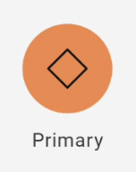
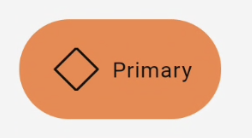
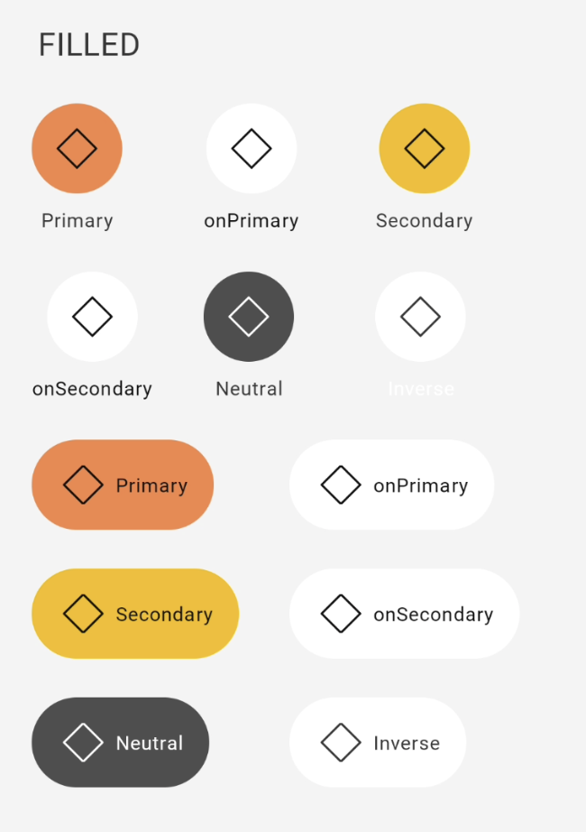
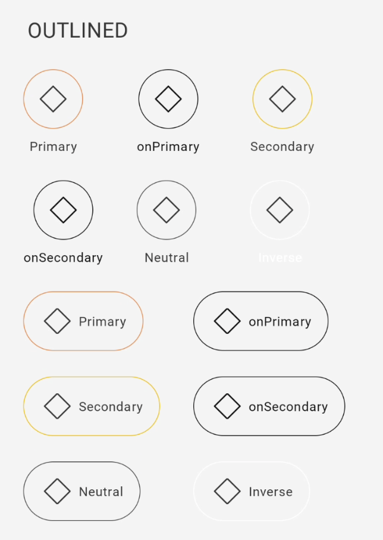
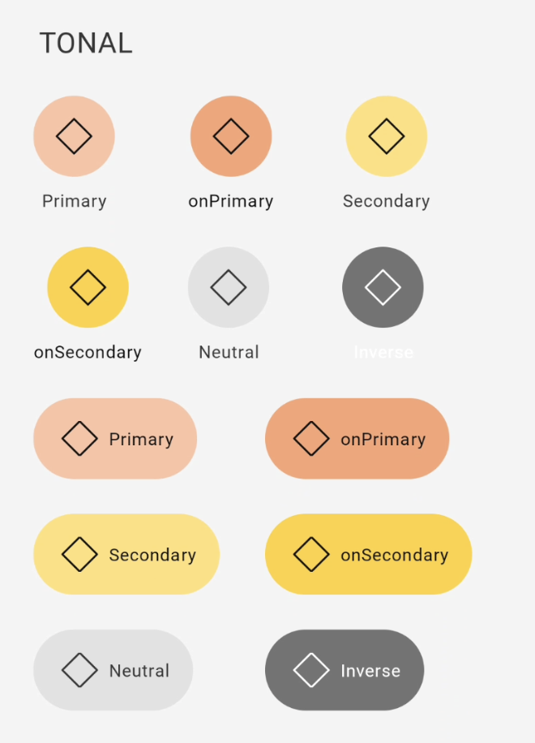
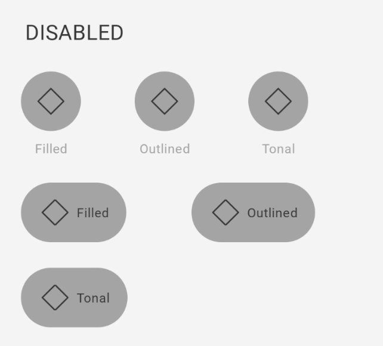
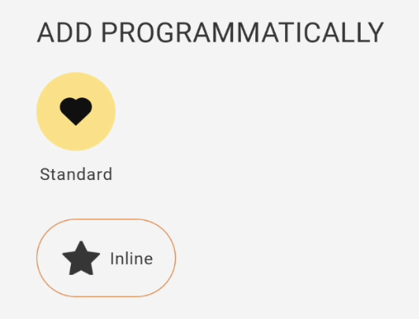

# Guia de Uso - GaYaShortcut

> 📢 O GaYaShortcut faz parte da evolução contínua de componentes do GaYa Design System. Ele foi lançado como um novo componente mas o antigo Shortcut, permaneceu disponível para uso mas não receberá mais atualizações ou suporte ativo. Encorajamos a migração para o GaYaShortcut o quanto antes para aproveitar as melhorias e garantir compatibilidade futura.


## Visão Geral

O componente `GaYaShortcut` permite que os usuários façam escolhas e executem ações com um simples toque. Este guia detalha as configurações disponíveis para personalizar de acordo com as necessidades do seu design.

| Prop Figma       | Prop XML       | Valores                                                      | Status            |
| -------------- |  --------------    |    -------------------------                                 |  ----------------- |
| gayaShortcut e gayaShortcutInline        | gshc_style              | standard, inline                               | ✅  Disponível       |
| Variant        | gshc_type              | filled, outlined, tonal                               | ✅  Disponível       |
| Colors         | gshc_color              | primary, onPrimary, secondary, onSecondary, inverse, neutral | ✅  Disponível       |
| Icon           | gshc_icon    | -                                                  | ✅  Disponível       |
| Label          | gshc_label               | -                                        | ✅  Disponível       |
| Disabled       | enabled          | True, False                                                  | ✅  Disponível       |


### Changelog

Para acompanhar a evolução deste e de outros componentes acesse: [https://github.com/natura-cosmeticos/natds-android/blob/main/CHANGELOG.md](https://github.com/natura-cosmeticos/natds-android/blob/main/CHANGELOG.md)

### Como Usar

Para começar a usar o `GaYaShortcut`, siga as instruções abaixo para configurar os diferentes estilos e funcionalidades.

## Style

**1. Standard**

<p align="center">
   
</p>

   - **Código**:
     ```xml
    <com.natura.android.shortcut.GaYaShortcut
        android:layout_width="wrap_content"
        android:layout_height="wrap_content"
        app:gshc_style="standard"
        app:gshc_icon="outlined_default_mockup"
        app:gshc_label="Standard"/>
     ```

**2. Inline**

<p align="center">
   
</p>

   - **Código**:
     ```xml
    <com.natura.android.shortcut.GaYaShortcut
        android:layout_width="wrap_content"
        android:layout_height="wrap_content"
        app:gshc_style="inline"
        app:gshc_icon="outlined_default_mockup"
        app:gshc_label="Inline"/>
     ```


## Tipos

**1. Filled**

<p align="center">
   
</p>

   - **Código**:
     ```xml
    <com.natura.android.shortcut.GaYaShortcut
        android:layout_width="wrap_content"
        android:layout_height="wrap_content"
        app:gshc_icon="outlined_default_mockup"
        app:gshc_label="Primary"
        app:gshc_type="filled"/>
     ```

**2. Outlined**

<p align="center">
   
</p>

   - **Código**:
     ```xml
    <com.natura.android.shortcut.GaYaShortcut
        android:layout_width="wrap_content"
        android:layout_height="wrap_content"
        app:gshc_icon="outlined_default_mockup"
        app:gshc_label="Primary"
        app:gshc_type="outlined"/>
     ```
     
**3. Tonal**

<p align="center">
   
</p>

   - **Código**:
     ```xml
    <com.natura.android.shortcut.GaYaShortcut
        android:layout_width="wrap_content"
        android:layout_height="wrap_content"
        app:gshc_icon="outlined_default_mockup"
        app:gshc_label="Primary"
        app:gshc_type="tonal"/>
     ```

## Cores

**1. Primary**
   - **Código**:
     ```xml
     app:gshc_color="primary"
     ```

**2. OnPrimary**
   - **Código**:
     ```xml
     app:gshc_color="onPrimary"
     ```

**3. Secondary**
   - **Código**:
     ```xml
     app:gshc_color="secondary"
     ```
     
**4. OnSecondary**
   - **Código**:
     ```xml
     app:gshc_color="onSecondary"
     ```

**5. Inverse**
   - **Código**:
     ```xml
     app:gshc_color="inverse"
     ```

**6. Neutral**
   - **Código**:
     ```xml
     app:gshc_color="neutral"
     ```


## Ativação


**Ativação**

<p align="center">
   
</p>

   - **Habilitar/Desabilitar Botão**
     
     ```xml
         android:enabled="false"
     ```

## Programaticamente

**Criando o GaYaShortcut dinamicamente**

<p align="center">
   
</p>

   - **Descrição**: Você pode criar o GaYaButton de forma programática e com todas as propriedades existentes.
     ```kotlin
     val gayaShortcut = GaYaShortcut(this).apply {
            iconName = "filled_action_love"
            color = GaYaShortcutColor.Secondary.value
            type = GaYaShortcutType.Tonal.value
            label = "Standard"
        }

        val gayaShortcutInline = GaYaShortcut(this).apply {
            iconName = "filled_action_rating"
            color = GaYaShortcutColor.Primary.value
            type = GaYaShortcutType.Outlined.value
            style = GaYaShortcutStyle.Inline.value
            label = "Inline"
        }
     ```

     
