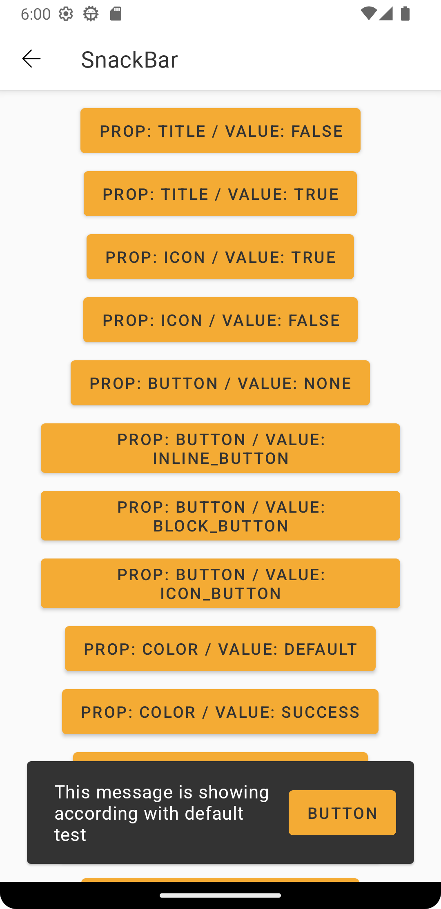

# Guia de Uso - GaYaSnackbar

> 📢 O GaYaSnackbar faz parte da evolução contínua de componentes do GaYa Design System. Ele foi lançado como um novo componente mas o antigo Snackbar permanece disponível para uso mas não receberão mais atualizações ou suporte ativo. Encorajamos a migração para o GaYaSnackbar o quanto antes para aproveitar as melhorias e garantir compatibilidade futura.

## Visão Geral

O componente `GaYaSnackbar` é essencial para fornecer mensagens breves sobre os processos do aplicativo. Este guia detalha as configurações disponíveis para personalizar o GaYaSnackbar de acordo com as necessidades do seu design de interface.


## Properties

| Prop Figma       | Prop Kotlin       | Valores                                                      | Status            |
| -------------- |  --------------    |    -------------------------                                 |  ----------------- |
| Variant        | -              | -                              | ✅  Disponível       |
| Title         | title              | true, false | ✅  Disponível       |
| Icon           | icon    | true, false      | ✅  Disponível       |
| Action Button          | mainButtonType               | None, Inline, Block, Icon Button     | ✅  Disponível       |
| Feedback (color)       | color          | Default, Success, Error, Warning, Info     | ✅  Disponível       |
| Timer        | timerType                  | Minimum, Intermediary, Indeterminated, Custom                    | ✅  Disponível  |
| Position | positionType                  | Top center, Bottom center                                          | ✅  Disponível  |
| Animation | animationType                  | False, Right, Left, Center Bottom, Center Top                                           | ✅  Disponível  |

<br>

## Como Usar

> Este componente não tem Xml atributos, somente em view code com Kotlin

<br><br>

<p align="center">
   
&nbsp;
  
</p>

<br>

```android
   showGaYaSnackbar(binding.root) {
      mainView = binding.root,
      message = "This message is showing according with default test",
      mainButtonTitle = "Button",
      mainButtonAction = {
        Toast.makeText(this,"SnackBar main button clicked",Toast.LENGTH_SHORT).show()
      },
      mainButtonType = SnackbarActionButtonType.INLINE_BOTTON,
   }
```

<br><br>

##### Title

<p align="center">
   
</p>

```android
   title = "Title",
   showTitle = true,
```

<br>

##### Icon

<p align="center">
   
</p>

```android
   showIcon = true,
   iconName = iconNameProp
```

<br>

##### Button

<p align="center">
   
</p>

```android
   mainButtonTitle = "Button",
   mainButtonAction = {
     Toast.makeText(this,"GaYaSnackBar main button clicked",Toast.LENGTH_SHORT).show()
   },
   mainButtonType = GaYaSnackbarActionButtonType.INLINE_BOTTON
```

<br>

##### Color

<p align="center">
   
</p>

```android
   color = GaYaSnackbarColorType.SUCCESS
```

<br>

##### Position

<p align="center">
   
</p>

```android
   animation = true,
   positionType = GaYaSnackbarPositionType.TOP_CENTER,
   animationType = GaYaSnackbarAnimationtype.NONE
```

<br>

##### Animation

```android
   animationType = GaYaSnackbarAnimationtype.CENTER
```

<br>

##### Timer

```android
   timerType = GaYaSnackbarTimerType.MINIMUM
```


<br>

## More code

You can check out more examples from SampleApp by
clicking [here](https://github.com/natura-cosmeticos/natds-android/tree/master/sample/src/main/res/layout/activity_select.xml)
