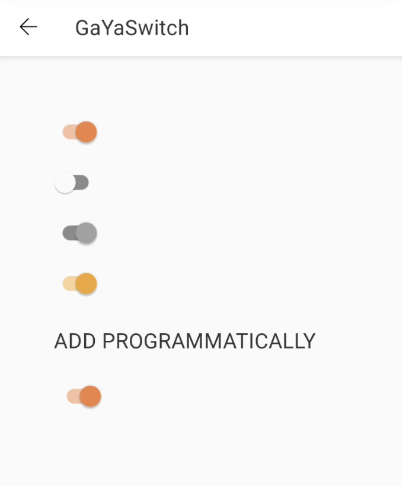

# Guia de Uso - GaYaSwitch

> 📢 O GaYaSwitch faz parte da evolução contínua de componentes do GaYa Design System. Ele foi lançado como um novo componente


## Visão Geral

O componente `GaYaSwitch` permite que os usuários habilitem ou desabilitem uma ação de maneira prática e rápida


| Prop Figma       | Prop XML       | Prop Kotlin       |  Valores                    | Status            |
| -------------- | -------------- | ------------------------- | ------------------------- | ----------------- |
| State          | android:enabled          | isEnabled          | True ou False | ✅  Disponível       |
| Disabled          | android:checked           | isChecked           | True ou False      | ✅  Disponível       |


### Versão disponível

9.30.2

### Changelog

Para acompanhar a evolução deste e de outros componentes acesse: [https://github.com/natura-cosmeticos/natds-android/blob/main/CHANGELOG.md](https://github.com/natura-cosmeticos/natds-android/blob/main/CHANGELOG.md)

### Como Usar

Para começar a usar o `GaYaSwitch`, siga as instruções abaixo para configurar as diferentes funcionalidades.

<p align="center">
   
</p>

```xml
    <com.natura.android.switch.GaYaSwitch
        android:layout_width="wrap_content"
        android:layout_height="wrap_content"
        android:checked="true"
        android:enabled="false"
        />
```

```kotlin
    val gaYaSwitch = GaYaSwitch(this).apply {
        isChecked = true
        isEnabled = true
    }
```

## Cores

A cor padrão está atrelada ao tema utilizado e não está disponível para alterações por parte do usuário.

### Mudança de temas: mesmo usando um tema padrão, é possível utilizar outro tema em determinado componente

```kotlin
    val gaYaSwitchAvon = GaYaSwitch(this, R.style.Theme_Avon_Light_SSOT).apply {
        isChecked = true
        isEnabled = true
    }
```
