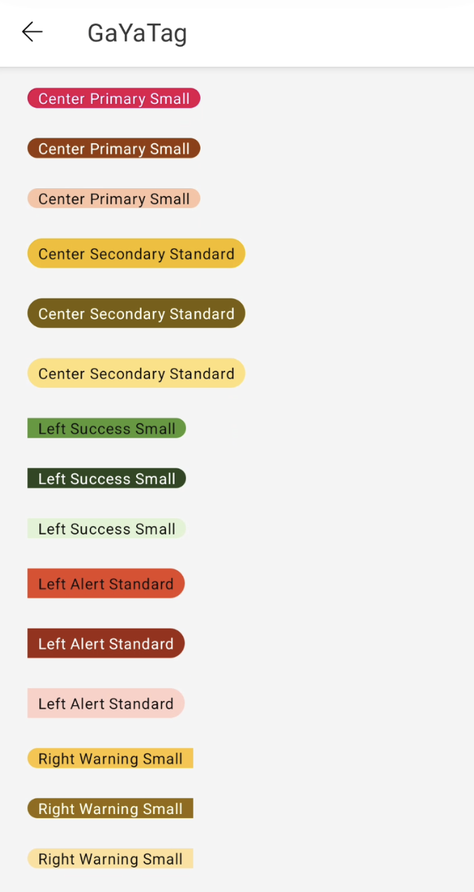
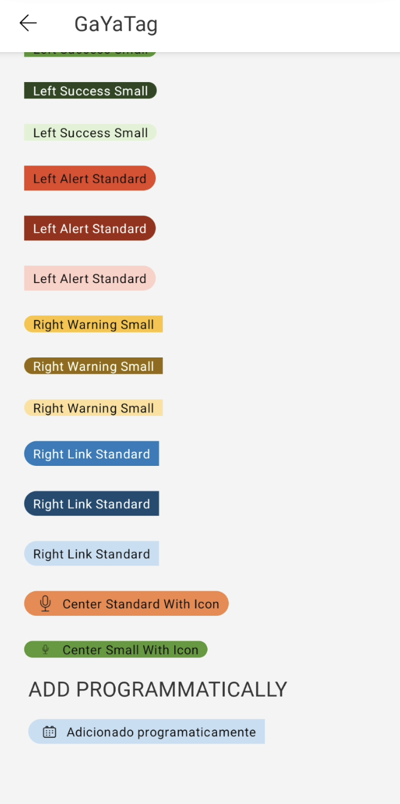

# Guia de Uso - GaYaTag

> 📢 O GaYaTag faz parte da evolução contínua de componentes do GaYa Design System. Ele foi lançado como um novo componente mas o antigo Tag permanecerá disponível para uso mas não receberá mais atualizações ou suporte ativo. Encorajamos a migração para o GaYaTag o quanto antes para aproveitar as melhorias e garantir compatibilidade futura.


## Visão Geral

O componente `GaYaTag` permite que os usuários rotulem, categorizem ou organizem itens usando palavras-chave que os descrevem.


| Prop Figma       | Prop XML       | Prop Kotlin       |  Valores                    | Status            |
| -------------- | -------------- | ------------------------- | ------------------------- | ----------------- |
| Colors          | gtag_color          | color          |  Primary, PrimaryDarkest, PrimaryLightest, Secondary, SecondaryDarkest, SecondaryLightest, Alert, AlertDarkest, AlertLightest, Success, SuccessDarkest, SuccessLightest, Warning, WarningDarkest, WarningLightest, Info, InfoDarkest, InfoLightest | ✅  Disponível       |
| Size          | gtag_size           | size           | Small, Standard      | ✅  Disponível       |
| Position          | gtag_position      | position           | center, right, left               | ✅  Disponível       |
| Icon          | gtag_icon           | icon           | -         | ✅  Disponível       |
| Label          | gtag_label          | label           | Texto | ✅  Disponível       |

### Changelog

Para acompanhar a evolução deste e de outros componentes acesse: [https://github.com/natura-cosmeticos/natds-android/blob/main/CHANGELOG.md](https://github.com/natura-cosmeticos/natds-android/blob/main/CHANGELOG.md)

### Como Usar

Para começar a usar o `GaYaTag`, siga as instruções abaixo para configurar os diferentes estilos e funcionalidades.

<p align="center">
   
   
</p>

```xml
    <com.natura.android.tag.GaYaTag
        android:id="@+id/tagSmallWithIcon"
        android:layout_width="wrap_content"
        android:layout_height="wrap_content"
        android:layout_marginTop="?spacingStandard"
        app:gtag_icon="outlined_action_mic"
        app:gtag_position="center"
        app:gtag_size="small"
        app:gtag_color="success"
        app:gtag_label="Center Small With Icon" />
```

```kotlin
    val gayaTag = GaYaTag(this).apply {
        label = "Adicionado programaticamente"
        color = GaYaTagColor.InfoLightest.value
        size = GaYaTagSize.Standard.value
        icon = "outlined_action_calendar"
        position = GaYaTagPosition.Right.value
    }
```
