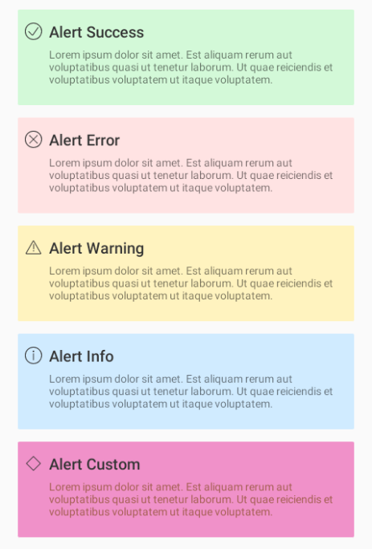
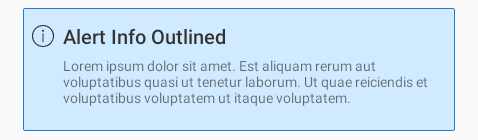

# Alert

### Difference of Snackbar and Alert

#### Alert
Alert is an element within the context of the page (like a disclaimer, a highlighted information box) without interaction.

#### Snackbar
The Snackbar is something temporary about the content of the page (like a notification) that can have the action of dismiss, or a CTA.

<br>


## Properties

| Property           | Values                         | Status            |
| --------------     | -------------------------      | ----------------- |
| Title             | True, False                          | ✅  Available     |
| Icon          | True, False   | ✅  Available     |
| Type         | Contained, Outlined       | ✅  Available     |
| Color          | Success, Warning, Info, Error, Custom                    | ✅  Available     |

<br>

## Technical Usages Examples
> All codes are available for Android with XML Layout.

<br>



#### Layout XML

```android
    <com.natura.android.alert.Alert
        android:layout_width="match_parent"
        android:layout_height="wrap_content"
        app:show_title="true"
        app:title_text="Alert Success"
        app:show_icon="true"
        app:iconName="outlined_alert_check"
        app:alert_type="contained"
        app:alert_color="success" />
```

<br><br>

### Title


```android
    <com.natura.android.alert.Alert
        android:layout_width="match_parent"
        android:layout_height="wrap_content"
        app:show_title="false"
        app:show_icon="true"
        app:iconName="outlined_alert_info"
        app:alert_type="contained"
        app:alert_color="info"/>
```

### Icon


```android
    <com.natura.android.alert.Alert
        android:layout_width="match_parent"
        android:layout_height="wrap_content"
        app:show_title="true"
        app:title_text="Alert Only Title"
        app:show_icon="false"
        app:alert_type="contained"
        app:alert_color="info"/>
```

<br>

### Type



```android
    <com.natura.android.alert.Alert
        android:layout_width="match_parent"
        android:layout_height="wrap_content"
        app:show_title="true"
        app:title_text="Alert Info Outlined"
        app:show_icon="true"
        app:iconName="outlined_alert_info"
        app:alert_type="outlined"
        app:alert_color="info"/>
```

<br>

## More code
You can check out more examples from SampleApp by clicking [here](https://github.com/natura-cosmeticos/natds-android/tree/master/sample/src/main/res/layout/activity_alert.xml).
