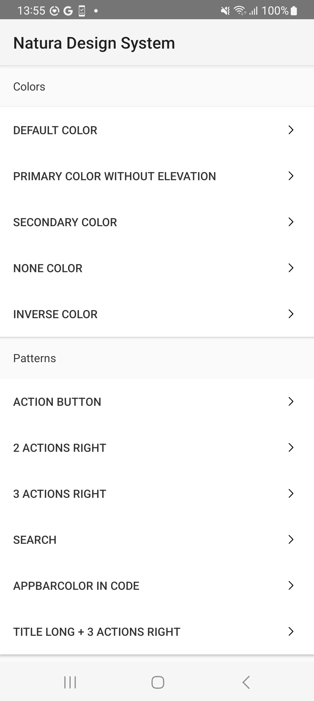
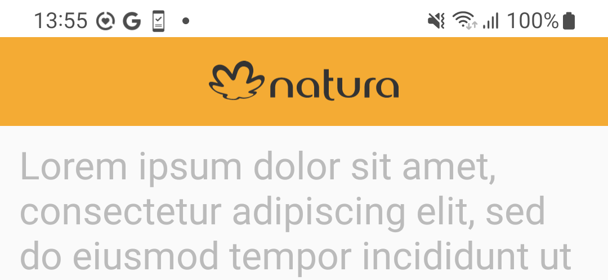
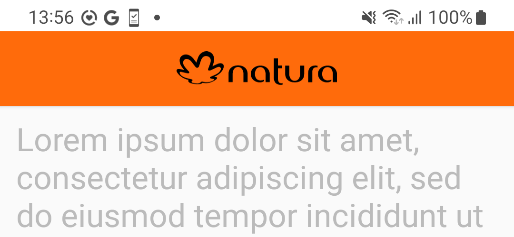
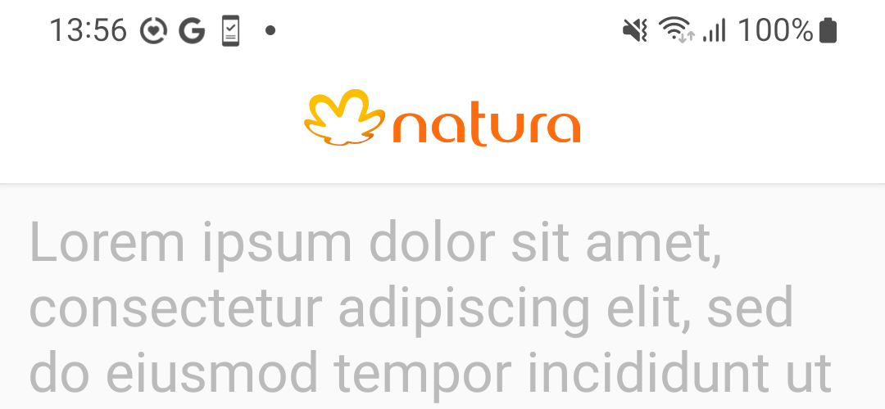
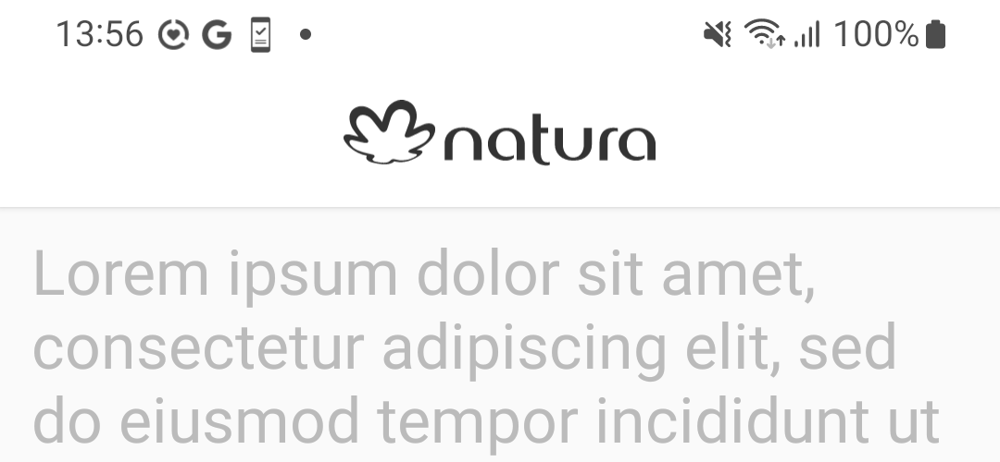
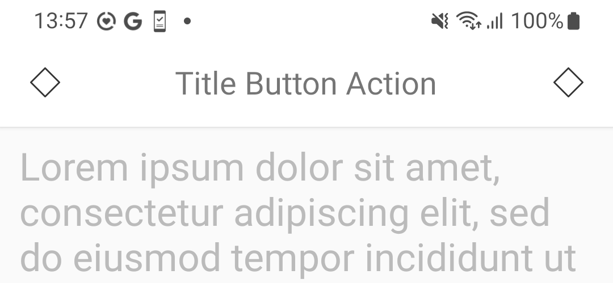
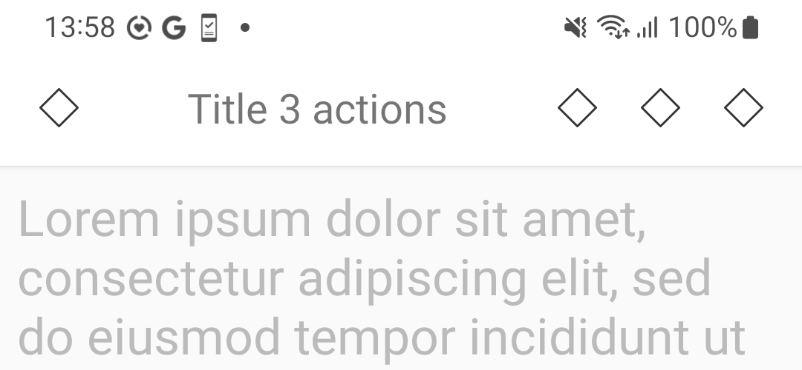
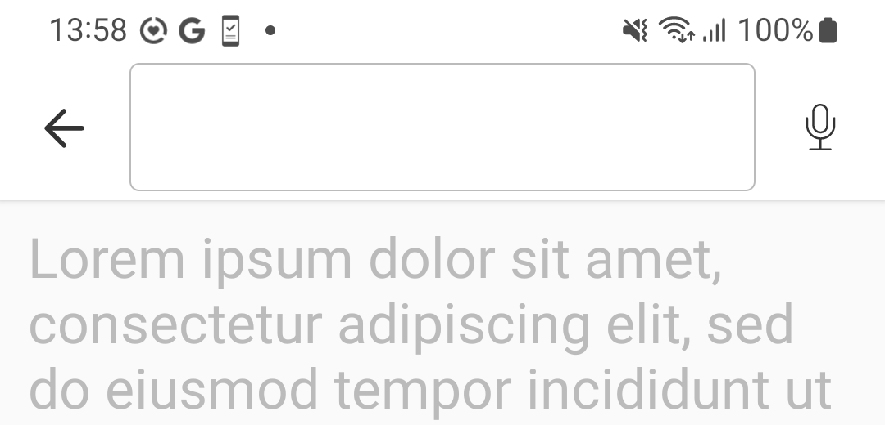
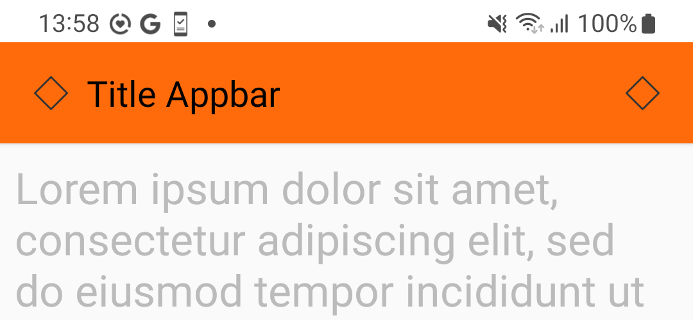
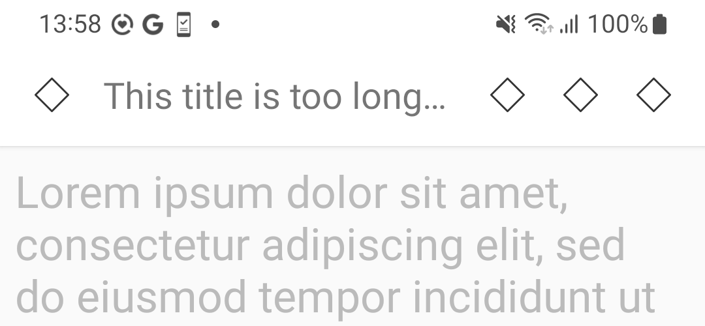

# App Bar Top

> The top app bar displays information and actions relating to the current screen

<br>

## Properties:

| Property           | Values                         | Status            |
| --------------     | -------------------------      | ----------------- |
| Elevation             | True, False                          | ✅  Available     |
| Color          | Primary, Secondary, Default, Inverse   | ✅  Available     |
| Action Right         | -        | ✅  Available     |
| Action Left         | -        | ✅  Available     |
| Content Position         | Left, Center        | ✅  Available     |
| Content Type         | Text, Media, Search        | ✅  Available     |
| Content Proeminent         | True, False        | 🗂️  Backlog     |
 

<br>
      
## Technical Usages Examples

<br><br>

<p align="center">
   
&nbsp; &nbsp; &nbsp; 
  
&nbsp; &nbsp; &nbsp; 
  
 &nbsp; &nbsp;&nbsp; &nbsp;&nbsp; &nbsp;&nbsp; &nbsp;&nbsp; &nbsp;&nbsp; &nbsp;&nbsp; &nbsp;&nbsp; &nbsp;&nbsp; &nbsp;
</p>
<br>

<p align="center">
   
&nbsp; &nbsp; &nbsp; 
  
&nbsp; &nbsp; &nbsp; 
  
 &nbsp; &nbsp;&nbsp; &nbsp;&nbsp; &nbsp;&nbsp; &nbsp;&nbsp; &nbsp;&nbsp; &nbsp;&nbsp; &nbsp;&nbsp; &nbsp;&nbsp; &nbsp;
</p>
<br>
<p align="center">
   
&nbsp; &nbsp; &nbsp; 
  
&nbsp; &nbsp;&nbsp; 
  
  &nbsp; &nbsp;&nbsp; &nbsp;&nbsp; &nbsp;&nbsp; &nbsp;&nbsp; &nbsp;&nbsp; &nbsp;&nbsp; &nbsp;&nbsp; &nbsp;&nbsp; &nbsp;
</p>
<br>
<p align="center">
   
&nbsp; &nbsp; &nbsp; 
  
  &nbsp; &nbsp;&nbsp; &nbsp;&nbsp; &nbsp;&nbsp; &nbsp;&nbsp; &nbsp;&nbsp; &nbsp;&nbsp; &nbsp;&nbsp; &nbsp;&nbsp; &nbsp;
</p>

<br>

### How to use it?
Add the app bar component in your xml layout file
Important! Do not use the default theme, use the NoActionBar variant. You can check more info [Getting Started guide](../README.md).
```android
        <com.natura.android.appbartop.StandardAppBarTop
                   android:id="@+id/appBar"
                   android:layout_width="match_parent"
                   android:layout_height="wrap_content"
                   android:theme="?toolbarDefaultTheme"
                   app:actionLeft="true"
                   app:actionRight="true"
                   app:appBarColor="colorDefault"
                   app:contentPosition="center"
                   app:contentText="Title Page Center"
                   app:contentType="text"
                   app:enabledElevation="true"
                   app:proeminentContent="false"
                   app:scrollable="true">
       
                   <com.natura.android.iconButton.IconButton
                       android:id="@+id/buttonActionViewIconButtonActionRight"
                       android:layout_width="wrap_content"
                       android:layout_height="wrap_content"
                       android:layout_gravity="center_vertical"
                       app:buttonColor="defaultColor"
                       app:iconName="outlined_default_mockup"
                       app:sizeButton="semi"
                       app:styleButton="inherit" />
       
                   <Button
                       android:id="@+id/buttonActionViewOutlinedButtonActionRight"
                       style="?textButton"
                       android:layout_width="wrap_content"
                       android:layout_height="wrap_content"
                       android:minWidth="?sizeHuge"
                       android:text="DEFAULT" />
               </com.natura.android.appbartop.StandardAppBarTop>
```

<br>

## More code
You can check out more examples from SampleApp by clicking [AppBar Top Example](https://github.com/natura-cosmeticos/natds-android/tree/master/sample/src/main/res/layout/appbartop_button_action.xml).

