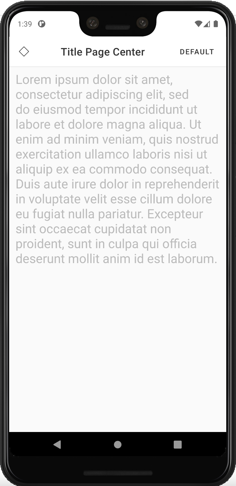
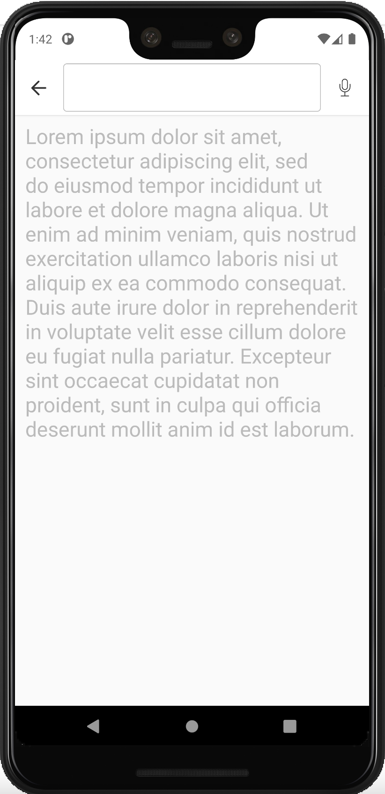
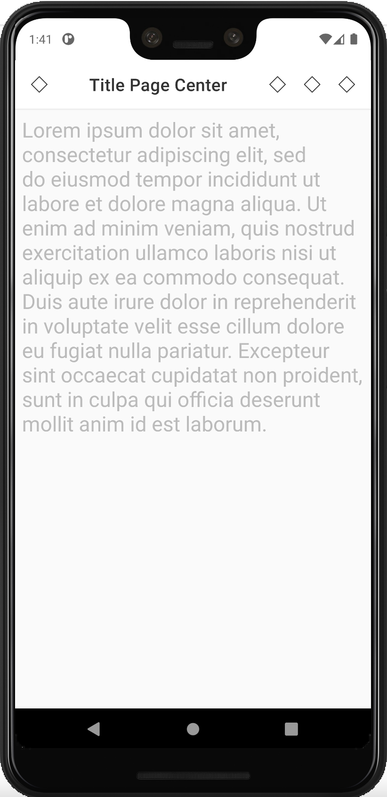
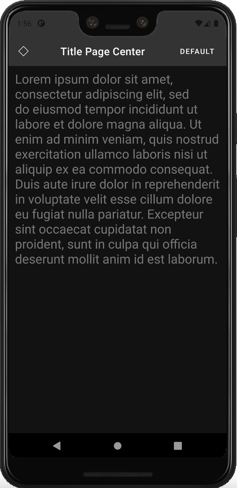
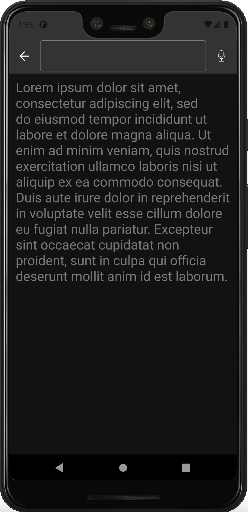
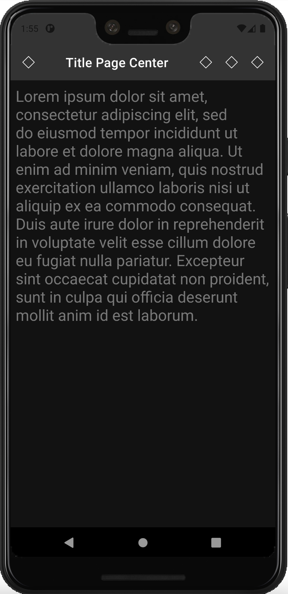

# App Bar Top

<p align="center">
   
&nbsp; &nbsp; 
  
&nbsp; &nbsp;
  
  afsdfas&nbsp; &nbsp;&nbsp; &nbsp;&nbsp; &nbsp;&nbsp; &nbsp;&nbsp; &nbsp;&nbsp; &nbsp;&nbsp; &nbsp;&nbsp; &nbsp;&nbsp; &nbsp;
fadsfas
</p>


<p align="center">
  
&nbsp; &nbsp;
  
&nbsp; &nbsp; 
  
</p>

### How to use it?
Add the app bar component in your xml layout file
Important! Do not use the default theme, use the NoActionBar variant. You can check more info [Getting Started guide](getting-started.md).
```android
        <com.natura.android.appbartop.StandardAppBarTop
                   android:id="@+id/appBar"
                   android:layout_width="match_parent"
                   android:layout_height="wrap_content"
                   android:theme="?toolbarDefaultTheme"
                   app:actionLeft="true"
                   app:actionRight="true"
                   app:appBarColor="colorDefault"
                   app:contentPosition="center"
                   app:contentText="Title Page Center"
                   app:contentType="text"
                   app:enabledElevation="true"
                   app:proeminentContent="false"
                   app:scrollable="true">
       
                   <com.natura.android.iconButton.IconButton
                       android:id="@+id/buttonActionViewIconButtonActionRight"
                       android:layout_width="wrap_content"
                       android:layout_height="wrap_content"
                       android:layout_gravity="center_vertical"
                       app:buttonColor="defaultColor"
                       app:iconName="outlined_default_mockup"
                       app:sizeButton="semi"
                       app:styleButton="inherit" />
       
                   <Button
                       android:id="@+id/buttonActionViewOutlinedButtonActionRight"
                       style="?textButton"
                       android:layout_width="wrap_content"
                       android:layout_height="wrap_content"
                       android:minWidth="?sizeHuge"
                       android:text="DEFAULT" />
               </com.natura.android.appbartop.StandardAppBarTop>
```
For more usage examples, access the code in the Sample App: [AppBar Top Example] (../sample/src/main/res/layout/appbartop_button_action.xml)


