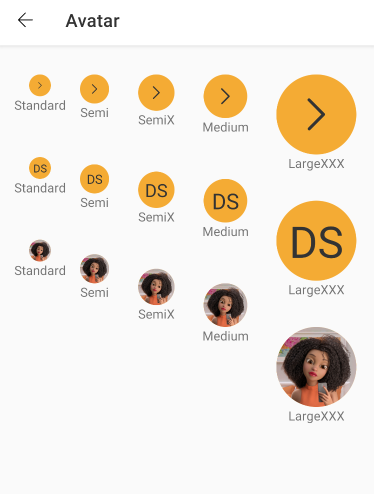

# Avatar Component

#### Note:

This component is available in the following variants:

* ✅ Standard

With the following attribute status:

* Size:
    * ✅ `Standard`
    * ✅ `Semi`
    * ✅ `SemiX`
    * ✅ `Medium` (default)
    * ✅ `LargeXXX`

* Type:
    * ✅ `Icon` (default)
    * ✅ `Label`
    * ✅ `Image`

* ✅ `avt_icon` (available only in Icon type)
* ✅ `avt_image` (available only in Image type)
* ✅ `avt_image_url` (available only in Image type)
* ✅ `avt_label` (available only in Label type)
* ✅ `avt_fallback_icon` (available only in Image type)
* ✅ `avt_fallback_label` (available only in Image type)
* ✅ `avt_content_description`

\
\
\



## What is it?

Avatar is a component that allows you to add images or identification of people and profiles in
applications.

### Why should I use it?

Because it has all the mechanism to display a profile ID

### How to use it?

Add the Avatar component in your xml layout file

```android
 <com.natura.android.avatar.Avatar
        android:id="@+id/standardAvatarWithIcon"
        android:layout_width="wrap_content"
        android:layout_height="wrap_content"
        app:avt_icon="@drawable/outlined_navigation_arrowleft"
        app:avt_size="standard" />
```

#### How are attributes defined?

`Size:`

```android
    
    app:avt_size="standard"` //standard, semi, semix, medium, largexxx
    
    avatarInActivity.size = Avatar.STANDARD_SIZE  //STANDARD_SIZE, SEMI_SIZE, SEMIX_SIZE, MEDIUM_SIZE, LARGE_SIZE

```

`Type:`

```android
    
    app:avt_size="icon"` //icon, label, image
    
    avatarInActivity.type = Avatar.ICON_TYPE  //ICON_TYPE, LABEL_TYPE, IMAGE_TYPE

````

`Icon:`

```android
    
    app:avt_icon="@drawable/yourIcon"`
    avatarInActivity.icon = R.drawable.yourIcon

```

`Local Image:`

```android
    
    app:avt_image="@drawable/yourImage"`
    avatarInActivity.icon = R.drawable.yourImage

```

`Url Image:`

```android
    
    app:avt_url_image="http://www.natura.com.br/yourimage.jpg"`
    avatarInActivity.icon = "http://www.natura.com.br/yourimage.jpg"

```

`Label:`

```android
    
    app:avt_label="Design System"`
    avatarInActivity.icon = "Design System"

```

`Fallback Icon:`

```android
    
    app:avt_fallback_icon="@drawable/yourIcon"`
    avatarInActivity.labelfallback = R.drawable.yourIcon

```

`Fallback Label:`

```android
    
    app:avt_fallback_label="Design System"`
    avatarInActivity.labelFallback = "Design System"

```

`Content Description:`

```android
    
    app:avt_content_description="Perfil de Design System"`
    avatarInActivity.labelFallback = "Perfil de Design System"

```


  

