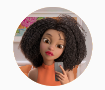
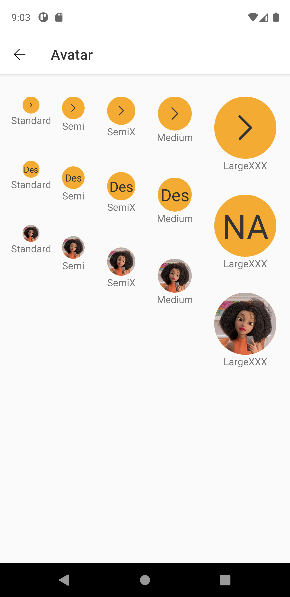
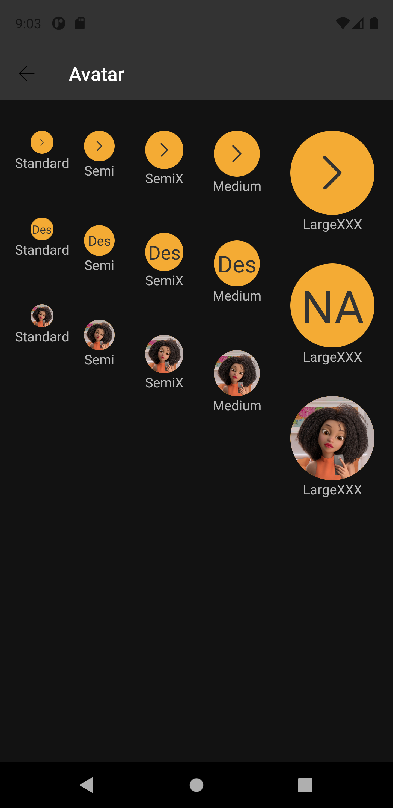

# Avatar
Avatar is a component that allows you to add images or identification of people and profiles in applications.  
Extends from [AbstractComposeView](https://developer.android.com/reference/kotlin/androidx/compose/ui/platform/AbstractComposeView).


This component is available in the following variants:

- ✅ **Standard**
   
With the following attribute statuses:

- **Size**:
  - ✅ `Standard`
  - ✅ `Semi`
  - ✅ `Semix`
  - ✅ `Medium`
  - ✅ `Largexxx`
- **Type**:
  - ✅ `Icon`
  - ✅ `Label`
  - ✅ `Image`
- **Fallback**:
  - ✅ `Icon`
  - ✅ `Label`

## Attributes
| Attr | Description | Type | Options |
| - | --- | --- | --- |
|`app:avt_type`|  Defines the component type based on its main content.| string | icon, label or image |
|`app:avt_size`| Sets the component size.| string | standard, semi, semix, medium or largexxx |
|`app:avt_icon`| Receives an icon to be displayed in the component. | drawable | image (drawable)
|`app:avt_image`| Receives an image to be displayed in the component. |drawable | image (drawable)
|`app:avt_label`| Defines the component label. | string | text
|`app:avt_image_url`| Receives an image from web to be displayed in the component. | PNG/JPG | image
|`app:avt_fallback_icon`| Sets an icon to be displayed when the image fails to load. | drawable | image (drawable)
|`app:avt_fallback_label`| Sets an label to be displayed when the image fails to load. | string | text
|`app:avt_content_description`| Defines the component description for screen readers (accessibility). | string | text

## Usage examples
Avatar with icon and semix size


#### Layout XML

```android
    <com.natura.android.avatar.Avatar
        android:id="@+id/avatar
        android:layout_width="wrap_content"
        android:layout_height="wrap_content"
        app:avt_icon="@drawable/outlined_navigation_arrowleft"
        app:avt_size="semix" />
```

#### Kotlin

```kotlin
    val avatar = findViewById<Avatar>(R.id.avatar)
    avatar.size = Avatar.STANDARD_SIZE
    avatar.icon = R.drawable.outlined_navigation_arrowleft
```
<br><br>
Avatar with label and medium size


#### Layout XML

```android
    <com.natura.android.avatar.Avatar
        android:id="@+id/avatar
        android:layout_width="wrap_content"
        android:layout_height="wrap_content"
        app:avt_label="Design System"
        app:avt_type="label" />
```

#### Kotlin

```kotlin
    val avatar = findViewById<Avatar>(R.id.avatar)
    avatar.size = Avatar.MEDIUM_SIZE
    avatarInActivity.label = "Design System"
```
<br><br>

Avatar with image and largexxx size



#### Layout XML

```android
    <com.natura.android.avatar.Avatar
        android:id="@+id/avatar
        android:layout_width="wrap_content"
        android:layout_height="wrap_content"
        app:avt_image="@mipmap/nat_avatar"
        app:avt_size="largexxx"
        app:avt_type="image" />
```

#### Kotlin

```kotlin
    val avatar = findViewById<Avatar>(R.id.avatar)
    avatar.size = Avatar.LARGEXXX_SIZE
    avatar.image = R.drawable.nat_avatar
```
<br>

## Light mode / Dark mode

<p align="center">
   
&nbsp;
  
</p>

## More code
You can check out more examples from SampleApp by clicking [here](../sample/src/main/res/layout/activity_avatar.xml).

## Attention points

1. A avatar is a DS component based on DS **multibrand themes**. It means if you want to use a avatar in your app, you MUST set the DS theme on a view parent or in the avatar component itself. [Check more info about how to set DS themes in your app](../README.md).


  

