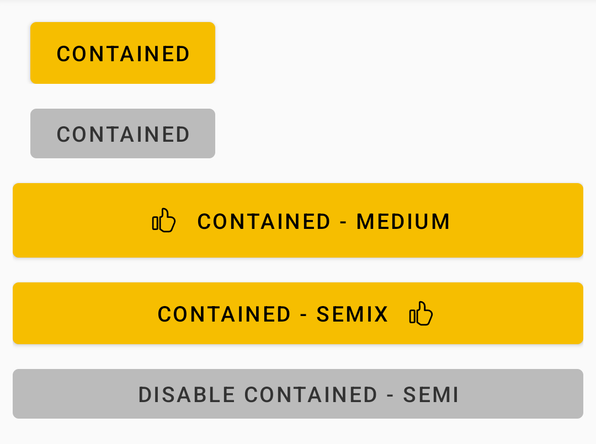
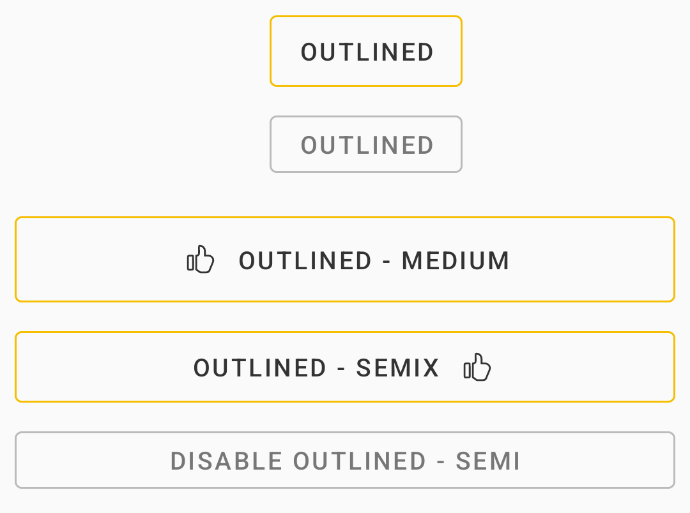
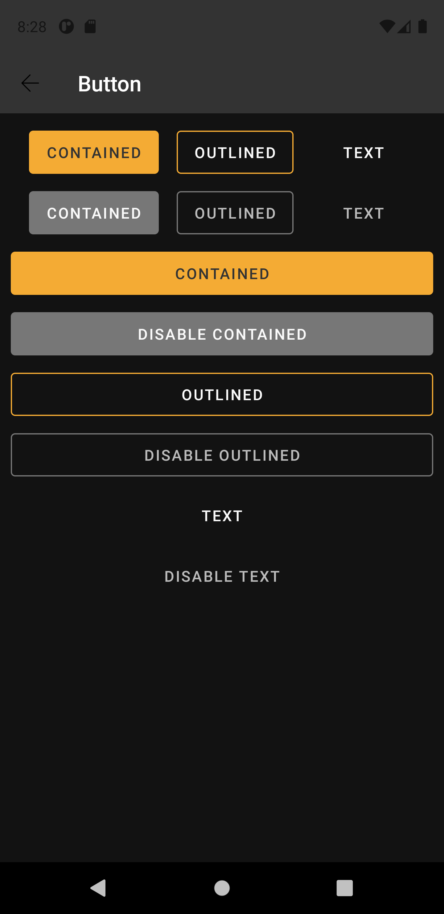

# Button
Buttons allow users to take actions, and make choices, with a single tap.

## Note for Design:

This component is available in the following styles:

- ✅ **Contained**
- ✅ **Outlined**
- ✅ **Text**

With the following attribute status:

- ✅ **Disabled**
- **Size**:
  - ✅ `Semi`
  - ✅`Semix`
  - ✅`Medium`
- **Icon**:
  - ✅`Left`
  - ✅ `Right`
- **Display**:
  - ✅ `Inline`
  - ✅ `Block`

## Subcomponents
The Button is divided into subcomponents: `ContainedButton`, `OutlinedButton` and `TextButton`, all coming from MaterialDesign. The way of use is the same for everyone, what changes is only the design.

## Attributes
| Attr | Description | Type | Options |
| - | --- |:-:|-|
|`app:iconName`| Receives a drawable to be render at component| drawable | icon drawable | 
|`app:iconGravity`| defines the icon's position within the component| string | start, end, top, textStart, textEnd, textTop| 
|`app:bt_size`| Set the height of the button| string | semi (old small), semix (old medium) or medium (old large)| 
|`android:layout_width`| Sets the width of the component| dimension |- **match_parent**: Component covers the entire width of the screen. <br> - **wrap_content**: Width defined according to the content size <br> - **(Dimension)**: Field allows you to enter dimension value <br>| 

## Usage Examples
Button Contained Disabled



#### Layout XML

```android
     <com.natura.android.button.ContainedButton
          android:id="@+id/button"
          android:layout_width="wrap_content"
          android:layout_height="wrap_content"
          android:minWidth="?sizeHuge"
          android:enabled="false"
          android:text="contained" />
```

<br><br>

Button Outlined



#### Layout XML

```android
    <com.natura.android.button.OutlinedButton
          android:id="@+id/button"
          android:layout_width="wrap_content"
          android:layout_height="wrap_content"
          android:minWidth="?sizeHuge"
          android:text="outlined" />
```

<br><br>


Button Text


#### Layout XML

```android
    <com.natura.android.button.TextButton
          android:id="@+id/button"
          style="?textButton"
          android:layout_width="wrap_content"
          android:layout_height="wrap_content"
          android:minWidth="?sizeHuge"
          android:text="text" />
```

<br><br>


## Light mode / Dark mode

<p align="center">
   
&nbsp;
  
</p>

## More code
You can check out more examples from SampleApp by clicking [here](https://github.com/natura-cosmeticos/natds-android/tree/master/sample/src/main/res/layout/activity_button.xml).

## Attention points

1. A button is a DS component based on DS **multibrand themes**. It means if you want to use a button in your app, you MUST set the DS theme on a view parent or in the button component itself. [Check more info about how to set DS themes in your app](../README.md).


