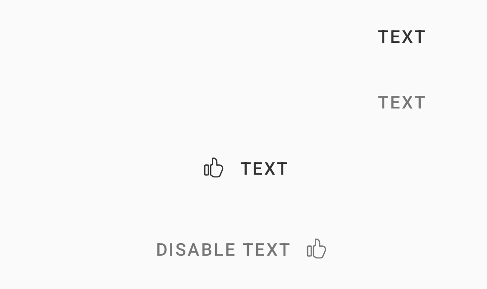

# Button Text

> Buttons allow users to take actions, and make choices, with a single tap.


## Properties

| Property       | Values                    | Status             |
| -------------- | ------------------------- | ------------------ |
| Icon           | start, end, textStart, textEnd         | ✅  Available      |
| Size           | Small, Medium, Large      | ❌  Not Applicable      |
| Enabled        | True, False               | ✅  Available      |
| Display        | True, False               | ❌  Not Applicable |
| Text-Transform | Uppercase, Capitalize     | ❌  Not Applicable  |
| Theme          | All Themes DS             | 🗂️  Backlog  |


## Technical Usages Examples

> All codes are available for Android with XML Layout.



``` xml

<com.natura.android.button.TextButton
    android:id="@+id/blockTextButton"
    android:layout_width="match_parent"
    android:layout_height="wrap_content"
    android:layout_marginTop="?spacingSmall"
    android:text="TEXT"
    app:icon="@drawable/outlined_action_like"
    app:iconGravity="textStart"/>

<com.natura.android.button.TextButton
    android:id="@+id/blockTextButtonDisable"
    android:layout_width="match_parent"
    android:layout_height="wrap_content"
    android:layout_marginTop="?spacingSmall"
    android:enabled="false"
    android:text="DISABLED TEXT"
    app:icon="@drawable/outlined_action_like"
    app:iconGravity="textEnd"/>
```


#### ICON - start, end, textStart, textEnd


``` xml
app:icon="@drawable/outlined_action_like"
app:iconGravity="start"

app:icon="@drawable/outlined_action_like"
app:iconGravity="end"

app:icon="@drawable/outlined_action_like"
app:iconGravity="textStart"

app:icon="@drawable/outlined_action_like"
app:iconGravity="textEnd"

```


#### SIZE - Small, Medium, Large

❌  Not Applicable

> This property is not visible because spacings and paddings depends border or background of button.


#### ENABLED - True, False

``` xml
android:enabled="false"
```


#### DISPLAY - True, False

> This property is not visible because spacing and padding depend on the button's border or background.


#### TEXT-TRANSFORM - Uppercase, Capitalize

🛠️ Not Available 


#### THEME - All DS Themes

🛠️ Not Available 


## More code
You can check out more examples from SampleApp by clicking [here](https://github.com/natura-cosmeticos/natds-android/tree/master/sample/src/main/res/layout/activity_button.xml).

