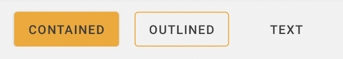

# Button

### What is it?
Buttons allow users to take actions, and make choices, with a single tap.

### Why should I use it?
Using it is a good way to increase visual consistency in apps.

### When should I use it?
You should use buttons according to its variations: [check buttons variations](https://zeroheight.com/28db352be/p/39708f-button/b/51a722)





## Contained Button
It is the default button. On it is possible to set:
- Size
- Icon

The contained button is based at native Button component. To use it, you should:

- Set a DS Theme at the view or its parent
- Add the Button at xml layout file

```android
<Button
     android:id="@+id/containedButton"
     android:layout_width="wrap_content"
     android:layout_height="wrap_content"
     android:text="contained"/>
}
```

## Outlined Button
It is the default button. On it is possible to set:
- Size
- Icon

The outlined button is based at native Button component. But it has an `style` applied on it. To use it, you should:

- Set a DS Theme at the view or its parent
- Add the Button at xml layout file
- Set the Outlined Button Style

```android
<Button
     android:id="@+id/containedButton"
     android:style="?outlinedButton"
     android:layout_width="wrap_content"
     android:layout_height="wrap_content"
     android:text="contained"/>
}
```

## Text Button
It is the default button. On it is possible to set:
- Size
- Icon

The outlined button is based at native Button component. But it has an `style` applied on it. To use it, you should:

- Set a DS Theme at the view or its parent
- Add the Button at xml layout file
- Set the Text Button Style

```android
<Button
     android:id="@+id/containedButton"
     android:style="?textButton"
     android:layout_width="wrap_content"
     android:layout_height="wrap_content"
     android:text="contained"/>
}
```


