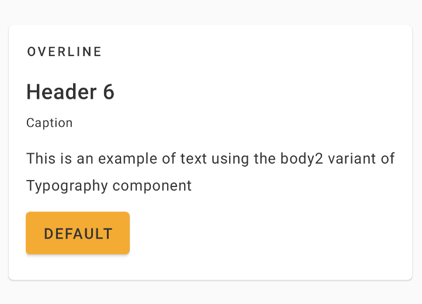
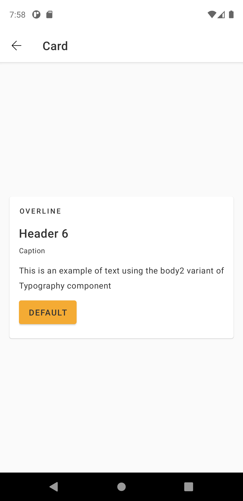
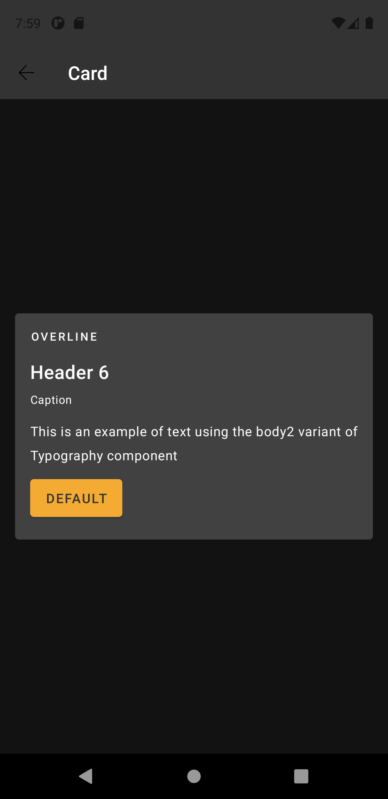

# Card
Cards are surfaces that groups content and actions in the same space. Its construction must always create a visual hierarchy of the content and communicate its purposes.

Extends from [MaterialCardView](https://developer.android.com/reference/com/google/android/material/card/MaterialCardView).

## Note for Design:

This component is available in the following variants:

- ✅ **Base**

With the following attribute statuses:

- **Elevation**:
  - ✅ `True`
  - ✅ `False`
- **Radius**:
  - ✅ `True`
  - ✅ `False`

## Attributes
| Attr | Description | Type | Options |
| - | --- | --- | --- |
|`app:enabledRadius`|  Defines if the radius effect is visible.| boolean | true or false <br> |
|`app:enabledElevation`| Defines if the elevation effect is visible| boolean | true or false <br> |

## Usage Examples
Card with radius and elevation enabled



#### Layout XML

```android
    <com.natura.android.card.Card
        android:id="@+id/card"
        android:layout_width="match_parent"
        android:layout_height="wrap_content"
        app:enabledRadius="true"
        app:enabledElevation="true">

        ...

    </Card>
```

<br><br>

Card with radius disabled


#### Layout XML

```android
    <com.natura.android.card.Card
        android:id="@+id/card"
        android:layout_width="match_parent"
        android:layout_height="wrap_content"
        app:enabledRadius="false"
        app:enabledElevation="true">

        ...

    </Card>
```

<br><br>

Card with elevation disabled


#### Layout XML

```android
    <com.natura.android.card.Card
        android:id="@+id/card"
        android:layout_width="match_parent"
        android:layout_height="wrap_content"
        app:enabledRadius="true"
        app:enabledElevation="false">

        ...

    </Card>
```

<br><br>

## Light mode / Dark mode

<p align="center">
   
&nbsp;
  
</p>

## More code
You can check out more examples from SampleApp by clicking [here](https://github.com/natura-cosmeticos/natds-android/tree/master/sample/src/main/res/layout/activity_card.xml).

## Attention points

1. A card is a DS component based on DS **multibrand themes**. It means if you want to use a card in your app, you MUST set the DS theme on a view parent or in the card component itself. [Check more info about how to set DS themes in your app](../README.md).


