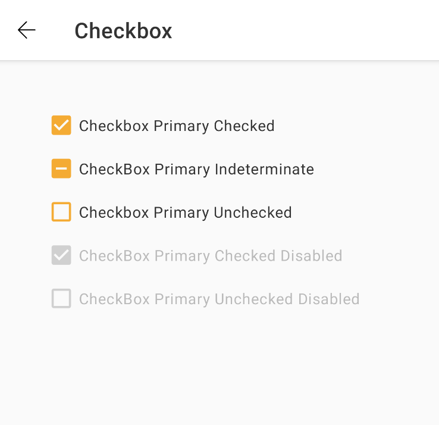

### Checkbox

This component is available in the following variants:

* ✅ Standard
* ✅ Indeterminate

With the following attribute status:

* ✅ Disabled
* ✅ Checked

* Interaction state:
    * ✅ `Enabled`
    * ✅ `Check`
    * ✅ `Press`

### What is it?
Checkbox can be used to turn an option on or off.
Nat DS Android Checkbox is based on a android [CheckBox](https://developer.android.com/reference/android/widget/CheckBox) with style provided by Nat DS Theme.

### When should I use it?
Checkboxes is normally used for the user to select one or more items from a set. 

### How to use it?
Add the Checkbox component in your xml layout file

```android
     <com.natura.android.checkbox.CheckBox
            android:id="@+id/checkboxPrimaryChecked"
            android:text="Checkbox Primary Checked"
            android:layout_width="wrap_content"
            android:checked="true"
            android:layout_height="wrap_content"/>
```

### Setting states

With the checkbox created, you can set states whenever you want, assigning through the *states* property

```android
checkboxPrimaryIndeterminate.state = CheckBox.INDETERMINATE
checkboxPrimaryChecked.state = CheckBox.CHECKED
```


