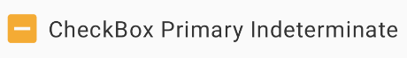
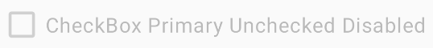
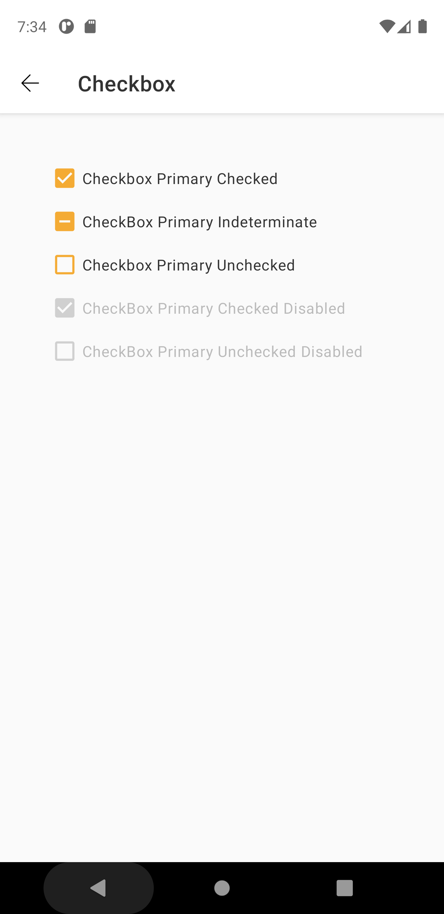
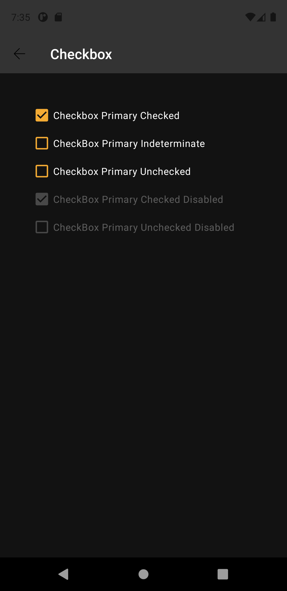

# Checkbox
Checkboxes allow users to select one or more items from a set. Checkboxes can turn an option on or off.

Extends from [AppCompatCheckBox](https://developer.android.com/reference/androidx/appcompat/widget/AppCompatCheckBox).

## Note for Design:

This component is available in the following variants:

- ✅ **Checked**
- ✅ **Unchecked**
- ✅ **Indeterminate**
   
With the following attribute statuses:

- **States**:
  - ✅ `Enabled`
  - ✅ `Pressed`

- ✅ **Disabled**


## Attributes
| Attr | Description | Type | Options |
| - | --- | --- | --- |
|`android:checked`|  Defines if the component is checked.| boolean | true or false <br> |
|`android:enabled`| Defines if the component is enabled.| boolean | true or false <br> |
|`android:text`| Sets the component label.| string | text |

## Usage Examples
Checkbox enabled checked


#### Layout XML

```android
    <com.natura.android.checkbox.CheckBox
        android:id="@+id/checkbox"
        android:text="Checkbox Checked"
        android:layout_width="wrap_content"
        android:checked="true"
        android:layout_height="wrap_content"/>
```

#### Kotlin

```kotlin
    val checkbox = findViewById<CheckBox>(R.id.checkbox)
    checkbox.state = CheckBox.CHECKED
```
<br><br>
Checkbox enabled checked



#### Kotlin

```kotlin
    val checkbox = findViewById<CheckBox>(R.id.checkbox)
    checkbox.state = CheckBox.INDETERMINATE
```
<br><br>
Checkbox unchecked disabled



#### Layout XML

```android
    <com.natura.android.checkbox.CheckBox
        android:id="@+id/checkbox"
        android:text="Checkbox Checked"
        android:layout_width="wrap_content"
        android:enabled="false"
        android:layout_height="wrap_content"/>
```

#### Kotlin

```kotlin
    val checkbox = findViewById<CheckBox>(R.id.checkbox)
    checkbox.state = CheckBox.UNCHECKED
```
<br>

## Light mode / Dark mode

<p align="center">
   
&nbsp;
  
</p>

## More code
You can check out more examples from SampleApp by clicking [here](../sample/src/main/res/layout/activity_checkbox.xml).

## Attention points

1. A checkbox is a DS component based on DS **multibrand themes**. It means if you want to use a checkbox in your app, you MUST set the DS theme on a view parent or in the checkbox component itself. [Check more info about how to set DS themes in your app](../README.md).


