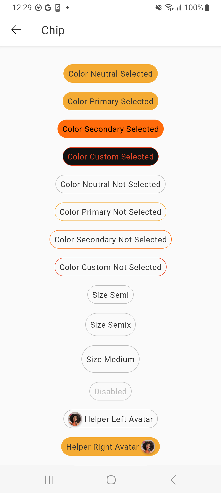
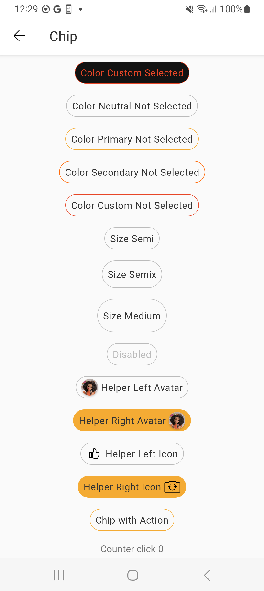
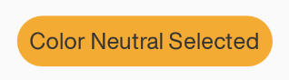
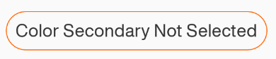
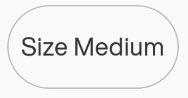

# Chip

> Chips are compact elements that represent an input, attribute, or action.

<br>

## Properties

| Property           | Values                         | Status            |
| --------------     | -------------------------      | ----------------- |
| Helper Before             | None, Icon, Avatar                          | ✅  Available     |
| Helper After          | None, Icon, Avatar    | ✅  Available     |
| Color         | Neutral, Primary, Secondary, Custom        | ✅  Available     |
| State          | Enabled, Press                    | ✅  Available     |
| Selected               | True, False           | ✅  Available     |
| Disabled               | True, False           | ✅  Available     |
| Action               | True, False           | ✅  Available     |
| Size               | Semi, SemiX, Medium           | ✅  Available     |

<br>

## Technical Usages Examples

<br>

<p align="center">
   
&nbsp;
  
</p>

<br>

#### Chip selected with primary color




```android
    <com.natura.android.chip.Chip
            android:id="@+id/chip_color_primary_selected"
            android:layout_width="wrap_content"
            android:layout_height="wrap_content"
            app:chp_color="primary"
            app:chp_label="Color Primary Selected"
            app:chp_selected="true"/>
```

<br><br>

#### Chip not select with secondary color



```android
   <com.natura.android.chip.Chip
            android:id="@+id/chip_color_secondary_notselected"
            android:layout_width="wrap_content"
            android:layout_height="wrap_content"
            app:chp_color="secondary"
            app:chp_label="Color Secondary Not Selected"
            app:chp_selected="false"/>
```

<br><br>

#### Chip with Size Medium



```android
   <com.natura.android.chip.Chip
            android:id="@+id/chip_size_medium"
            android:layout_width="wrap_content"
            android:layout_height="wrap_content"
            app:chp_color="neutral"
            app:chp_label="Size Medium"
            app:chp_selected="false"
            app:chp_size="medium"/>
```

<br><br>

#### Chip with helper right


```android
   <com.natura.android.chip.Chip
            android:id="@+id/chip_helper_right_avatar"
            android:layout_width="wrap_content"
            android:layout_height="wrap_content"
            app:chp_color="neutral"
            app:chp_helper_right="@mipmap/nat_avatar"
            app:chp_helper_right_type="avatar"
            app:chp_label="Helper Right Avatar"
            app:chp_selected="true"
            app:chp_size="semi"/>
```

<br>

## More code

You can check out more examples from SampleApp by
clicking [here](https://github.com/natura-cosmeticos/natds-android/tree/master/sample/src/main/res/layout/activity_chip.xml)
