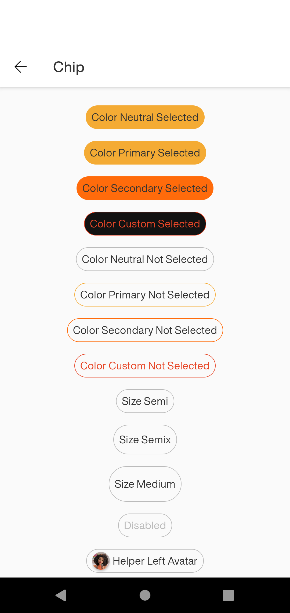
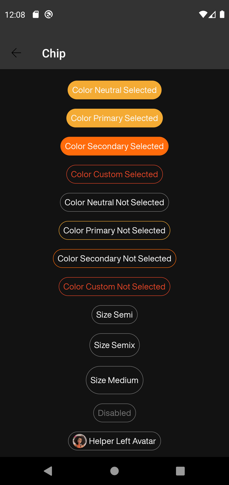

# Chip

Chips are compact elements that represent an input, attribute, or action.

Extends
from [ConstraintLayout](https://developer.android.com/reference/androidx/constraintlayout/widget/ConstraintLayout)
.

## Note for Design:

This component is available in the following variants:

- ✅ **Standard**

With the following attribute statuses:

- ✅ **Label**
- **Helper Before**:
    - ✅ `None`
    - ✅ `Icon`
    - ✅ `Avatar`
- **Helper After**:
    - ✅ `None`
    - ✅ `Icon`
    - ✅ `Avatar`    
- **Color**:
    - ✅ `Neutral`
    - ✅ `Primary`
    - ✅ `Secondary`
    - ✅ `Custom`
- **State**:
    - ✅ `Enabled`
    - ❌ `Hover`
    - ❌ `Focus`
    - ✅ `Press`
- **Selected**:
    - ✅ `True`
    - ✅ `False`
- **Disabled**:
  - ✅ `True`
  - ✅ `False`
- **Action**:
  - ✅ `True`
  - ✅ `False`
- **Size**:
  - ✅ `Semi`
  - ✅ `SemiX`  
  - ✅ `Medium`  
  
# Attributes
| Attr | Description | Type | Options |
| - | --- | --- | --- |
|`android:enabled`|  An unenabled chip prevents the user from clicking and performing some action. | boolean | true or false
|`app:chp_label`| Sets the label of component.| string | text
|`app:chp_action`| Defines if the component will have any action on click. | boolean | true or false
|`app:chp_selected`| Defines whether the component will have the appearance of selected. | boolean | true or false
|`app:chp_color`| Sets the color style of component, based at background and border.| string | neutral, primary, secondary or custom |
|`app:chp_size`| Sets the size of component.| string | semi, semix, or medium |
|`app:chp_custom_background_color`| Sets the component's background color when the color type is customized.| color | colors
|`app:chp_custom_label_color`| Sets the component's label color when the color type is customized. | color | colors
|`app:chp_custom_border_color`| Sets the component's border color when the color type is customized. | color | colors
|`app:chp_helper_right_type`| Defines the type of helper will be shown in the right side of the component.| string | none, avatar or icon |
`app:chp_helper_left_type`| Defines the type of helper will be shown in the left side of the component.| string | none, avatar or icon |
`app:chp_helper_left`| Sets the resource to the left helper.| drawable | resources |
`app:chp_helper_right`| Sets the resource to the right helper.| drawable | resources |

## Usage Examples
Chip selected with primary color


#### Layout XML

```android
    <com.natura.android.chip.Chip
            android:id="@+id/chip_color_primary_selected"
            android:layout_width="wrap_content"
            android:layout_height="wrap_content"
            app:chp_color="primary"
            app:chp_label="Color Primary Selected"
            app:chp_selected="true"/>
```

<br><br>

Chip not select with secondary color


#### Layout XML

```android
   <com.natura.android.chip.Chip
            android:id="@+id/chip_color_secondary_notselected"
            android:layout_width="wrap_content"
            android:layout_height="wrap_content"
            app:chp_color="secondary"
            app:chp_label="Color Secondary Not Selected"
            app:chp_selected="false"/>
```

<br><br>

Chip with Size Medium


#### Layout XML

```android
   <com.natura.android.chip.Chip
            android:id="@+id/chip_size_medium"
            android:layout_width="wrap_content"
            android:layout_height="wrap_content"
            app:chp_color="neutral"
            app:chp_label="Size Medium"
            app:chp_selected="false"
            app:chp_size="medium"/>
```

<br><br>

Chip with helper right


#### Layout XML

```android
   <com.natura.android.chip.Chip
            android:id="@+id/chip_helper_right_avatar"
            android:layout_width="wrap_content"
            android:layout_height="wrap_content"
            app:chp_color="neutral"
            app:chp_helper_right="@mipmap/nat_avatar"
            app:chp_helper_right_type="avatar"
            app:chp_label="Helper Right Avatar"
            app:chp_selected="true"
            app:chp_size="semi"/>
```


<br>


## Light mode / Dark mode

<p align="center">
   
&nbsp;
  
</p>

## More code

You can check out more examples from SampleApp by
clicking [here](https://github.com/natura-cosmeticos/natds-android/tree/master/sample/src/main/res/layout/activity_chip.xml)
.

## Attention points

1. A chip is a DS component based on DS **multibrand themes**. It means if you want to use a
   chip in your app, you MUST set the DS theme on a view parent or in the chip component
   itself. [Check more info about how to set DS themes in your app](../README.md).


