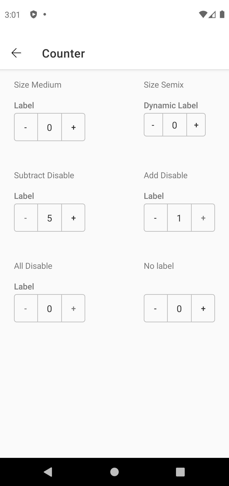
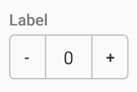
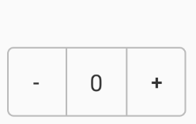

# Counter

> Reduce input effort for fields with values that deviate little from the default by allowing users to increase or decrease the number in a single button press.


## Properties

| Property           | Values                         | Status            |
| --------------     | -------------------------      | ----------------- |
| Label             | -                          | ✅  Available     |
| Size          | Semi X, Medium   | ✅  Available     |
| Disabled         | Subtract, Add, Both        | ✅  Available     |
| States          | Enabled, Press                    | ✅  Available     |


## Technical Usages Examples




##### Counter with semix size



```android
   <com.natura.android.counter.Counter
        android:id="@+id/counterSemix"
        android:layout_width="wrap_content"
        android:layout_height="wrap_content"
        app:ctr_disabled="none"
        app:ctr_label="Label"
        app:ctr_size="semix"/>
```

<br><br>

##### Counter with medium size and no label



```android
   <com.natura.android.counter.Counter
        android:id="@+id/counterSemix"
        android:layout_width="wrap_content"
        android:layout_height="wrap_content"
        app:ctr_disabled="none"
        app:ctr_size="medium"/>
```

<br><br>

## More code

You can check out more examples from SampleApp by
clicking [here](https://github.com/natura-cosmeticos/natds-android/tree/master/sample/src/main/res/layout/activity_counter.xml)
