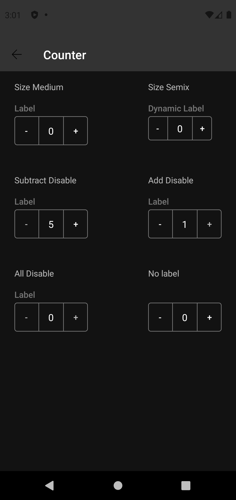

# Counter

Reduce input effort for fields with values that deviate little from the default by allowing users to
increase or decrease the number in a single button press.

Extends
from [ConstraintLayout](https://developer.android.com/reference/androidx/constraintlayout/widget/ConstraintLayout)
.

## Note for Design:

This component is available in the following variants:

- ✅ **Standard**

With the following attribute statuses:

- ✅ **Label**
- **Size**:
    - ✅ `Semi X`
    - ✅ `Medium`
- **Disabled**:
    - ✅ `Subtract`
    - ✅ `Add`
    - ✅ `Both`
- **States**:
    - ✅ `Enabled`
    - ✅ `Press`

## Attributes

| Attr | Description | Type | Options | | - | --- | --- | --- | |`app:ctr_size`| Sets the component
size.| string | semix or medium <br> | |`app:ctr_disabled`| Defines whether one of the buttons will
be disabled, none or both.| string | none, subtract, add or all. <br> | |`app:ctr_label`| | Sets the
label of component.| string | text <br> | |`app:ctr_add_description`| Sets the accessibility
description for the add button.| string | text |`app:ctr_add_description`| Sets the accessibility
description for the subtract button.| string | text

## Usage Examples

Counter with semix size


#### Layout XML

```android
   <com.natura.android.counter.Counter
        android:id="@+id/counterSemix"
        android:layout_width="wrap_content"
        android:layout_height="wrap_content"
        app:ctr_disabled="none"
        app:ctr_label="Label"
        app:ctr_size="semix"/>
```

<br><br>

Counter with medium size and no label


#### Layout XML

```android
   <com.natura.android.counter.Counter
        android:id="@+id/counterSemix"
        android:layout_width="wrap_content"
        android:layout_height="wrap_content"
        app:ctr_disabled="none"
        app:ctr_size="medium"/>
```

<br><br>


## Light mode / Dark mode

<p align="center">
   
&nbsp;
  
</p>

## More code

You can check out more examples from SampleApp by
clicking [here](https://github.com/natura-cosmeticos/natds-android/tree/master/sample/src/main/res/layout/activity_counter.xml)
.

## Attention points

1. A counter is a DS component based on DS **multibrand themes**. It means if you want to use a counter in
   your app, you MUST set the DS theme on a view parent or in the counter component
   itself. [Check more info about how to set DS themes in your app](../README.md).


