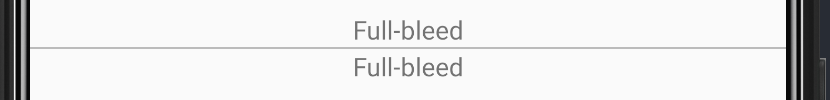
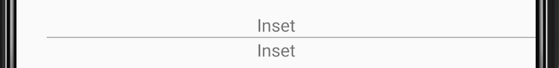
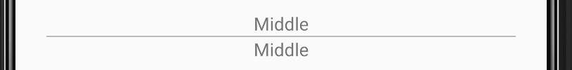
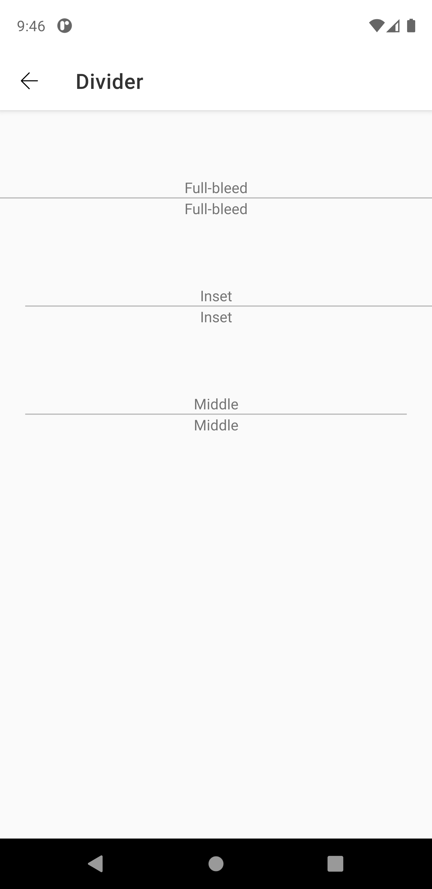
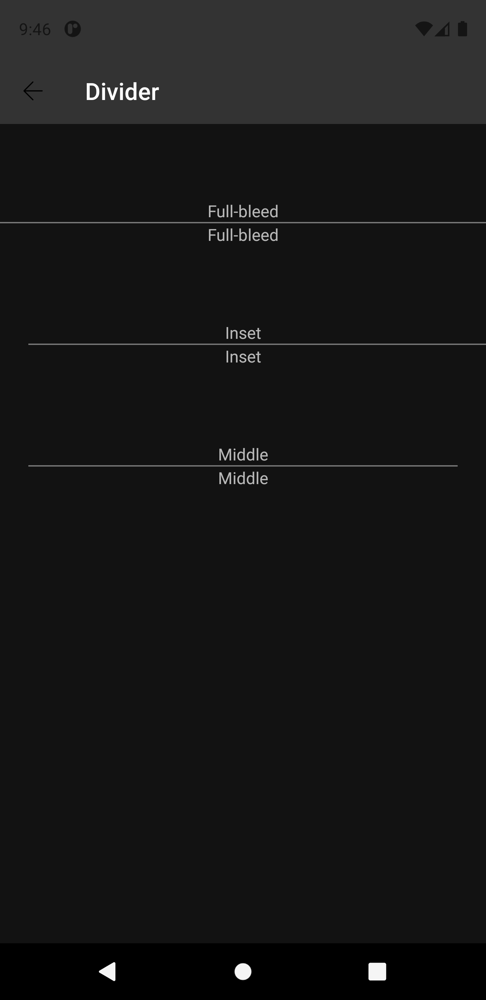

# Divider
A divider is a thin line that groups content in lists and layouts.

Extends from [ConstraintLayout](https://developer.android.com/reference/androidx/constraintlayout/widget/ConstraintLayout).


## Note for Design:

This component is available in the following variants:

- ✅ **Full-bleed**
- ✅ **Inset**
- ✅ **Middle**


## Attributes
| Attr | Description | Type | Options |
| - | --- | --- | --- |
|`app:dividerType`|  Sets the component type based on its position. | string| fullBleed, inset or middle |

## Usage Examples
Divider with fullBleed type



#### Layout XML

```android
    <com.natura.android.divider.Divider
       android:id="@+id/divider"
       android:layout_width="match_parent"
       android:layout_height="wrap_content"
       app:dividerType="fullBleed" />
```

<br><br>
Divider with inset type



#### Layout XML

```android
    <com.natura.android.divider.Divider
       android:id="@+id/divider"
       android:layout_width="match_parent"
       android:layout_height="wrap_content"
       app:dividerType="inset" />
```

<br><br>

<br><br>
Divider with middle type



#### Layout XML

```android
    <com.natura.android.divider.Divider
       android:id="@+id/divider"
       android:layout_width="match_parent"
       android:layout_height="wrap_content"
       app:dividerType="middle" />
```

<br><br>

## Light mode / Dark mode

<p align="center">
   
&nbsp;
  
</p>

## More code
You can check out more examples from SampleApp by clicking [here](../sample/src/main/res/layout/activity_divider.xml).


## Attention points

1. A divider is a DS component based on DS **multibrand themes**. It means if you want to use a divider in your app, you MUST set the DS theme on a view parent or in the divider component itself. [Check more info about how to set DS themes in your app](getting-started.md).
   
2. Margin spacing is fixed and not customizable.