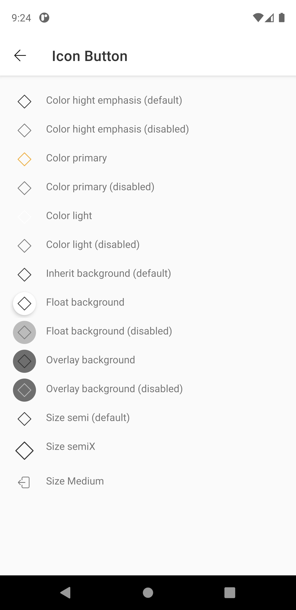
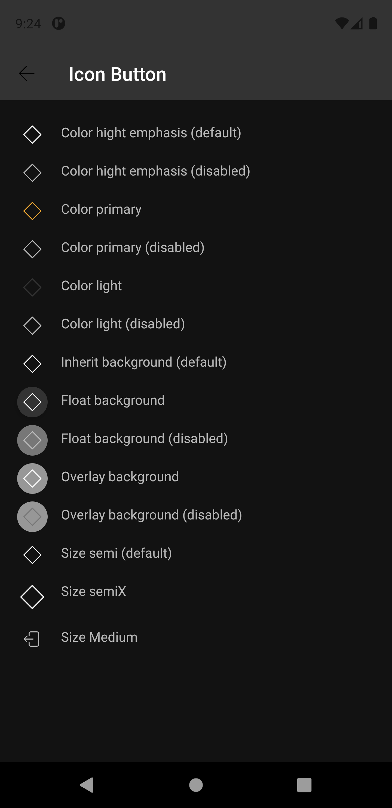

# Icon Button
Icon buttons are commonly found in app bars and toolbars.

Icons are also appropriate for toggle buttons that allow a single choice to be selected or deselected, such as adding or removing a star to an item.

Extends from [ConstraintLayout](https://developer.android.com/reference/androidx/constraintlayout/widget/ConstraintLayout).


## Note for Design:

This component is available in the following variants:

- ✅ **Standard**
   
With the following attribute statuses:

- **Icon color**:
  - ✅ `HighEmphasis`
  - ✅ `Primary`
  - ✅ `Light`
- **Background style**:
  - ✅ `Inherit`
  - ✅ `Float`
  - ✅ `Overlay`
- **States**:
  - ✅ `Enabled`
  - ✅ `Press`


## Attributes
| Attr | Description | Type | Options |
| - | --- | --- | --- |
|`android:enabled`|  Defines whether the component is enabled or disabled.| boolean | true or false|
|`app:iconName`| Receives a string with the drawable to be render at component| string | text (icon name) |
|`app:buttonColor`| Sets the icon color. | string | defaultColor, primaryColor or lightColor|
|`app:sizeButton`| Sets the component size. | string | semi, semix or medium
|`app:styleButton`| Sets the component's style. | string | inherit, floating or overlay|

## Usage Examples
Icon Button enabled with primary color, medium size and float style.


#### Layout XML

```android
    <com.natura.android.iconButton.IconButton
        android:id="@+id/iconButton"
        android:layout_width="wrap_content"
        android:layout_height="wrap_content"
        app:buttonColor="primaryColor"
        app:iconName="outlined-navigation-exit"
        app:sizeButton="medium"
        app:styleButton="floating" />
```

#### Kotlin

```kotlin
    val iconButton = findViewById<IconButton>(R.id.iconButton)
    iconButton.setIcon("outlined-navigation-exit")
    iconButton.setEnabled(true)
```
<br><br>
Icon Button enabled with high emphasis (default) color, semix size and overlay style.


#### Layout XML

```android
    <com.natura.android.iconButton.IconButton
        android:id="@+id/iconButton"
        android:layout_width="wrap_content"
        android:layout_height="wrap_content"
        app:buttonColor="defaultColor"
        app:iconName="outlined-navigation-exit"
        app:sizeButton="semix"
        app:styleButton="overlay" />
```

#### Kotlin

```kotlin
    val iconButton = findViewById<IconButton>(R.id.iconButton)
    iconButton.setIcon("outlined-navigation-exit")
    iconButton.setEnabled(true)
```
<br><br>
Icon Button disabled with light color, semi size and inherit style.


#### Layout XML

```android
    <com.natura.android.iconButton.IconButton
        android:id="@+id/iconButtonSizeMedium"
        android:layout_width="wrap_content"
        android:layout_height="wrap_content"
        android:enabled="false"
        app:buttonColor="lightColor"
        app:iconName="outlined-navigation-exit"
        app:sizeButton="semi"
        app:styleButton="inherit" />
```

#### Kotlin

```kotlin
    val iconButton = findViewById<IconButton>(R.id.iconButton)
    iconButton.setIcon("outlined-navigation-exit")
    iconButton.setEnabled(false)
```
<br><br>

## Light mode / Dark mode

<p align="center">
   
&nbsp;
  
</p>

## More code
You can check out more examples from SampleApp by clicking [here](../sample/src/main/res/layout/activity_icon_button.xml).

## Attention points

1. An icon button is a DS component based on DS **multibrand themes**. It means if you want to use a icon button in your app, you MUST set the DS theme on a view parent or in the icon button component itself. [Check more info about how to set DS themes in your app](getting-started.md).