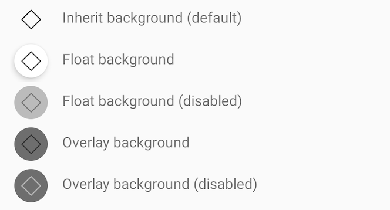

# IconButton

> Icon buttons are commonly found in app bars and toolbars.

> Icons are also appropriate for toggle buttons that allow a single choice to be selected or deselected, such as adding or removing a star to an item.


## Properties

| Property           | Values                         | Status            |
| --------------     | -------------------------      | ----------------- |
| OnClick             | -                          | ✅  Available     |
| ButtonColor          | defaultColor, primaryColor, lightColor   | ✅  Available     |
| StyleButton         | Inherit, Floating, Overlay        | ✅  Available     |
| Enabled          | True, False                    | ✅  Available     |
| SizeButton               | Semi, Semix, Medium            | ✅  Available     |


## Technical Usages Examples

> All codes are available for Android with XML Layout.


```xml

    <com.natura.android.iconButton.IconButton
        android:id="@+id/iconButtonColorDefault"
        android:layout_width="wrap_content"
        android:layout_height="wrap_content"
        android:layout_marginTop="?spacingSmall"
        app:buttonColor="defaultColor"
        app:iconName="outlined_default_mockup"
        app:layout_constraintEnd_toStartOf="@id/textViewColorDefault"
        app:layout_constraintStart_toStartOf="parent"
        app:layout_constraintTop_toTopOf="parent"
        app:sizeButton="semi"
        app:styleButton="inherit" />

```


#### OnClick


#### BUTTON COLOR - defaultColor, primaryColor, lightColor


```xml

    app:buttonColor="defaultColor"
    
    app:buttonColor="primaryColor"
            
    app:buttonColor="lightColor"

```


#### STYLE BUTTON - Inherit, Floating, Overlay



```xml

    app:styleButton="inherit"
    
    app:styleButton="floating"
    
    app:styleButton="overlay"

```


#### ENABLED - True, False


```xml

    android:enabled="true"

    android:enabled="false"

```


>


#### SIZE BUTTON - Semi, Semix, Medium


```xml

    app:sizeButton="semi"
    
    app:sizeButton="semix"
        
    app:sizeButton="medium"

```


## More code
You can check out more examples from SampleApp by clicking [here](https://github.com/natura-cosmeticos/natds-android/tree/master/sample/src/main/res/layout/activity_icon_button.xml).
