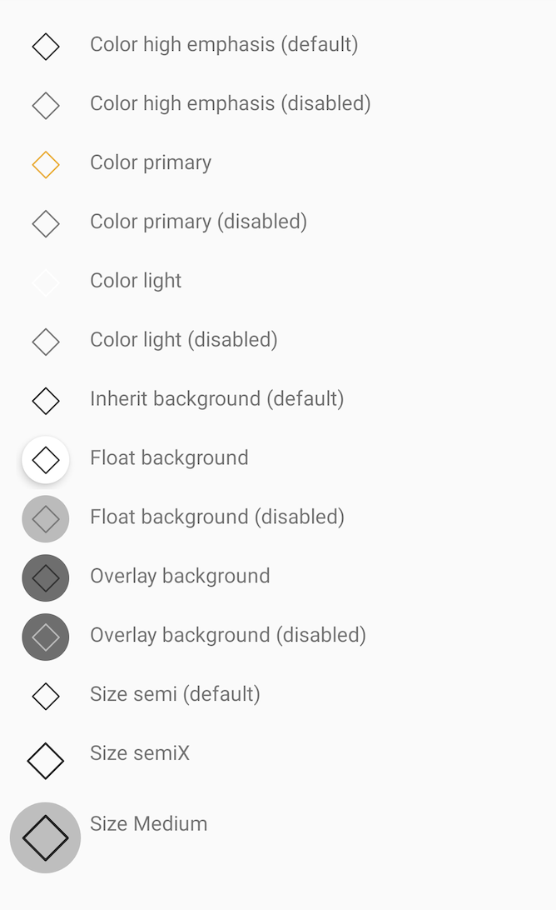
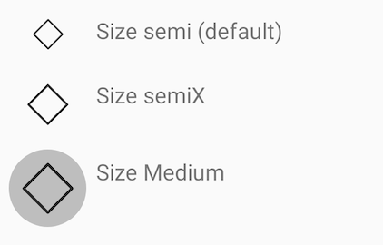
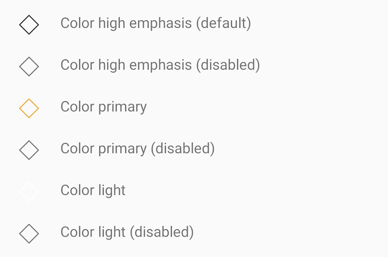

# IconButton

> Icon buttons are commonly found in app bars and toolbars.

> Icons are also appropriate for toggle buttons that allow a single choice to be selected or deselected, such as adding or removing a star to an item.


## Properties

| Property           | Values                         | Status            |
| --------------     | -------------------------      | ----------------- |
| OnClick             | -                          | ✅  Available     |
| Style          | standardDefault, standardPrimary, standardLight   | ✅  Available     |
| Background         | Inherit, Float, Overlay        | ✅  Available     |
| State          | Enabled, Disabled                    | ✅  Available     |
| Size               | Semi, Semix, Medium            | ✅  Available     |


## Technical Usages Examples

> All codes are available for Android with XML Layout.



```swift

    private let iconButtonDefaultStyle: NatIconButton = {
        let iconButton = NatIconButton(style: .standardDefault)
        iconButton.translatesAutoresizingMaskIntoConstraints = false
        iconButton.configure(icon: getIcon(.outlinedDefaultMockup))
        return iconButton
    }()

```


#### OnClick




#### STYLE - standardDefault, standardPrimary, standardLight



```swift

    let iconButton = NatIconButton(style: .standardDefault)
    
    let iconButton = NatIconButton(style: .standardPrimary)
            
    let iconButton = NatIconButton(style: .standardLight)

```


#### BACKGROUND - Inherit, Float, Overlay


```swift

    iconButton.configure(background: .inherit)
    
    iconButton.configure(background: .float)
    
    iconButton.configure(background: .overlay)

```


#### STATE - Enabled, Disabled


```swift

    iconButton.configure(state: .enabled)

    iconButton.configure(state: .disabled)

```


>


#### SIZE - Semi, Semix, Medium


```swift

    let iconButton = NatIconButton(style: .standardDefault, size: .semi)
    
    let iconButton = NatIconButton(style: .standardDefault, size: .semiX)
        
    let iconButton = NatIconButton(style: .standardDefault, size: .medium)

```


## More code
You can check out more examples from SampleApp by clicking [here](https://github.com/natura-cosmeticos/natds-android/tree/master/sample/src/main/res/layout/activity_icon_button.xml).
