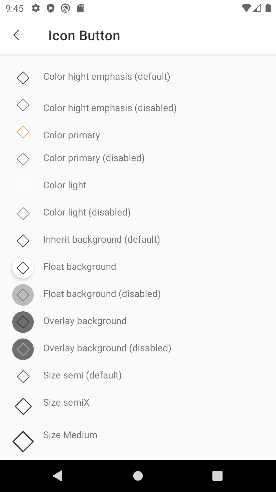

# Icon Button

This component is available in the following variants:

#### Note:

* ✅ Standard

With the following attribute status:

* Size:
    * ✅ Semi
    * ✅ SemiX
    * ✅ Medium
* Icon color:
    * ✅ HighEmphasis
    * ✅ Primary
    * ✅ Light
* Background style:
    * ✅ Inherit
    * ✅ Float
    * ✅ Overlay
    * ✅ Disabled
    * ✅ Onclick
    * ✅ Icon
* Interaction state:
    * ✅ Enabled
    * ✅ Press


Icons are also appropriate for toggle buttons that allow a single choice to be selected or deselected, such as adding or removing a star to an item.

### When should I use it?
Icon buttons are commonly found in app bars and toolbars.

### How to use it?
Add the Icon Button component in your xml layout file

```android
    <com.natura.android.iconButton.IconButton
            android:id="@+id/iconButtonDefault"
            android:layout_width="wrap_content"
            android:layout_height="wrap_content"
            app:buttonColor="defaultColor"
            app:iconName="outlined_action_calendar" />
```
#### Icon Button component has the following attributes that can be set:
- `android:enabled` : when true, the button is active, when false the button is inactive
- `app:iconName` : receives a string with the drawable to be render at button
- `app:buttonColor` : receives three values, `default`,`primary` or `light`
- `app:styleButton` : receives three values, `inherit`, `overlay` or `floating`
- `app:sizeButton` : receives three values, `semi`, `semix`, or `medium`


