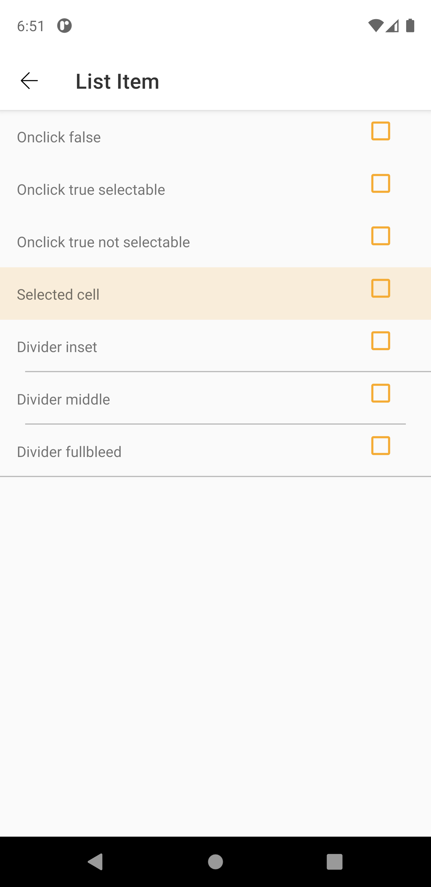
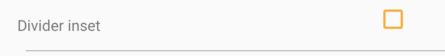

# List Item

> Lists are continuous, vertical indexes of content such as text and images.

## Properties

| Property           | Values                         | Status            |
| --------------     | -------------------------      | ----------------- |
| Type             | None, Action, Selectable                           | ✅  Available     |
| States          | Enabled, Press, Selectable   | ✅  Available     |


## Technical Usages Examples




```android
    <com.natura.android.listitem.ListItem
        android:id="@+id/listItem"
        android:layout_width="match_parent"
        android:layout_height="wrap_content"
        app:selectableState="true"
        app:dividerBottom="fullBleed"
        app:touchState="false">

        ...

    </ListItem>
```
<br>
em Kotlin
<br>

```kotlin
    val listItem = itemView.findViewById<ListItem>(R.id.listItem)
    listItem.setSelectableStateTrue()
    listItem.setDividerFullbleed()
```
<br><br>

#### List Item  with none divider and touchable


```android
    <com.natura.android.listitem.ListItem
        android:id="@+id/listItem"
        android:layout_width="match_parent"
        android:layout_height="wrap_content"
        app:selectableState="false"
        app:dividerBottom="none"
        app:touchState="true">

        ...

    </ListItem>
```
<br>
em Kotlin
<br>

```kotlin
    val listItem = itemView.findViewById<ListItem>(R.id.listItem)
    listItem.setTouchStateTrue()
```
<br><br>


#### List Item with inset divider, not selectable and not touchable



```android
    <com.natura.android.listitem.ListItem
        android:id="@+id/listItem"
        android:layout_width="match_parent"
        android:layout_height="wrap_content"
        app:selectableState="false"
        app:dividerBottom="inset"
        app:touchState="false">

        ...

    </ListItem>
```

<br>
em Kotlin
<br>

```kotlin
    val listItem = itemView.findViewById<ListItem>(R.id.listItem)
    listItem.setDividerInset()
```
<br>

## More code
You can check out more examples from SampleApp by clicking [here](https://github.com/natura-cosmeticos/natds-android/tree/master/sample/src/main/res/layout/activity_list_item.xml).
