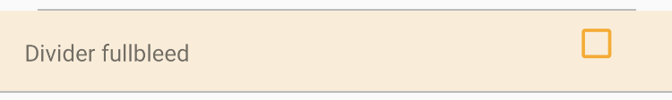
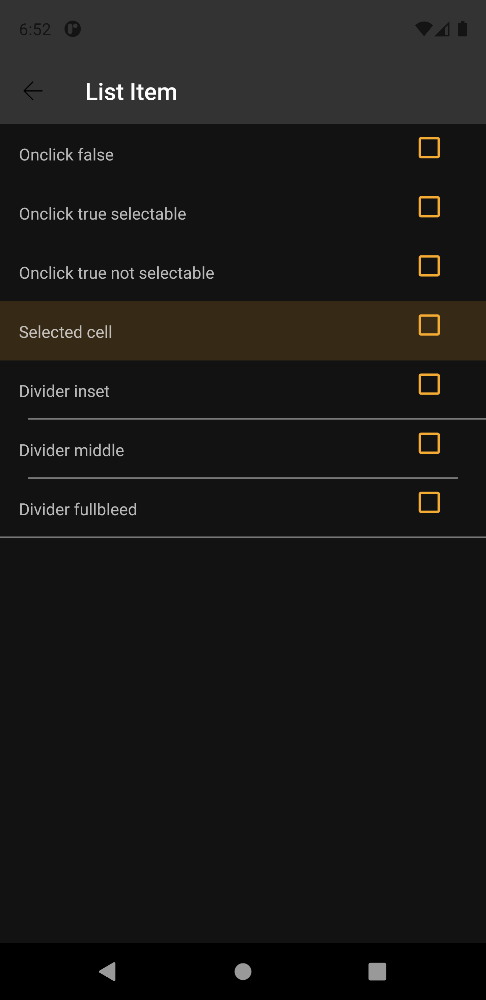

# List Item
Lists are continuous, vertical indexes of content such as text and images.

Extends from [RelativeLayout](https://developer.android.com/reference/android/widget/RelativeLayout).


## Note for Design:

This component is available in the following variants:

- ✅ **Base**
   
With the following attribute statuses:

- **Type**:
  - ✅ `None`
  - ✅ `Action`
  - ✅ `Selectable`
- **States**:
  - ✅ `Enabled`
  - ✅ `Press`
  - ✅ `Selected`

## Attributes
| Attr | Description | Type | Options |
| - | --- | --- | --- |
|`app:touchState`|  Sets the component's state and touch effect. | boolean | true or false|
|`app:selectableState`| Sets the component selection state and its effect.| boolean | true or false |
|`app:dividerBottom`| Defines the type of bottom separator that the view can contain. | string | none, fullbleed, inset,  middle

## Usage Examples
List Item  with fullbleed divider and selectable



#### Layout XML

```android
    <com.natura.android.listitem.ListItem
        android:id="@+id/listItem"
        android:layout_width="match_parent"
        android:layout_height="wrap_content"
        app:selectableState="true"
        app:dividerBottom="fullBleed"
        app:touchState="false">

        ...

    </ListItem>
```

#### Kotlin

```kotlin
    val listItem = itemView.findViewById<ListItem>(R.id.listItem)
    listItem.setSelectableStateTrue()
    listItem.setDividerFullbleed()
```
<br><br>

List Item  with none divider and touchable


#### Layout XML

```android
    <com.natura.android.listitem.ListItem
        android:id="@+id/listItem"
        android:layout_width="match_parent"
        android:layout_height="wrap_content"
        app:selectableState="false"
        app:dividerBottom="none"
        app:touchState="true">

        ...

    </ListItem>
```

#### Kotlin

```kotlin
    val listItem = itemView.findViewById<ListItem>(R.id.listItem)
    listItem.setTouchStateTrue()
```
<br><br>


List Item with inset divider, not selectable and not touchable


#### Layout XML

```android
    <com.natura.android.listitem.ListItem
        android:id="@+id/listItem"
        android:layout_width="match_parent"
        android:layout_height="wrap_content"
        app:selectableState="false"
        app:dividerBottom="inset"
        app:touchState="false">

        ...

    </ListItem>
```

#### Kotlin

```kotlin
    val listItem = itemView.findViewById<ListItem>(R.id.listItem)
    listItem.setDividerInset()
```
<br><br>

## Light mode / Dark mode

<p align="center">
   
&nbsp;
  
</p>

## More code
You can check out more examples from SampleApp by clicking [here](../sample/src/main/res/layout/activity_list_item.xml).

## Attention points

1. A list item is a DS component based on DS **multibrand themes**. It means if you want to use a list item in your app, you MUST set the DS theme on a view parent or in the list item component itself. [Check more info about how to set DS themes in your app](../README.md).

