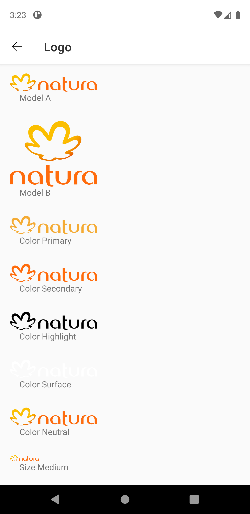
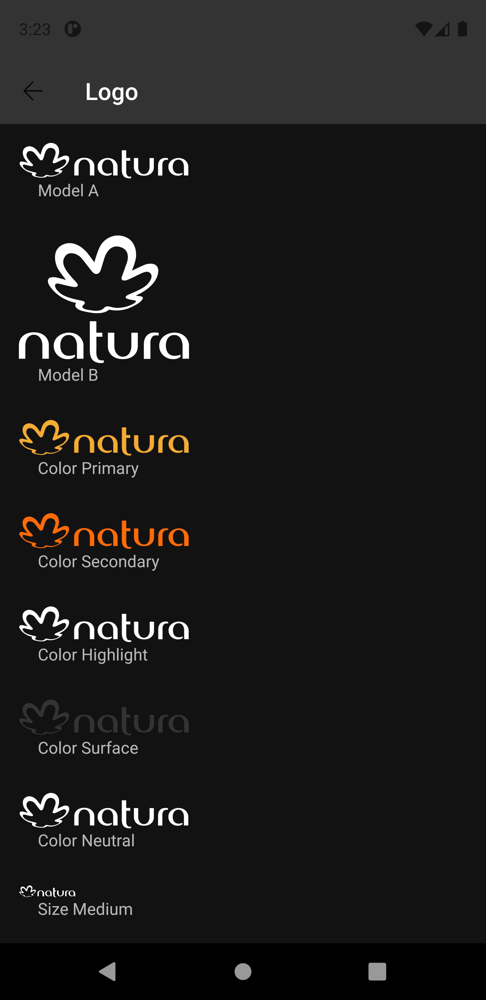

# Logo
Logo adapted as brand standards for each company.

Extends from [ConstraintLayout](https://developer.android.com/reference/androidx/constraintlayout/widget/ConstraintLayout).


## Note for Design:

This component is available in the following variants:

- ✅ **Natura**
- ✅ **The Body Shop**
- ✅ **Aesop**
- ✅ **Avon**
- ✅ **Natura&Co** 
   
With the following attribute statuses:

- **Model**:
  - ✅ `A`
  - ✅ `B`
- **Color**:
  - ✅ `Primary`
  - ✅ `Secondary`
  - ✅ `Highlight`
  - ✅ `Surface`
  - ✅ `Neutral`
- **Size**:
  - ✅ `Medium`
  - ✅ `Mediumx`
  - ✅ `Large`
  - ✅ `Largex`
  - ✅ `Largexx`
  - ✅ `Largexxx`
  - ✅ `Huge`
  - ✅ `Hugex`
  - ✅ `Hugexx`
  - ✅ `Hugexxx`
  - ✅ `Veryhuge`


## Attributes
| Attr | Description | Type | Options |
| - | --- | --- | --- |
|`app:model`|  Defines the component model.| string | A or B|
|`app:customColor`| Sets the color of component.| string | neutral, primary, secondary, highlight or surface
|`app:customSize`| Sets the component size. | string | medium, mediumx, large, largex, largexx, largexxx, huge, hugex, hugexx, hugexxx or veryhuge 

## Usage Examples
Logo model B with highlight color and mediumx size


#### Layout XML

```android
    <com.natura.android.logo.Logo
        android:id="@+id/logo"
        android:layout_width="wrap_content"
        android:layout_height="wrap_content"
        app:customColor="highlight"
        app:customSize="mediumx"
        app:model="b"/>
```
<br><br>

Logo model A with surface color and hugexx size


#### Layout XML

```android
    <com.natura.android.logo.Logo
        android:id="@+id/logo"
        android:layout_width="wrap_content"
        android:layout_height="wrap_content"
        app:customColor="surface"
        app:customSize="hugexx"
        app:model="a"/>
```
<br><br>

Logo model A with neutral color and veryhuge size


#### Layout XML

```android
    <com.natura.android.logo.Logo
        android:id="@+id/logo"
        android:layout_width="wrap_content"
        android:layout_height="wrap_content"
        app:customColor="neutral"
        app:customSize="veryhuge"
        app:model="a"/>
```
<br>

## Light mode / Dark mode

<p align="center">
   
&nbsp;
  
</p>

## More code
You can check out more examples from SampleApp by clicking [here](https://github.com/natura-cosmeticos/natds-android/tree/master/sample/src/main/res/layout/activity_logo.xml).

## Attention points

1. A logo is a DS component based on DS **multibrand themes**. It means if you want to use a logo in your app, you MUST set the DS theme on a view parent or in the logo component itself. [Check more info about how to set DS themes in your app](../README.md).


