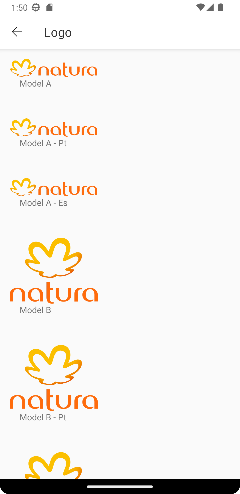
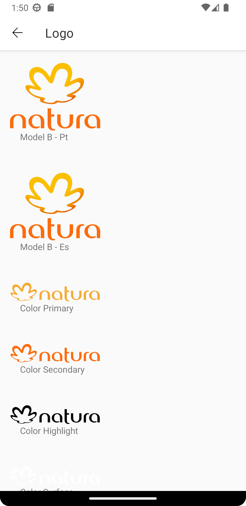
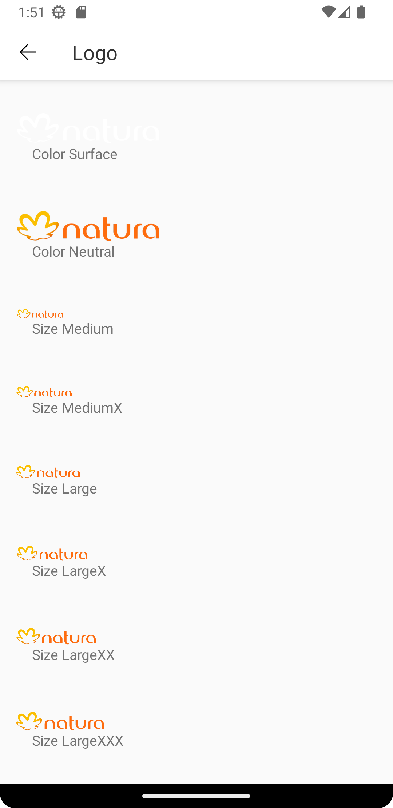
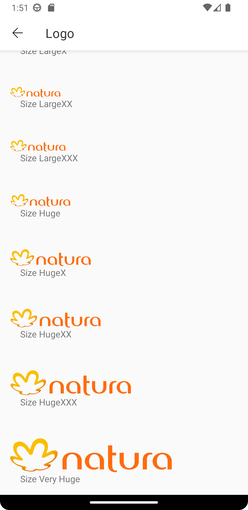
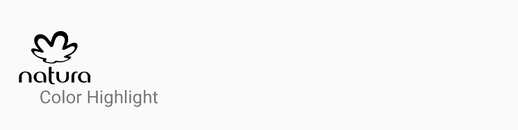
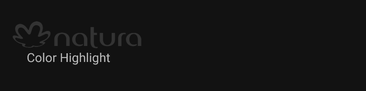

# Logo
Logo adapted as brand standards for each company.

<br>

## Properties

| Property           | Values                         | Status            |
| --------------     | -------------------------      | ----------------- |
| Variant             | Todos os temas disponíveis no GaYa       | ✅  Available     |
| Model          | A, B   | ✅  Available     |
| Color         | Primary, Secondary, Highlight, Surface, Neutral        | ✅  Available     |
| Size          | Medium, MediumX, Large, LargeX, LargeXX, LargeXXX, Huge, HugeX, HugeXX, HugeXXX, VeryHuge                    | ✅  Available     |
| Language               | Pt, Es, Default            | ✅  Available     |

<br>

## Technical Usages Examples

<p align="center">
   
&nbsp;
  
   &nbsp;
  
   &nbsp;
  
</p>

<br>

##### Logo model B with highlight color and mediumx size



```android
    <com.natura.android.logo.Logo
        android:id="@+id/logo"
        android:layout_width="wrap_content"
        android:layout_height="wrap_content"
        app:customColor="highlight"
        app:customSize="mediumx"
        app:model="b"/>
```
<br><br>

##### Logo model A with surface color and hugexx size



```android
    <com.natura.android.logo.Logo
        android:id="@+id/logo"
        android:layout_width="wrap_content"
        android:layout_height="wrap_content"
        app:customColor="surface"
        app:customSize="hugexx"
        app:model="a"/>
```
<br><br>

##### Logo model A with neutral color and veryhuge size


```android
    <com.natura.android.logo.Logo
        android:id="@+id/logo"
        android:layout_width="wrap_content"
        android:layout_height="wrap_content"
        app:customColor="neutral"
        app:customSize="veryhuge"
        app:model="a"/>
```
<br>


## More code
You can check out more examples from SampleApp by clicking [here](https://github.com/natura-cosmeticos/natds-android/tree/master/sample/src/main/res/layout/activity_logo.xml).
