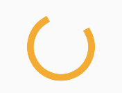
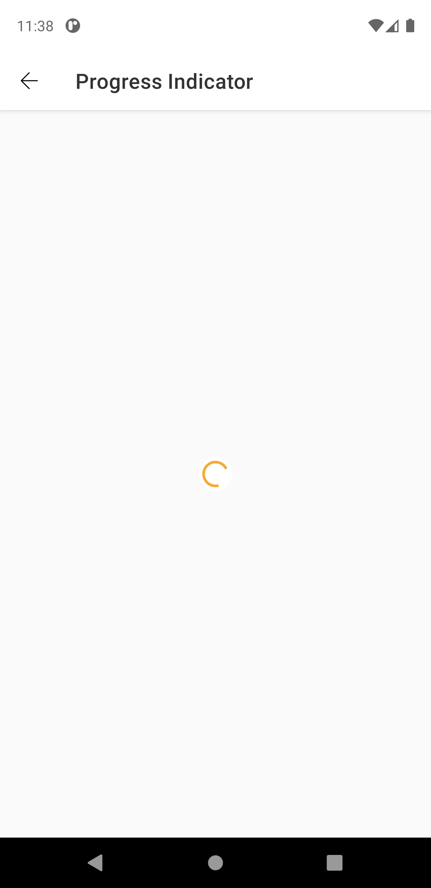
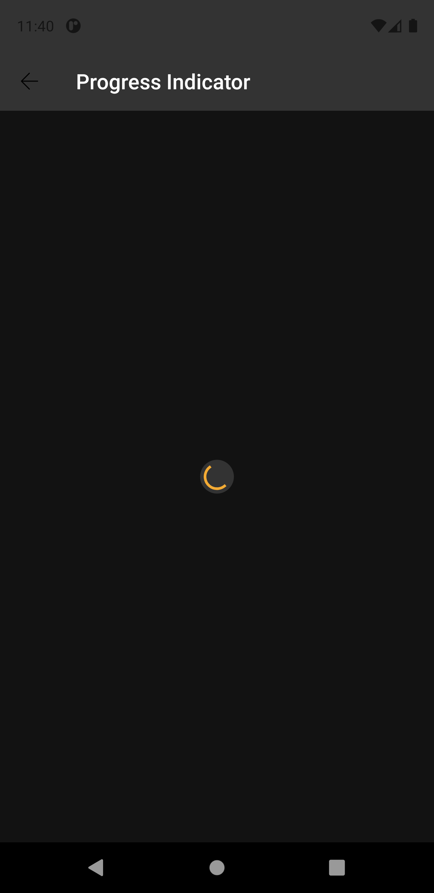

# Progress Indicator
The progress indicator is a component that informs users about the status of ongoing processes, such as loading an application, submitting a form, or saving updates.

Extends from [ProgressBar](https://developer.android.com/reference/android/widget/ProgressBar).


| _Created: 3.4.0_ <br> _Last updated (With Breaking Change): 9.0.0_ |
| ----- | 


## Attributes
| Attr | Description | Type | Options |
| - | --- | --- | --- |
|`app:pgid_size`|  Sets the component size. | string| standard, semi, medium or large |
|`app:pgid_layer`| Defines if the component has a background layer.| boolean | true or false |

## Usage Examples
Progress Indicator with standard size and layer true


#### Layout XML

```android
    <com.natura.android.progressindicator.ProgressIndicator
        android:id="@+id/progressIndicator"
        android:layout_width="wrap_content"
        android:layout_height="wrap_content"
        app:pgid_layer="true"
        app:pgid_size="standard" />
```

<br><br>
Progress Indicator with large size and layer false



#### Layout XML

```android
    <com.natura.android.progressindicator.ProgressIndicator
        android:id="@+id/progressIndicator"
        android:layout_width="wrap_content"
        android:layout_height="wrap_content"
        app:pgid_layer="false"
        app:pgid_size="large"/>
```
<br>

## Light mode / Dark mode

<p align="center">
   
&nbsp;
  
</p>

## More code
You can check out more examples from SampleApp by clicking [here](../sample/src/main/res/layout/activity_progress_indicator.xml).


## Attention points

1. A progress indicator is a DS component based on DS **multibrand themes**. It means if you want to use a progress indicator in your app, you MUST set the DS theme on a view parent or in the progress indicator component itself. [Check more info about how to set DS themes in your app](getting-started.md).
   
2. Nat DS Android supports for now only Circular variant of Progress Indicator