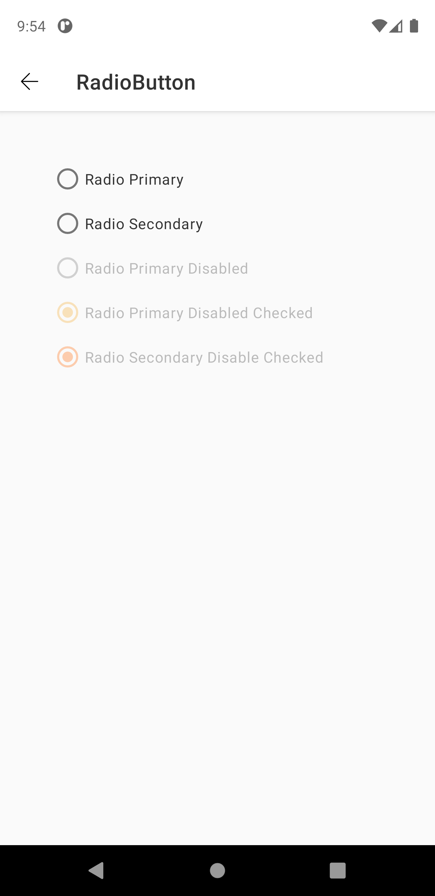
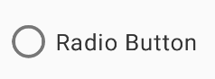
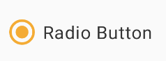

# RadioButton

> Radio buttons allow users to select one option from a set.

## Properties

| Property           | Values                         | Status            |
| --------------     | -------------------------      | ----------------- |
| State             | Enabled, Pressed                          | ✅  Available     |
| Disabled          | True or False   | ✅  Available     |


## Technical Usages Examples

> All codes are available for Android with XML Layout.




##### RadioButton enabled unchecked



```android
    <com.natura.android.radiobutton.RadioButton
        android:id="@+id/radioButton"
        android:layout_width="wrap_content"
        android:layout_height="wrap_content"
        android:text="Radio Button" />
```
<br>
em Kotlin
<br>

```kotlin
    val radioButton = findViewById<RadioButton>(R.id.radioButton)
    radioButton.text = "Radio Button"
    radioButton.isEnabled = true
    radioButton.isChecked = false
```
<br><br>

##### RadioButton enabled checked

<br>       



```android
    <com.natura.android.radiobutton.RadioButton
        android:id="@+id/radioButton"
        android:layout_width="wrap_content"
        android:layout_height="wrap_content"
        android:checked="true"
        android:text="Radio Button" />
```

<br>
em Kotlin
<br>

```kotlin
    val radioButton = findViewById<RadioButton>(R.id.radioButton)
    radioButton.text = "Radio Button"
    radioButton.isEnabled = true
    radioButton.isChecked = true
```    
<br><br>

##### RadioButton disabled unchecked


```android
    <com.natura.android.radiobutton.RadioButton
        android:id="@+id/radioButton"
        android:enabled="false"
        android:layout_width="wrap_content"
        android:layout_height="wrap_content"
        android:text="Radio Button" />
```

<br>
em Kotlin
<br>

```kotlin
    val radioButton = findViewById<RadioButton>(R.id.radioButton)
    radioButton.text = "Radio Button"
    radioButton.isEnabled = false
    radioButton.isChecked = false
```

<br><br>

##### RadioButton disabled checked


```android
    <com.natura.android.radiobutton.RadioButton
        android:id="@+id/radioButton"
        android:enabled="false"
        android:checked="true"
        android:layout_width="wrap_content"
        android:layout_height="wrap_content"
        android:text="Radio Button" />
```

<br>
em Kotlin
<br>

```kotlin
    val radioButton = findViewById<RadioButton>(R.id.radioButton)
    radioButton.text = "Radio Button"
    radioButton.isEnabled = false
    radioButton.isChecked = true
```

<br>

## More code
You can check out more examples from SampleApp by clicking [here](https://github.com/natura-cosmeticos/natds-android/tree/master/sample/src/main/res/layout/activity_radiobutton.xml).
