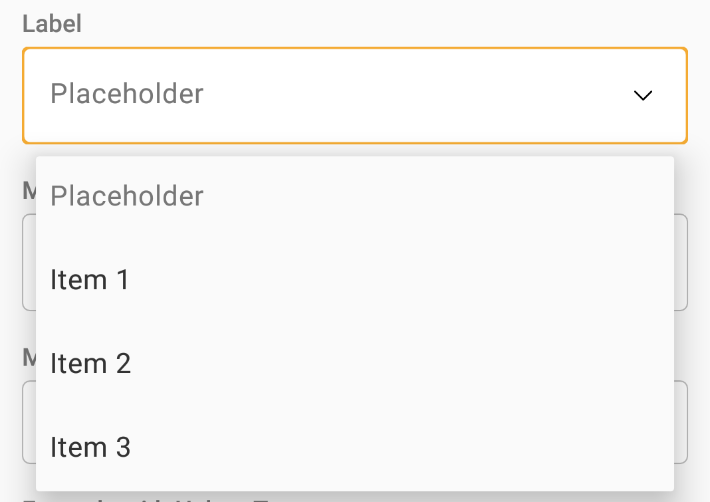
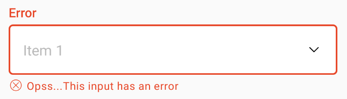
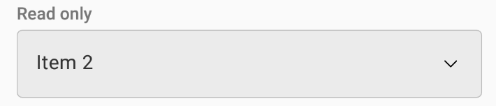
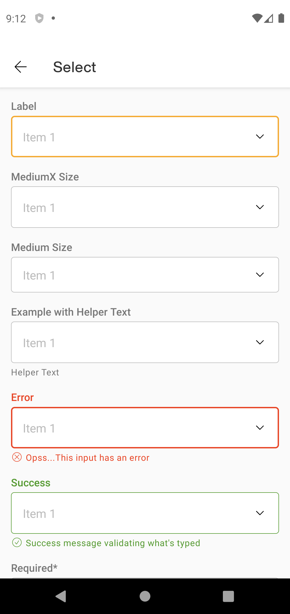
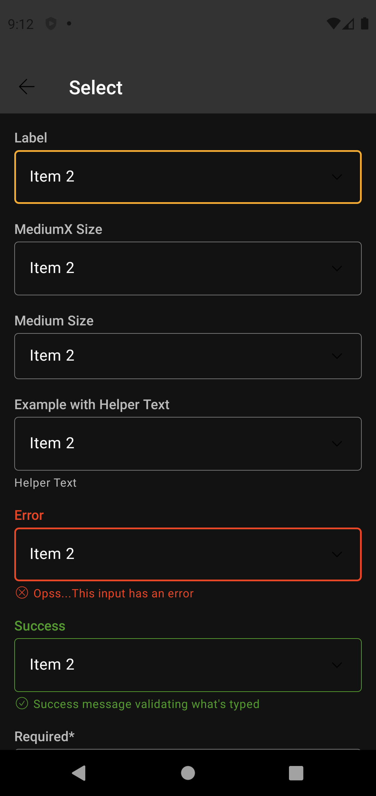

# Select

Select lets user choose one option from an options menu. Consider using select when you have 4 or
more options.

Extends
from [ConstraintLayout](https://developer.android.com/reference/androidx/constraintlayout/widget/ConstraintLayout)
.

## Note for Design:

This component is available in the following variants:

- ✅ **Outlined**

With the following attribute statuses:

- ✅ **Label**
- ✅ **Footer**
- **Size**:
    - ✅ `Medium`
    - ✅ `MediumX`
- **States**:
    - ✅ `None`
    - ✅ `Success`
    - ✅ `Error`
- ✅ **Required**
- ✅ **Read Only**
- ✅ **Enabled / Disabled**

## Attributes

| Attr | Description | Type | Options | | - | --- | --- | --- | |`android:enable`| Specifies whether
the widget is enabled. An unenabled Select prevents the user from choosing any option. | boolean |
true or false |`app:slc_label`| Label showed above the input. Can be used to describe the field. |
string | text |`app:slc_footer`| | Label showed below the input. Can be used to give feedback about
the field state. | string | text |`app:slc_state`| Describes the state of the field. | string |
none, success or error |`app:slc_size`| Describes the size (height) of the field. | string | mediumx
or medium |`app:slc_required`| Specifies if the widget is required, with an asterisk in label. |
boolean | true or false |`app:slc_readonly`| Specifies whether the widget is read only. | boolean |
true or false

## Usage Examples

Select dropdown



#### Layout XML

```android
   <com.natura.android.select.Select
       android:id="@+id/selectDefault"
       android:layout_width="match_parent"
       android:layout_height="wrap_content"
       app:slc_label="Label" />
```

<br><br>

Select with Error



#### Layout XML

```android
   <com.natura.android.select.Select
        android:id="@+id/selectWithError"
        android:layout_width="match_parent"
        android:layout_height="wrap_content"
        android:paddingTop="?spacingSmall"
        app:slc_label="Error"
        app:slc_footer="Opss...This input has an error"
        app:slc_state="error"/>
```

<br><br>

Select Read Only



#### Layout XML

```android
   <com.natura.android.select.Select
        android:id="@+id/selectReadOnly"
        android:layout_width="match_parent"
        android:layout_height="wrap_content"
        android:paddingTop="?spacingSmall"
        app:slc_readonly="true"
        app:slc_label="Read only"/>
```

<br>

### Kotlin

 So that it is possible to show the items in the select, it is necessary to create and assign an
  adapter to the spinner, inside a kotlin class. This trick will allow you to control the selected
  values and actions on them. Below is an example:

```android

val arraySpinner = listOf("Item 1", "Item 2", "Item 3", "Item 4")
val arrayAdapter = ArrayAdapter(this, R.layout.custom_spinner_dropdown_item, arraySpinner)
binding.selectDefault.spinner.adapter = arrayAdapter
```

## Light mode / Dark mode

<p align="center">
   
&nbsp;
  
</p>

## More code

You can check out more examples from SampleApp by
clicking [here](https://github.com/natura-cosmeticos/natds-android/tree/master/sample/src/main/res/layout/activity_select.xml)
.

## Attention points

1. A select is a DS component based on DS **multibrand themes**. It means if you want to use a
   select in your app, you MUST set the DS theme on a view parent or in the select component
   itself. [Check more info about how to set DS themes in your app](../README.md).


