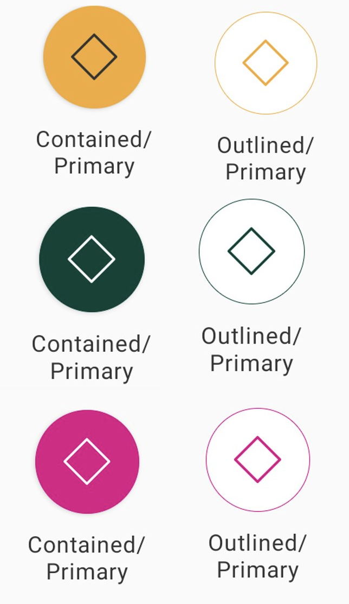

# Shortcut

## What is it?
Shortcut is a component that represents a shortcut to some action.

## How to use it?
Shortcut receives an icon, a label and its type. The shortcut type represents
it's visual style: contained or outlined.



Following there's an example of an shortcut outlined code:

```android
    <com.natura.android.shortcut.Shortcut
        android:id="@+id/shortcutOutlined"
        android:layout_width="wrap_content"
        android:layout_height="wrap_content"
        app:icon="@drawable/outlined_default_mockup"
        app:textLabel="Shortcut outlined sample"
        app:type="outlined" />
```

Following there's an example of an shortcut contained code:

```android
    <com.natura.android.shortcut.Shortcut
        android:id="@+id/shortcutOutlined"
        android:layout_width="wrap_content"
        android:layout_height="wrap_content"
        app:icon="@drawable/outlined_default_mockup"
        app:textLabel="Shortcut contained sample"
        app:type="contained" />
```

**A shortcut is a DS component based on DS multibrand themes. It means
if you want to use a shortcut in your app, you MUST set the DS theme
on a view parent or in the shortcut component itself. You can check
more info about how to set DS themes in your app [here](getting-started.md).**

```android
    <com.natura.android.shortcut.Shortcut
        android:id="@+id/shortcutOutlined"
        android:layout_width="wrap_content"
        android:layout_height="wrap_content"
        app:icon="@drawable/outlined_default_mockup"
        app:textLabel="Shortcut sample"
        app:type="outlined"
        android:theme="@style/Theme.Natura"/>
```

### Setting shortcut action
A shortcut behave similar to a button. So, to add action to it
just set a shortcut click lister:

```kotlin
    shortcutContained1.setOnClickListener {
        Toast.makeText(this, "Testing shortcut", Toast.LENGTH_SHORT).show()
    }
```
