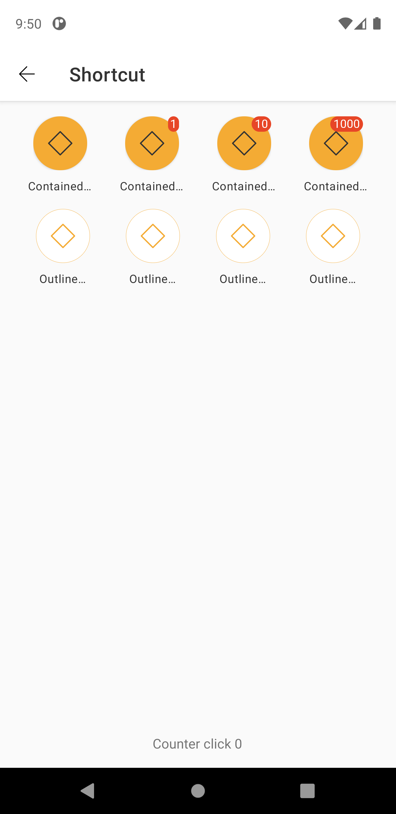
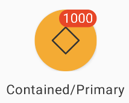
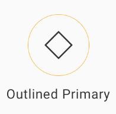

# Shortcut

> Shortcuts for quick access to a page and facilitate navigation.  

## Properties

| Property           | Values                         | Status            |
| --------------     | -------------------------      | ----------------- |
| Variant             | Standard, Outlined                          | ✅  Available     |
| Size          | Medium, MediumX   | ✅  Available     |
| State         | Enabled, Press         | ✅  Available     |
| Color          | Contained Primary, Contained Light, Outlined Primary, Outlined Light       | ✅  Available     |
| Notify               | None, Standard            | ✅  Available     |


## Technical Usages Examples



##### Shortcut with mockup icon, type contained and notify



```android
    <com.natura.android.shortcut.Shortcut
        android:id="@+id/shortcut"
        android:layout_width="wrap_content"
        android:layout_height="wrap_content"
        app:shct_icon_name="outlined-default-mockup"
        app:shct_notify="1000"
        app:shct_text_label="Contained/Primary"
        app:shct_type="contained" />
```

<br>

em Kotlin

<br>

```kotlin
    val shortcut = findViewById<Shortcut>(R.id.shortcut)
    shortcut.notify = 1000
    shortcut.setLabel("Contained/Primary")
    shortcut.setIcon("outlined-default-mockup")
```
<br><br>

##### Shortcut with mockup icon, type outlined and action



```android
    <com.natura.android.shortcut.Shortcut
        android:id="@+id/shortcut"
        android:layout_width="wrap_content"
        android:layout_height="wrap_content"
        app:shct_icon_name="outlined-default-mockup"
        app:shct_text_label="Outlined/Primary"
        app:shct_type="outlined" />
```
<br>

em Kotlin

<br>

```kotlin
    val shortcut = findViewById<Shortcut>(R.id.shortcut)
    shortcut.setLabel("Outlined/Primary")
    shortcut.setIcon("outlined-default-mockup")

    shortcut.setOnClickListener {
        Toast.makeText(this, "Testing shortcut", Toast.LENGTH_SHORT).show()
    }
```

<br>


## More code
You can check out more examples from SampleApp by clicking [here](https://github.com/natura-cosmeticos/natds-android/tree/master/sample/src/main/res/layout/activity_shortcut.xml).

## Attention points

1. Before the **3.0.0** version, the parameter to set the shortcut icon is different <br>
    - Attribute name: icon  
    - Parameter type: drawable

    Ex: `app:icon="@drawable/outlined_default_mockup"`

<br>
