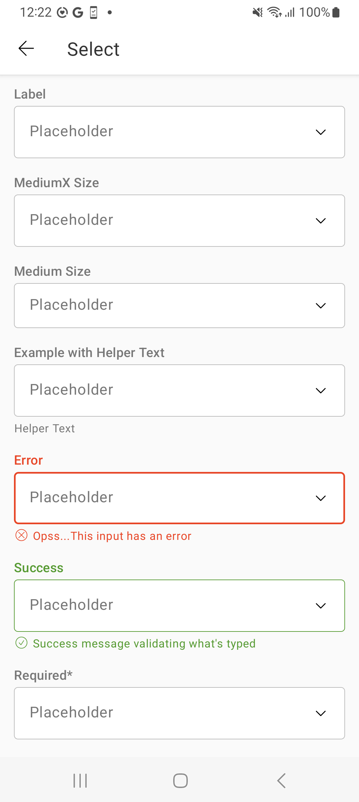
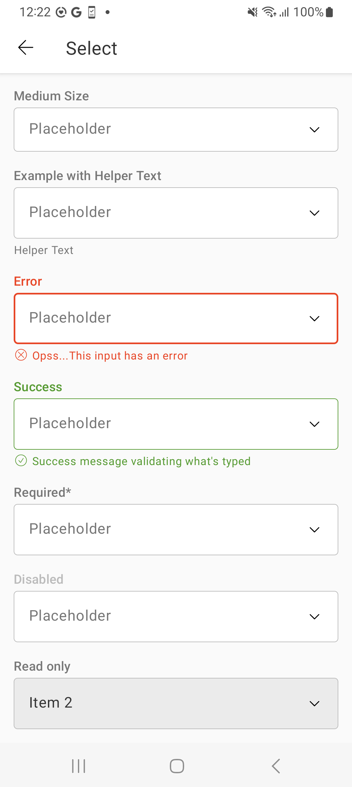

# Select

> Select lets user choose one option from an options menu. Consider using select when you have 4 or
more options.


## Properties

| Property           | Values                         | Status            |
| --------------     | -------------------------      | ----------------- |
| Variant             | Standard                          | ✅  Available     |
| Label             | -                          | ✅  Available     |
| Footer             | -                          | ✅  Available     |
| Size             | Medium, MediumX                          | ✅  Available     |
| States             | None, Success, Error                          | ✅  Available     |
| Required             | True, False                          | ✅  Available     |
| Read-only             | True, False                          | ✅  Available     |
| Disabled             | -                          | ✅  Available     |


## Technical Usages Examples

<br>

<p align="center">
   
&nbsp;
  
</p>

<br>

##### Select dropdown


```android
   <com.natura.android.select.Select
       android:id="@+id/selectDefault"
       android:layout_width="match_parent"
       android:layout_height="wrap_content"
       app:slc_label="Label" />
```

<br><br>

##### Select with Error


```android
   <com.natura.android.select.Select
        android:id="@+id/selectWithError"
        android:layout_width="match_parent"
        android:layout_height="wrap_content"
        android:paddingTop="?spacingSmall"
        app:slc_label="Error"
        app:slc_footer="Opss...This input has an error"
        app:slc_state="error"/>
```

<br><br>

##### Select Read Only


```android
   <com.natura.android.select.Select
        android:id="@+id/selectReadOnly"
        android:layout_width="match_parent"
        android:layout_height="wrap_content"
        android:paddingTop="?spacingSmall"
        app:slc_readonly="true"
        app:slc_label="Read only"/>
```

<br>

### Kotlin

 So that it is possible to show the items in the select, it is necessary to create and assign an
  adapter to the spinner, inside a kotlin class. This trick will allow you to control the selected
  values and actions on them. Below is an example:

```android
val arraySpinner = listOf("Item 1", "Item 2", "Item 3", "Item 4")
val arrayAdapter = ArrayAdapter(this, R.layout.custom_spinner_dropdown_item, arraySpinner)
binding.selectDefault.spinner.adapter = arrayAdapter
```


## More code

You can check out more examples from SampleApp by
clicking [here](https://github.com/natura-cosmeticos/natds-android/tree/master/sample/src/main/res/layout/activity_select.xml)
