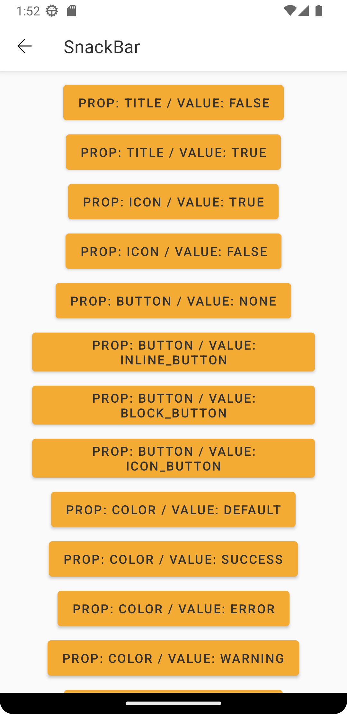
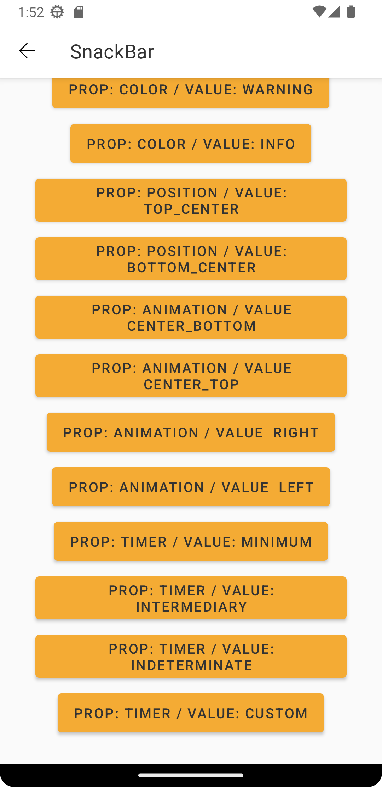
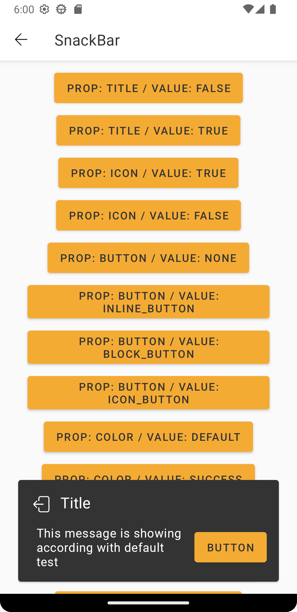
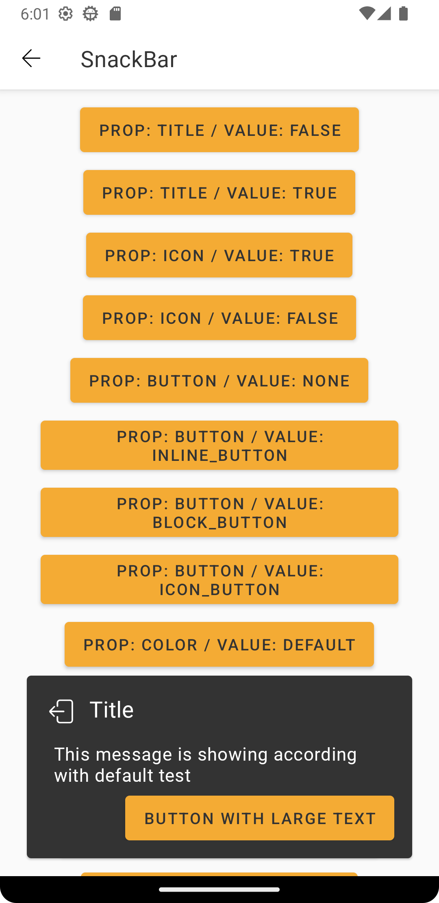
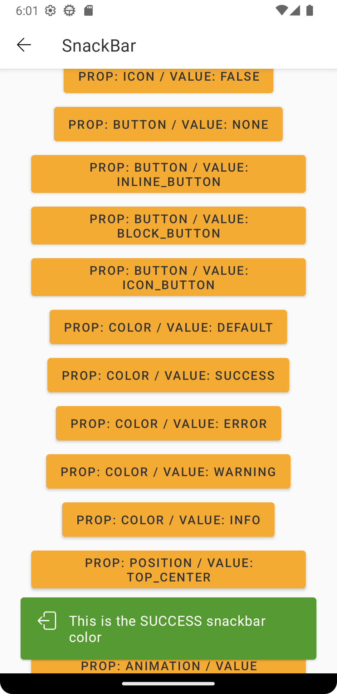
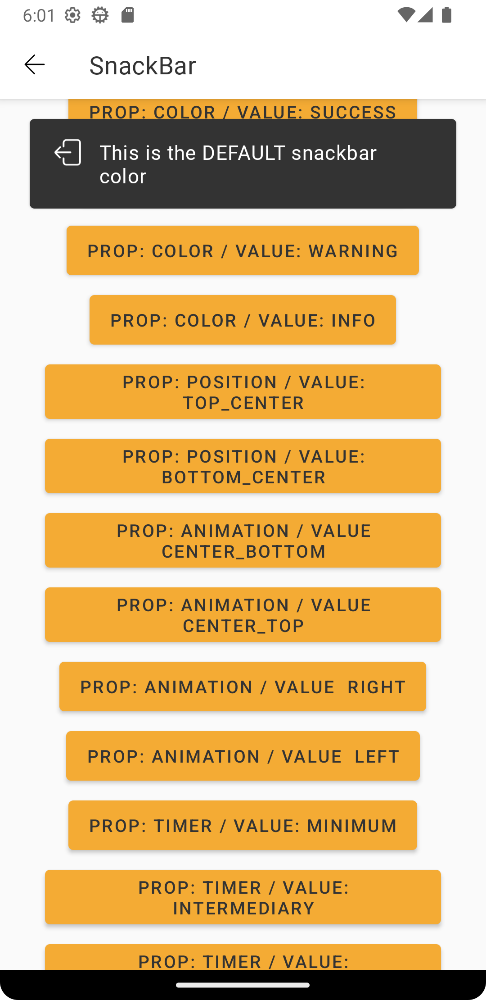

# Snackbar

> Snackbars provide brief messages about app processes at the bottom of the screen.

<br>

## Properties

| Property           | Values                         | Status            |
| --------------     | -------------------------      | ----------------- |
| Variant             | Standard                          | ✅  Available     |
| Title             | True, False                           | ✅  Available     |
| Icon             | True, False                           | ✅  Available     |
| Action Button        | None, Inline, Block, Icon Button           | ✅  Available     |
| Feedback (color)      | Default, Success, Error, Warning, Info            | ✅  Available     |
| Timer     | Minimum, Intermediary, Indeterminated, Custom             | ✅  Available     |
| Position     | Top center, Bottom center             | ✅  Available     |
| Animation     | False, Right, Left, Center Bottom, Center Top        | ✅  Available     |

<br>

## Technical Usages Examples

> This component has no xml attributes, only available in view code with Kotlin

<br><br>

<p align="center">
   
&nbsp;
  
</p>

<br>

```android
   SnackBar(
      mainView = binding.root,
      message = "This message is showing according with default test",
      mainButtonTitle = "Button",
      mainButtonAction = {
        Toast.makeText(this,"SnackBar main button clicked",Toast.LENGTH_SHORT).show()
      },
      mainButtonType = SnackbarActionButtonType.INLINE_BOTTON,
    )
```

<br><br>

##### Title



```android
   title = "Title",
   showTitle = true,
```

<br>

##### Icon


```android
   showIcon = true,
   iconName = iconNameProp
```

<br>

##### Button



```android
   mainButtonTitle = "Button",
   mainButtonAction = {
     Toast.makeText(this,"SnackBar main button clicked",Toast.LENGTH_SHORT).show()
   },
   mainButtonType = SnackbarActionButtonType.INLINE_BOTTON
```

<br>

##### Color



```android
   color = SnackbarColorType.DEFAULT
```

<br>

##### Position



```android
   animation = true,
   positionType = SnackbarPositionType.TOP_CENTER,
   animationType = SnackbarAnimationtype.NONE
```

<br>

##### Animation

```android
   animationType = SnackbarAnimationtype.CENTER
```

<br>

##### Timer

```android
   timerType = SnackbarTimerType.MINIMUM
```


<br>

## More code

You can check out more examples from SampleApp by
clicking [here](https://github.com/natura-cosmeticos/natds-android/tree/master/sample/src/main/res/layout/activity_select.xml)
