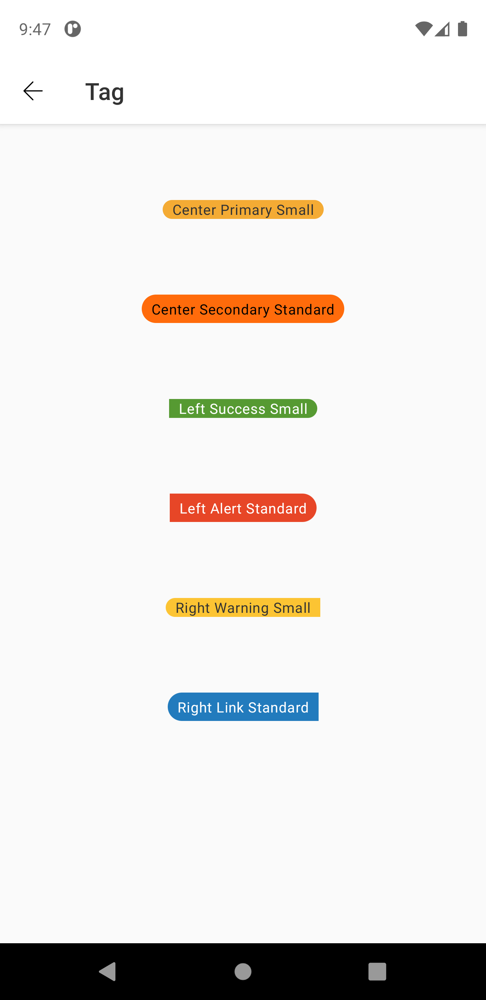
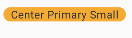
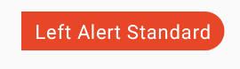
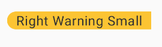

# Tag
> Tags are used to label, categorize, or organize items using keywords that describe them.  

## Properties

| Property           | Values                         | Status            |
| --------------     | -------------------------      | ----------------- |
| Size             | Standard, Small                          | ✅  Available     |
| Color          | Primary, Secondary, Alert, Success, Link, Warning, Custom   | ✅  Available     |
| Position         | Center, Left, Right       | ✅  Available     |
| Icon          | True, False                    | ✅  Available     |


## Technical Usages Examples



<br>

##### Tag with position center, primary type and small size



```android
    <com.natura.android.tag.Tag
        android:id="@+id/tagPrimary"
        android:layout_width="wrap_content"
        android:layout_height="wrap_content"
        app:tag_type="primary"
        app:textLabel="Center Primary Small" />
```
<br> 

em Kotlin

<br>

```kotlin
    val tag = findViewById<Tag>(R.id.tagPrimary)
    tag.setLabel("Center Primary Small")
```
<br><br>

##### Tag with position left, alert type and standard size



```android
     <com.natura.android.tag.Tag
        android:id="@+id/tagAlert"
        android:layout_width="wrap_content"
        android:layout_height="wrap_content"
        app:tag_size="standard"
        app:tag_type="alert"
        app:tag_position="left"
        app:textLabel="Left Alert Standard" />

```
<br> 

em Kotlin

<br>

```kotlin
    val tag = findViewById<Tag>(R.id.tagAlert)
    tag.setLabel("Left Alert Standard")
```
<br><br>

##### Tag with position right, warning type and small size



```android
    <com.natura.android.tag.Tag
        android:id="@+id/tagWarning"
        android:layout_width="wrap_content"
        android:layout_height="wrap_content"
        app:tag_size="small"
        app:tag_type="warning"
        app:tag_position="right"
        app:textLabel="Right Warning Small" />
```

<br><br>

##### Tag with icon and custom color


```android
    <com.natura.android.tag.Tag
        android:id="@+id/tagWithIcon"
        android:layout_width="wrap_content"
        android:layout_height="wrap_content"
        app:tag_icon="@drawable/outlined_action_mic"
        app:tag_position="center"
        app:tag_size="standard"
        app:tag_type="custom"
        app:tag_background_color="?colorNeutral300"
        app:tag_label_color="?colorOnPrimary"
        app:textLabel="Tag" />
```

<br> 

em Kotlin

<br>

```kotlin
    val tag = findViewById<Tag>(R.id.tagWarning)
    tag.setLabel("Right Warning Small")
```

<br>


## More code
You can check out more examples from SampleApp by clicking [here](https://github.com/natura-cosmeticos/natds-android/tree/master/sample/src/main/res/layout/activity_tag.xml).
