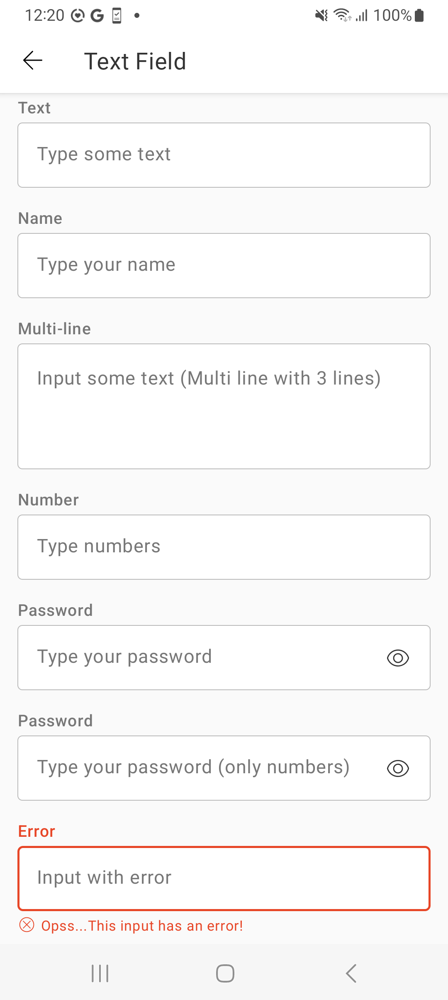
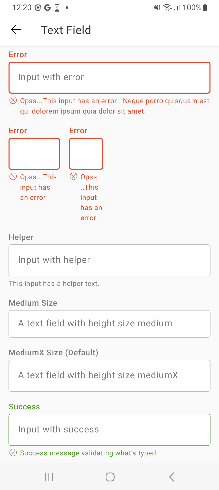
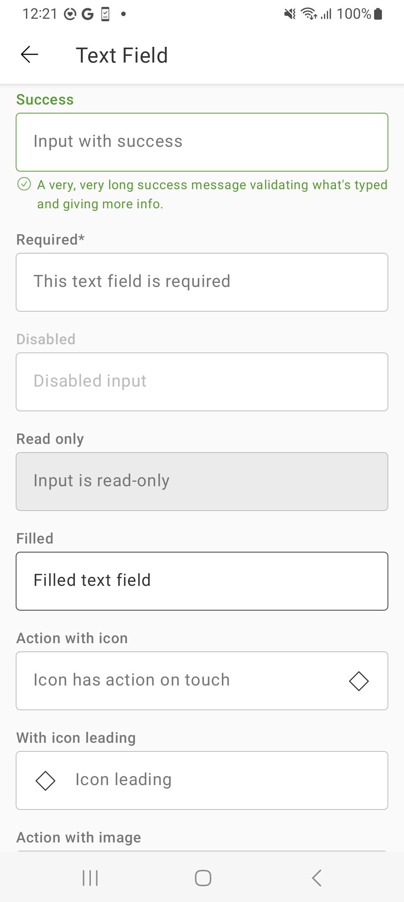
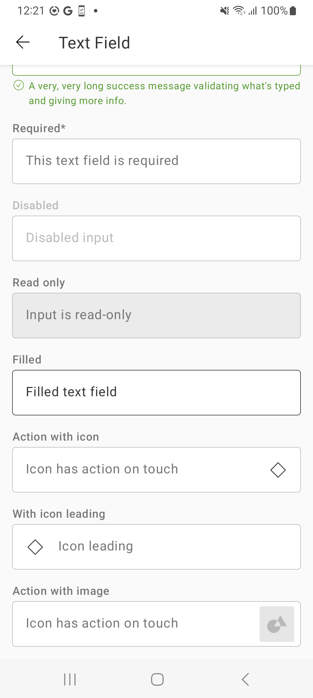

# TextField
> Text fields let users enter and edit text.

<br>

## Properties

| Property           | Values                         | Status            |
| --------------     | -------------------------      | ----------------- |
| Size             | Medium, MediumX                          | ✅  Available     |
| Style          | Outlined   | ✅  Available     |
| States         | Enabled, Active, Filled       | ✅  Available     |
| Feedback          | Error, Success, Required, Disabled, Read-Only,Helper Text                   | ✅  Available     |
| Action               | None, Icon Button, Image           | ✅  Available     |
| Type               | Text, Password, Multi-line, Number           | ✅  Available     |

<br>

## Technical Usages Examples

<p align="center">
   
&nbsp;
  
  &nbsp;
  
  &nbsp;
  
</p>

<br>

##### Textfield with text type   


```android
    <com.natura.android.textfield.TextField
        android:id="@+id/text_item"
        android:layout_width="match_parent"
        android:layout_height="wrap_content"
        android:hint="Type some text"
        app:text_field_label="Label" />
```
<br>

Kotlin

<br>

```kotlin
    val textField = findViewById<TextField>(R.id.myTextField)
    textField.hint = "Type some text"
    textField.label = "Text"
```

<br><br>

##### Textfield with error


```android
    <com.natura.android.textfield.TextField
        android:id="@+id/error_long_footer_item"
        android:layout_width="match_parent"
        android:layout_height="wrap_content"
        android:hint="Input with error"
        app:text_field_footer="Opss...This input has an error - Neque porro quisquam est qui dolorem ipsum quia dolor sit amet."
        app:text_field_label="Error"
        app:text_field_state="error" />
```

<br>

Kotlin

<br>

```kotlin
    val textField = findViewById<TextField>(R.id.myTextField)
    textField.hint = "Input with error"
    textField.state = TextField.State.ERROR
    textField.label = "Error"
    textField.footer = "Opss...This input has an error - Neque porro quisquam est qui dolorem ipsum quia dolor sit amet."
```

<br><br>

##### Textfield with image


```android
     <com.natura.android.textfield.TextField
        android:id="@+id/action_image_item"
        android:layout_width="match_parent"
        android:layout_height="wrap_content"
        android:hint="Icon has action on touch"
        app:text_field_image="@drawable/textfield_image_arealimit"
        app:text_field_label="Action with image" />
```

<br>

Kotlin

<br>

```kotlin
    val textField = findViewById<TextField>(R.id.myTextField)
    textField.hint = "Icon has action on touch"
    textField.label = "Action with image"
    textField.image = R.drawable.myImage
```
<br>


## More code
You can check out more examples from SampleApp by clicking [here](https://github.com/natura-cosmeticos/natds-android/tree/master/sample/src/main/res/layout/activity_textfield.xml).
