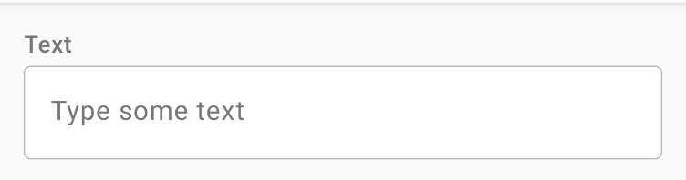
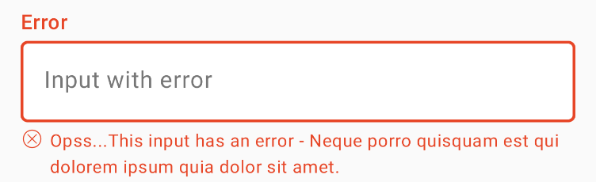
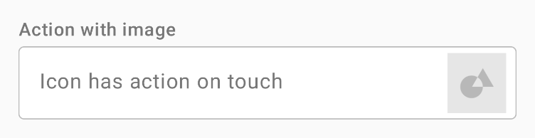
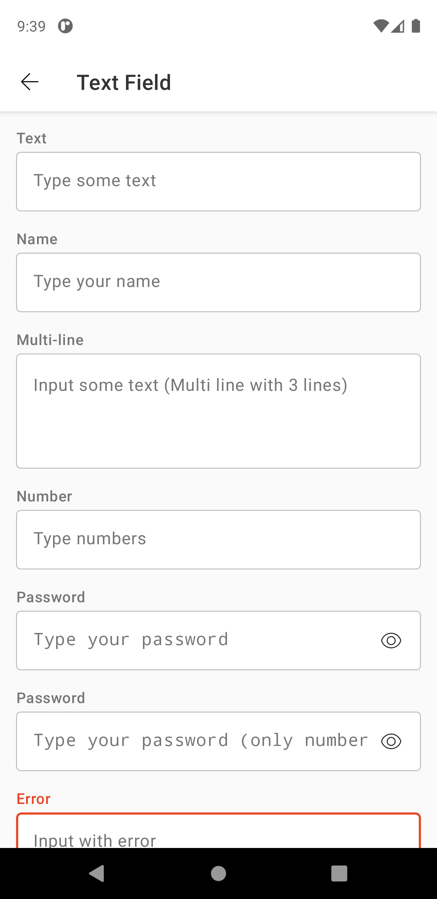
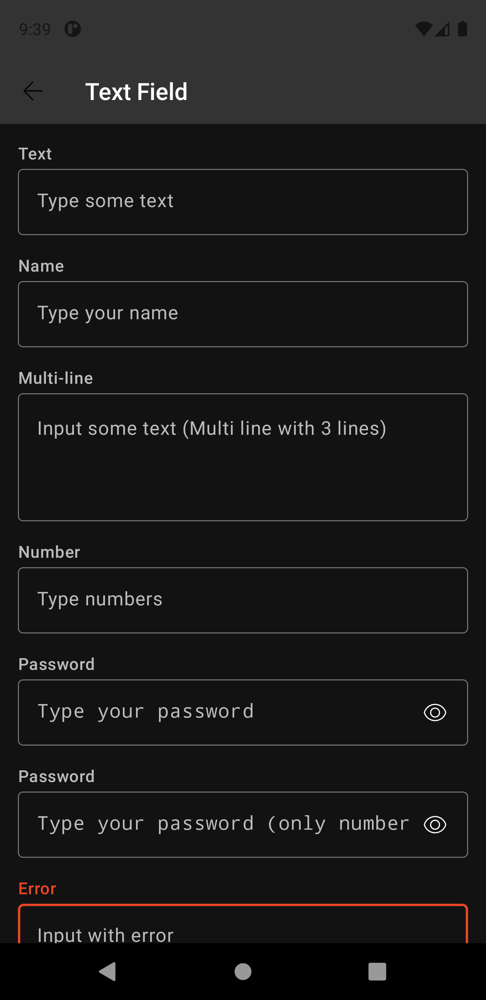

# TextField
Text fields let users enter and edit text.

Extends from [ConstraintLayout](https://developer.android.com/reference/androidx/constraintlayout/widget/ConstraintLayout).

## Note for Design:

This component is available in the following variants:

- ✅ **Standard**

With the following attribute statuses:

- **Size**:
  - ✅ `Medium`
  - ✅ `MediumX`
- **Style**:
  - ✅ `Outlined`
- **States**:
  - ✅ `Enabled`
  - ✅ `Active`
  - ✅ `Filled`
- **Feedback**:
  - ✅ `Error`
  - ✅ `Success`
  - ✅ `Required`
  - ✅ `Disabled`
  - ✅ `Read Only`
  - ✅ `Helper Text`
- **Action**:
  - ✅ `None`
  - ✅ `Icon Button`
  - ✅ `Image`
- **Type**:
  - ✅ `Text`
  - ✅ `Password`
  - ✅ `Multi-line`
  - ✅ `Number`


## Attributes
| Attr | Description | Type | Options |
| - | --- | --- | --- |
|`android:inputType`| Nat DS TextField component is defined on Android EditText component. This attribute is inherited from EditText and set the type of content supported by Text Field. | string |- **text**: Plain old text <br> - **textMultiLine**: Can be combined with <var>text</var> and its variations to indicate that though the regular text view should be multiple lines <br> - **textPassword**: Text that is a password <br> - **number**: A numeric only field <br> - **numberPassword**: A numeric password field |
|`android:maxLines`| Makes the TextView be at most this many lines tall. When used on an editable text, the <code>inputType</code> attribute's value must be combined with the <code>textMultiLine</code> flag for the maxLines attribute to apply.| integer | min = 0
|`android:maxLength`| Sets an input filter to constrain the text length to the specified number. | integer | min = 0
|`android:lines`| Makes the text be exactly this many lines tall. | integer | min = 0
|`android:hint`| Hint text to display when the text is empty. | string | text
|`android:enable`| Specifies whether the widget is enabled. A non-enabled TextField prevents the user from editing the contained text. | boolean | true or false
|`app:text_field_text`| Text Content of TextField | string | text
|`app:text_field_icon`| Icon visible on right side of TextField.  Receives an string that represent an icon. 
|`app:text_field_label`| Label showed above the input. Can be used to describe the field. | string | text
|`app:text_field_footer`| Label showed below the input. Can be used to give feedback about the field state. | string | text
|`app:text_field_state`| Describes the state of the field. | string | none, success or error
|`app:text_field_size`| Describes the size (height) of the field. | string | mediumx or medium
|`app:text_field_required`| Specifies if the widget is required, with an asterisk in label. | boolean | true or false
|`app:text_field_readonly`| Specifies whether the widget is read only. | boolean | true or false
|`app:text_field_image`| Image visible on right side of TextField. | drawable | image resource


## Usage examples
Textfield with text type   



#### Layout XML

```android
    <com.natura.android.textfield.TextField
        android:id="@+id/text_item"
        android:layout_width="match_parent"
        android:layout_height="wrap_content"
        android:hint="Type some text"
        app:text_field_label="Label" />
```

#### Kotlin

```kotlin
    val textField = findViewById<TextField>(R.id.myTextField)
    textField.hint = "Type some text"
    textField.label = "Text"
```

<br><br>
Textfield with error


#### Layout XML

```android
    <com.natura.android.textfield.TextField
        android:id="@+id/error_long_footer_item"
        android:layout_width="match_parent"
        android:layout_height="wrap_content"
        android:hint="Input with error"
        app:text_field_footer="Opss...This input has an error - Neque porro quisquam est qui dolorem ipsum quia dolor sit amet."
        app:text_field_label="Error"
        app:text_field_state="error" />
```

#### Kotlin

```kotlin
    val textField = findViewById<TextField>(R.id.myTextField)
    textField.hint = "Input with error"
    textField.state = TextField.State.ERROR
    textField.label = "Error"
    textField.footer = "Opss...This input has an error - Neque porro quisquam est qui dolorem ipsum quia dolor sit amet."
```

<br><br>
Textfield with image


#### Layout XML

```android
     <com.natura.android.textfield.TextField
        android:id="@+id/action_image_item"
        android:layout_width="match_parent"
        android:layout_height="wrap_content"
        android:hint="Icon has action on touch"
        app:text_field_image="@drawable/textfield_image_arealimit"
        app:text_field_label="Action with image" />
```

#### Kotlin

```kotlin
    val textField = findViewById<TextField>(R.id.myTextField)
    textField.hint = "Icon has action on touch"
    textField.label = "Action with image"
    textField.image = R.drawable.myImage
```
<br>

## Light mode / Dark mode

<p align="center">
   
&nbsp;
  
</p>

## More code
You can check out more examples from SampleApp by clicking [here](https://github.com/natura-cosmeticos/natds-android/tree/master/sample/src/main/res/layout/activity_textfield.xml).

## Attention points

1. A textfield is a DS component based on DS **multibrand themes**. It means if you want to use a textfield in your app, you MUST set the DS theme on a view parent or in the textfield component itself. [Check more info about how to set DS themes in your app](../README.md).