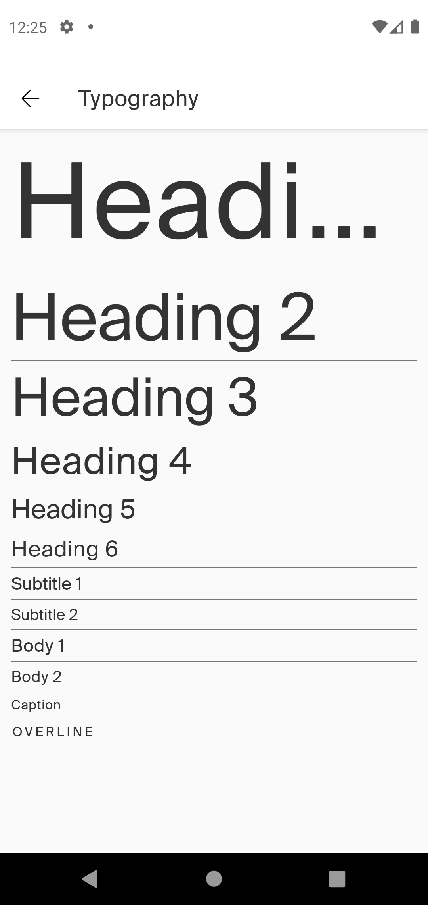

# Typography Component Style - How to Use
Typography component style can help you to style texts. It is the easiest way to support multibrand and
consume an standard style to texts


## How to use it?
Right now Nat DS Typography Tokens support these variants:


### Heading 1
 Theme attribute name: textAppearanceHeadline1
 ```android
  <TextView
   android:layout_width="match_parent"
   android:layout_height="wrap_content"
   android:text="Heading 1"
   android:textAppearance="?textAppearanceHeadline1"/>
   ```

### Heading 2
 Theme attribute name: textAppearanceHeadline2
  ```android
  <TextView
   android:layout_width="match_parent"
   android:layout_height="wrap_content"
   android:text="Heading 2"
   android:textAppearance="?textAppearanceHeadline2"/>
   ```
### Heading 3
 Theme attribute name: textAppearanceHeadline3
  ```android
  <TextView
   android:layout_width="match_parent"
   android:layout_height="wrap_content"
   android:text="Heading 3"
   android:textAppearance="?textAppearanceHeadline3"/>
   ```

### Heading 4
 Theme attribute name: textAppearanceHeadline4
  ```android
  <TextView
   android:layout_width="match_parent"
   android:layout_height="wrap_content"
   android:text="Heading 4"
   android:textAppearance="?textAppearanceHeadline4"/>
   ```

### Heading 5
 Theme attribute name: textAppearanceHeadline5

  ```android
  <TextView
   android:layout_width="match_parent"
   android:layout_height="wrap_content"
   android:text="Heading 5"
   android:textAppearance="?textAppearanceHeadline5"/>
   ```

### Heading 6
 Theme attribute name: textAppearanceHeadline6
  ```android
  <TextView
   android:layout_width="match_parent"
   android:layout_height="wrap_content"
   android:text="Heading 6"
   android:textAppearance="?textAppearanceHeadline6"/>
   ```

### Subtitle 1
 Theme attribute name: textAppearanceSubtitle1
  ```android
  <TextView
   android:layout_width="match_parent"
   android:layout_height="wrap_content"
   android:text="Subtitle 2"
   android:textAppearance="?textAppearanceSubtitle1"/>
   ```

### Subtitle 2
  Theme attribute name: textAppearanceSubtitle2
  ```android
  <TextView
   android:layout_width="match_parent"
   android:layout_height="wrap_content"
   android:text="Subtitle 2"
   android:textAppearance="?textAppearanceSubtitle2"/>
   ```

### Body 1
   Theme attribute name: textAppearanceBody1
   ```android
   <TextView
    android:layout_width="match_parent"
    android:layout_height="wrap_content"
    android:text="Body 1"
    android:textAppearance="?textAppearanceBody1"/>
```

### Body 2
   Theme attribute name: textAppearanceBody2
   ```android
   <TextView
    android:layout_width="match_parent"
    android:layout_height="wrap_content"
    android:text="Body 2"
    android:textAppearance="?textAppearanceBody2"/>
   ```

  ### Caption
 Theme attribute name: textAppearanceCaption
 
   ```android
   <TextView
    android:layout_width="match_parent"
    android:layout_height="wrap_content"
    android:text="Caption"
    android:textAppearance="?textAppearanceCaption"/>
   ```

  ### Overline
 Theme attribute name: textAppearanceOverline
   ```android
   <TextView
    android:layout_width="match_parent"
    android:layout_height="wrap_content"
    android:text="Overline"
    android:textAppearance="?textAppearanceOverline"/>
   ```



 ### Styles
 All these variations allow the application of the bold and italic styles through the xml, as shown below:
 ```android
 <TextView
   android:layout_width="match_parent"
   android:layout_height="wrap_content"
   android:text="Heading 4"
   android:textStyle="bold"
   android:textAppearance="?textAppearanceHeadline4"/>
```

 ```android
<TextView
   android:layout_width="match_parent"
   android:layout_height="wrap_content"
   android:text="Heading 1"
   android:textStyle="italic"
   android:textAppearance="?textAppearanceHeadline1"/>
```